# Bio*Philia* Living Design ~ Learning to live in the light of Nature.
(*Proof of concept: Oct 2016 - Jan 2020*)

**The cultivation of a symbiotic habitat that honors the individual as a *biological organism* in the *built environment* within the *biophysical environment.***

## *Becoming a part of the circle of life.* The *symbiotic relationship* between *Wo-Man and Mother Earth* (environment) is highlighted, not human and 'things'.

***Harvesting Knowledge:*** Learning to catalogue experiences, the sources in the natural environment, of positive emotional states that humans experience, then recreate them in the built and cultivated environment to enhance emotional, mental, physical and biological health.

Civilized living; life-giving and life-sustaining with a high degree of refinement and comfort. Adaptable to all practical needs of life within an attractive built environment.

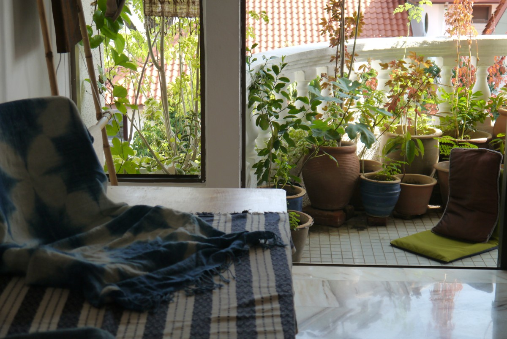

***Curated to allow enjoyment of nature as freely as possible.***

Wo-Men have an inherited need to connect to nature and other biotic forms due to their *Evolutionary Dependence* on it for *Survival* and *Personal Fulfillment.* This is the human birth wright.

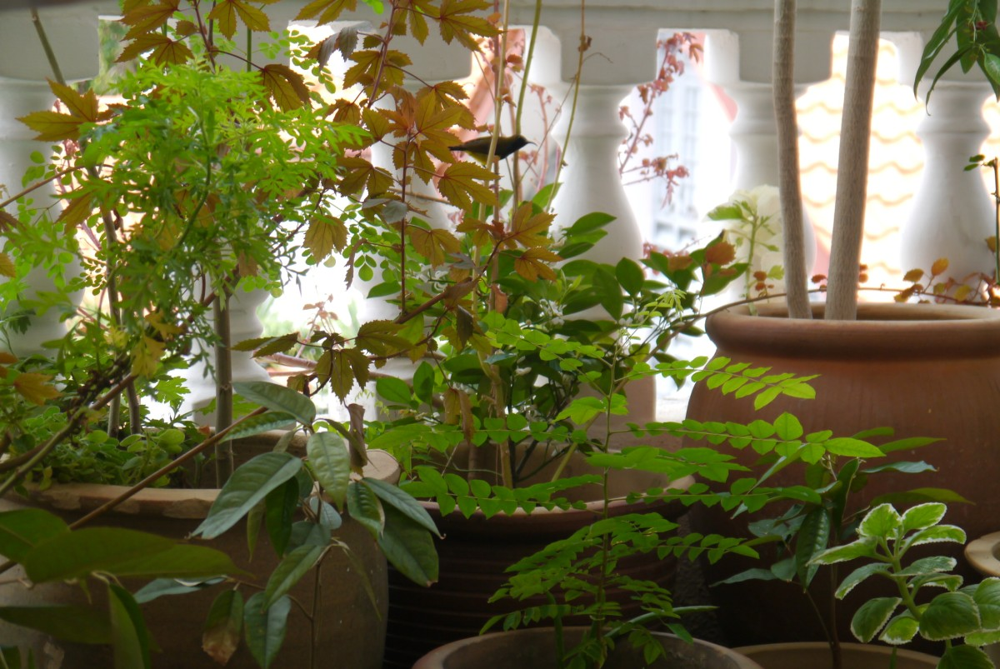

#### *Naturally tap into the abundant emotions of joy, grace, awe, wholeness, passion and compassion that are experienced from beauty in nature. An archaic revival of Wo-Mans symbiotic microbial Gaian connection, honoring the feminine by connecting soil to soul.*

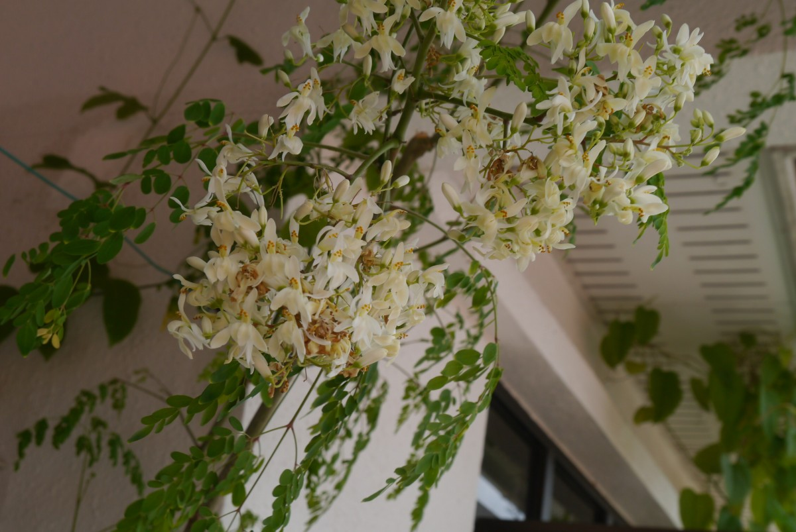

***Cross Pollinate; be the *gardener*, an open hand bringing seed to soil the womb, the beginnings of life, love and endings. Each bloom in the doing of this most holy act.***

Using the symbiotic relationship with *'Mother Earth'* as a path of discovery into the unique characteristics of intentional independent habitats, that not only can influence a spontaneous therapeutic act but also can be used by the designer to open; they are dynamic, adaptable and can be experienced, offering a safe space and the possibility for trying out inventive solutions and transformation.

#### *Psychobiology, where mind meets matter. The interaction between bio-logical systems and behavior.*

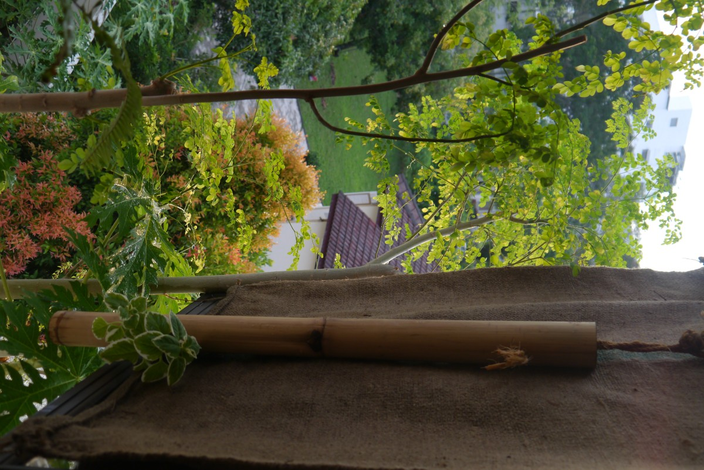

***Healing environments*** allow one to draw emotional support from their settings through the Symbiotic Energy, the living energy of the space. One then feels free to move around and interact unselfconsciously, to combine ones life with the life of the living systems and elements within the built space. Achieved by bringing in a number of high quality visual and intuitive interactions among the bio-logical ecosystems and elements of a built space and its users. 

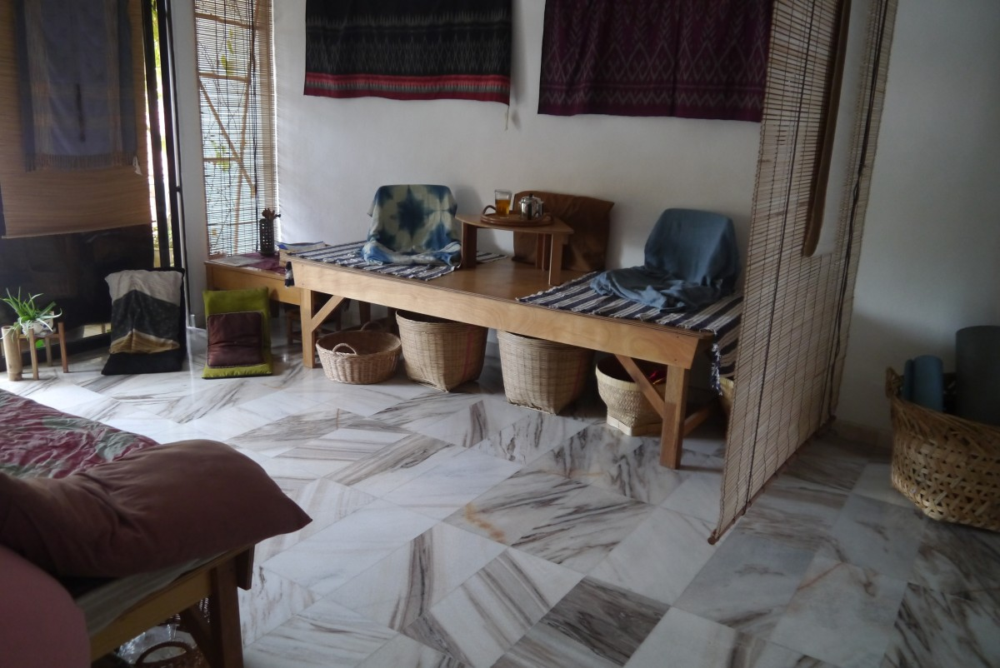

A living design built upon the inherent intuitive 'biophilic' response to built forms, natural settings and systems. Designed to generate healthy interactions by encouraging their spontaneous occurrence. New ways of thinking, seeing and relating to the Natural World can be expanded, experienced. Causing a total shift of posture, perceptions, beliefs, and thought processes. Transforming ones relationship with the Natural World.

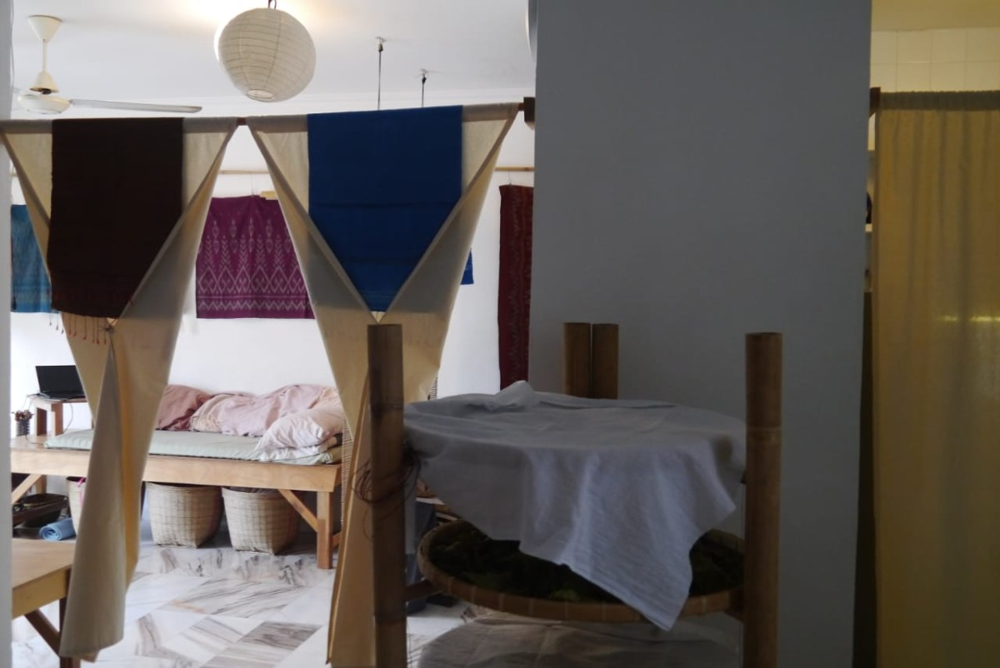

#### *Designing and creating symbiotic living environments that support, restore and regenerate both the physical body and the environment (earth body) have positive effects on the health of a population as a whole, not just the individual within the living design.*

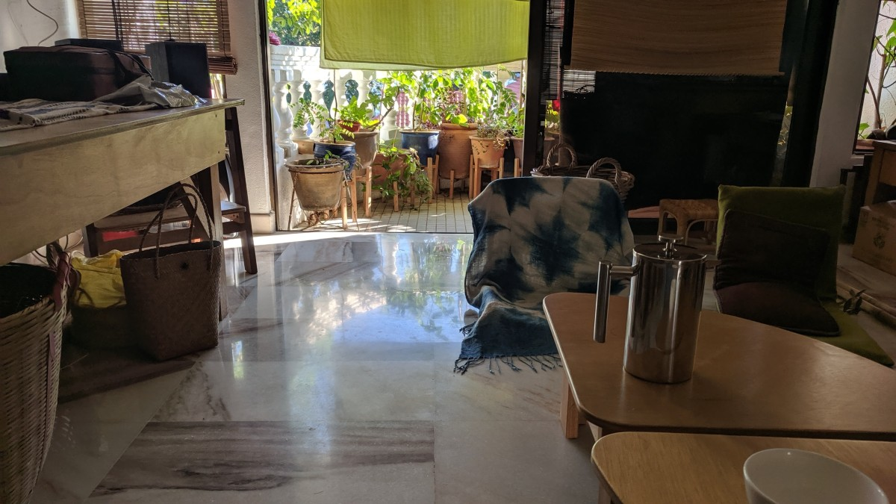

### *Knowledge Harvested* from the 'symbiotic co-evolutionary experience' and theory are shared here.

**An effort to cultivate personal potential and help others do so in the process.**

#### *The way out is a personal responsibility, the way out is in the soil. When the soil is healed the soul follows.*

*It's time to call home.* 
*To act and that act to transfer through nature.*

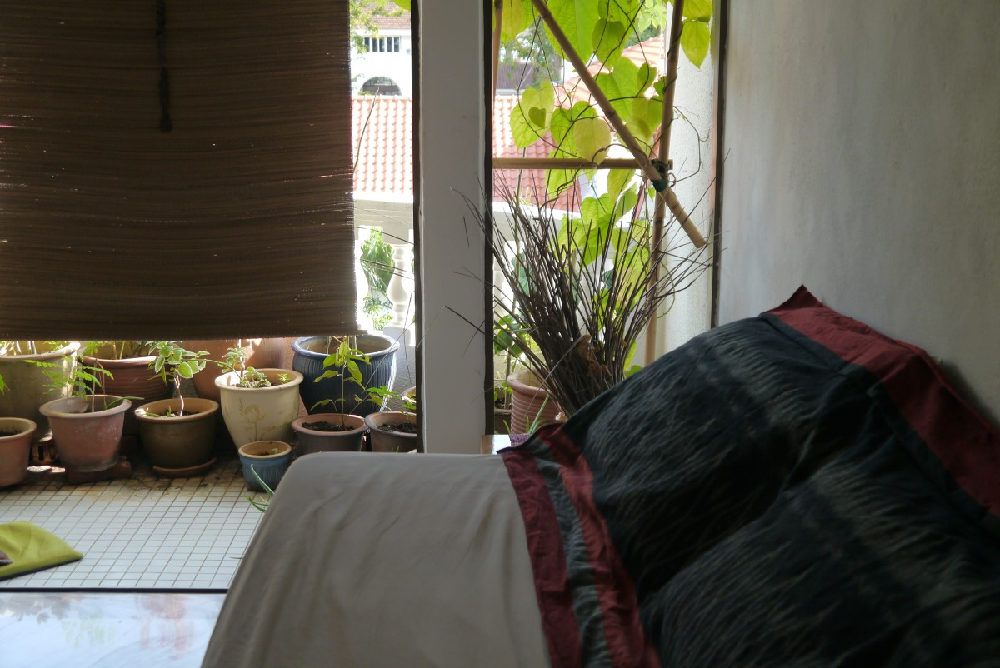

***Welcome to the***
#### *Vivarium ~ place of life*

*An interactive space curated to explore, learn, reflect, ... on how Wo-Man interact, impact and live in their personal environments; homes, work, travel, ..., spaces.*

**Vivarium**- (Latin, literally for "place of life"; plural: vivaria or vivariums) is an area, usually enclosed, for keeping and raising animals (in this case Wo-Man and biological ecosystems) or plants for observation or research. Often, a portion of the ecosystem for a particular species is simulated on a smaller scale, with controls for environmental conditions.

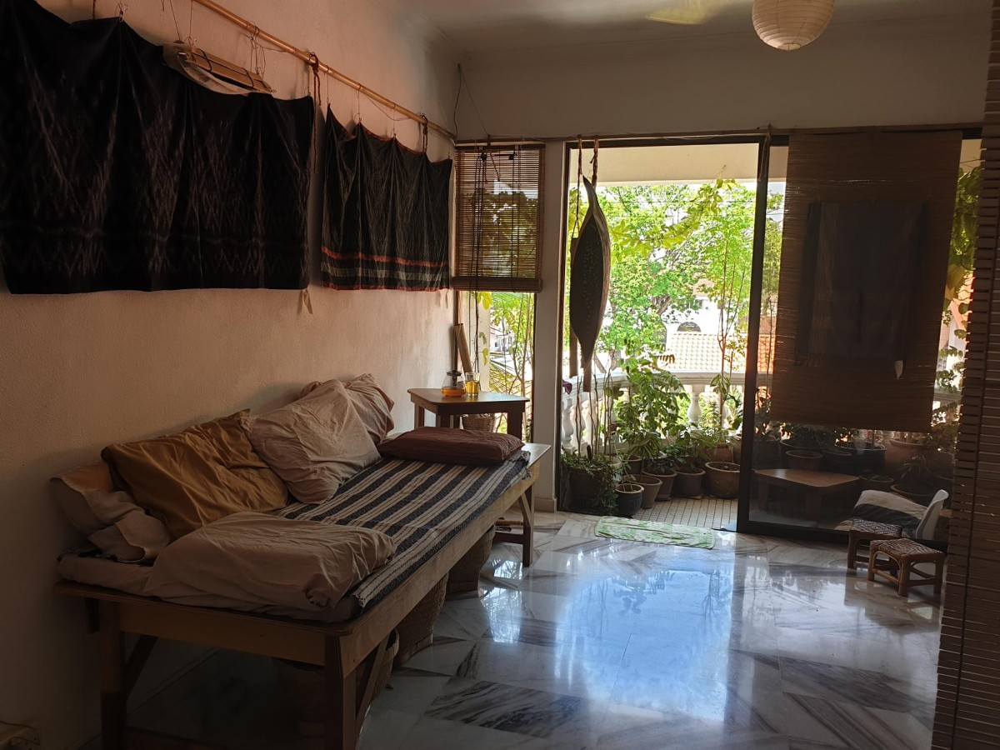

#### *The Aim; to Harmonize the Natural World with the Modern World.*

*Mind, Body, Earth; Anima Mundi (world soul) Symbiotic Connections. Creating live and dynamic, open independent spaces that feel as they have existed long before ones arrival and will remain long after their depart.*

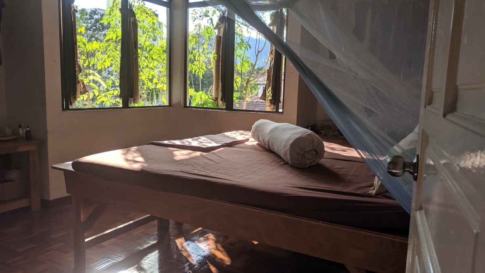

An enchanted sensibility can be strategically cultivated to ***'Capitalize On The Use Of The Senses To Create Change'.***

***Physical body is the placebo;*** the mind’s capacity to influence bodily functions and symptoms. 

Re-establishing and encouraging healthy symbiotic connections with nature through sensory experiences, interactions, movement, and hands-on activities. Allowing the brain and body to establish new, more productive patterns.

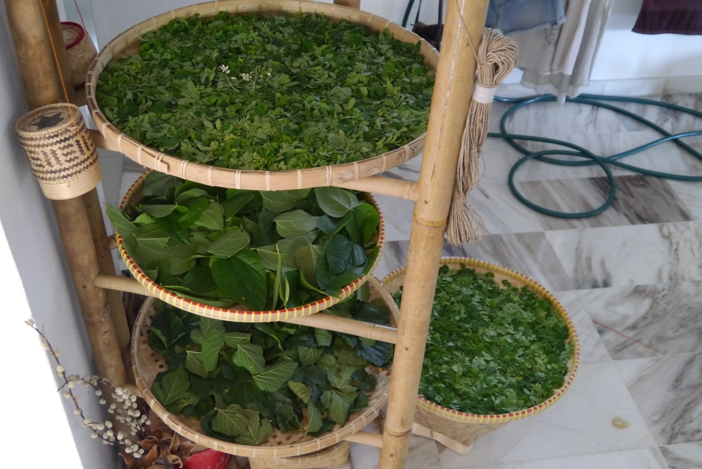

Inventing a new universe to live in, a universe of possibility. A place where people are continually discovering how they create their reality, and how they can change it.

#### Location

**George Town, Penang**

Due to the intermingling of the various ethnicities and religions that arrived on its shores, George Town acquired a large eclectic assortment of Colonial and Asian architectural styles. It also gained a reputation as gastronomic paradise. 

The Vivarium, central to many George Town attractions and just 500 meters from "Link Bike" a public bike rental station. Pulau Tikus Market/Hawker Center: 1.2km, Botanical Garden: 3.2km and UNESCO World Heritage Site: 2.6km. 

**The Neighborhood ~ Dunn Road**

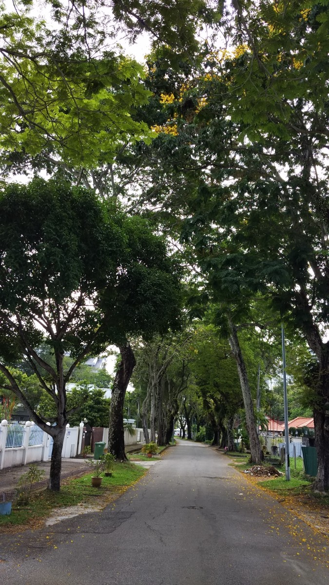

The surrounding low density neighborhood is tranquil with many large trees, and properties with plenty of green space. Dunn Road is one of the preferred addresses on the island today.

#### The Building and Property

**Dunn House** is a freehold, 3-story residential apartment building with just 15 exclusive units, each 1230 square feet in size. Dunn House is one of the pioneering boutique developments of George Town, Penang.

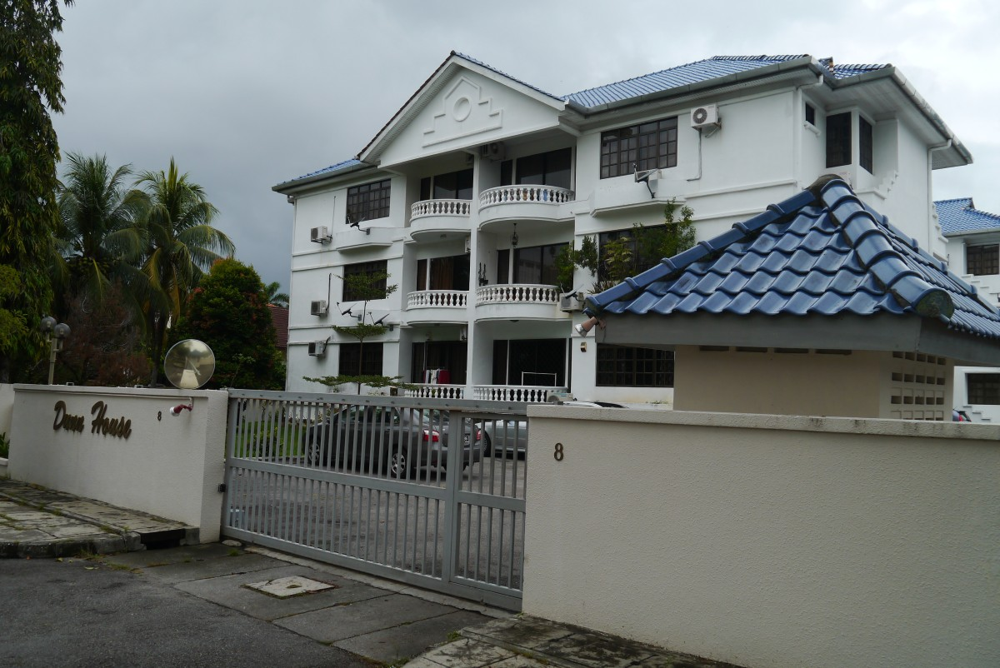

#### *The Vivarium ~ place of life*

In October 2016 occupancy was privately secured for one of the third floor corner units, north-facing with three bedrooms. Permission had already been gained from the building management and residents for a food garden on the property that was already underway.

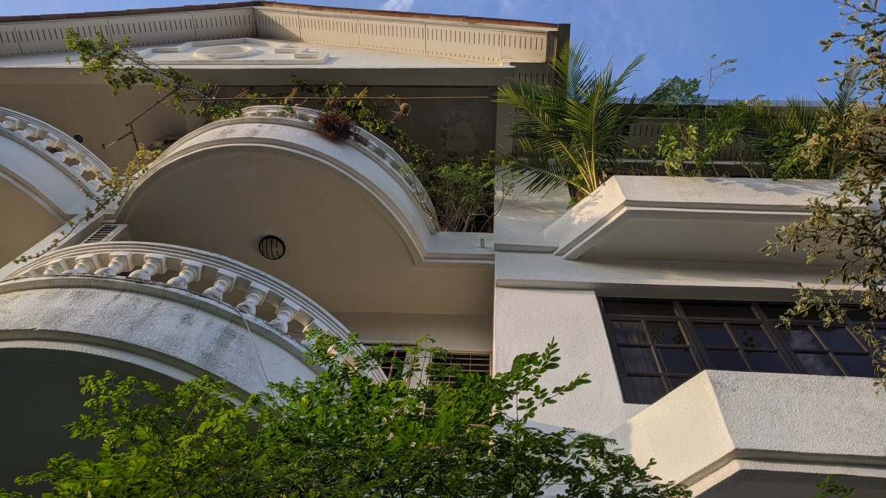 

The unique design of the boutique residence offers each corner condo, three outside walls with large opening garden windows. Due to this design the Vivarium enjoyed a wonderful open feel and fantastic cross breeze. A conscious decision to experience the smell, sound and feel of an A/C free environment was made (a bold move at 5 degrees north of the equator).

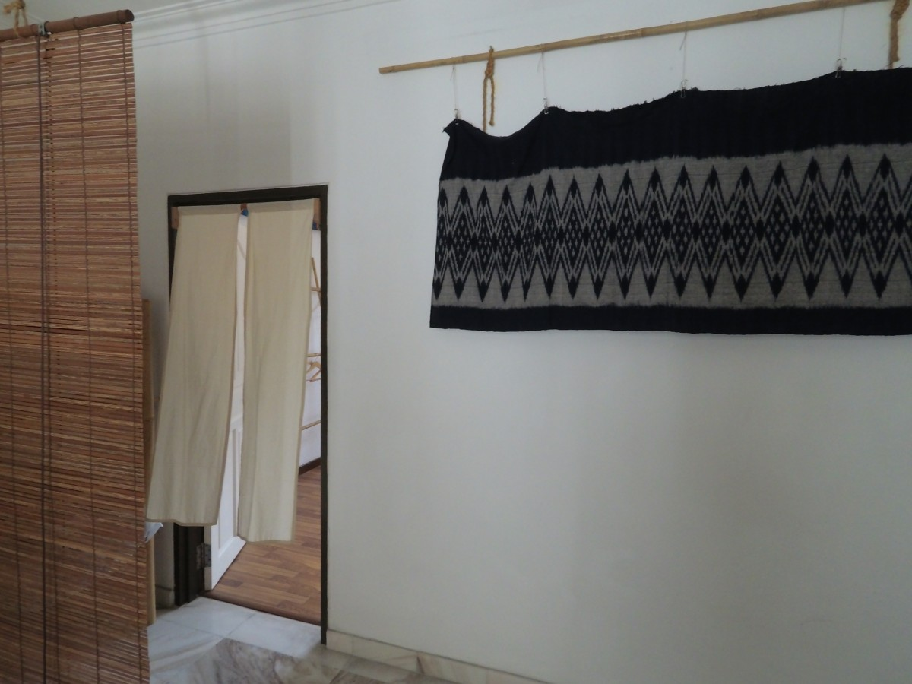

Intentional privacy screening was installed to allows guests to open bedroom doors and take advantage of the natural flow of fresh air. Jute window covers where installed to provide natural air-conditioning. Additionally an evaporative cooler was used in the common area that supported the creation of a pleasant micro climate.

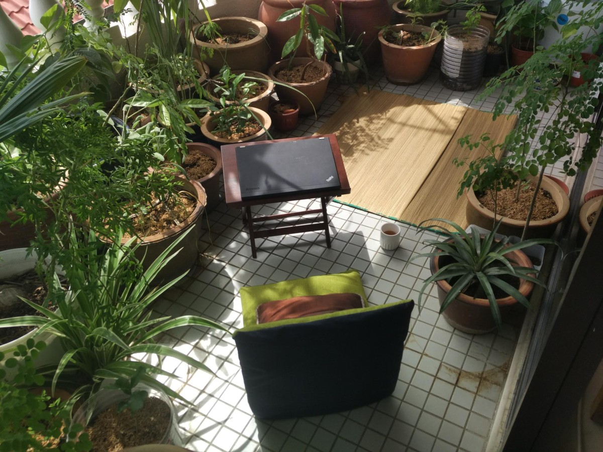

**The Private Medicinal Food Garden;** boasted over ***27 large 5 gallon (or larger) containers*** located outside all bedroom windows, as well as ***22+ clay pots*** on the balcony. Nearly all plants being edible, medicinal or functional. Besides an assortment of herbs, aloe plants, and experimental seedlings like Durian the garden was home to 23 Moringa oleifera trees, Papaya trees, Coconut seedlings, Sacha inchi vines and a passion fruit vine (that tried to take over the laundry wire) where among the numerous plants.

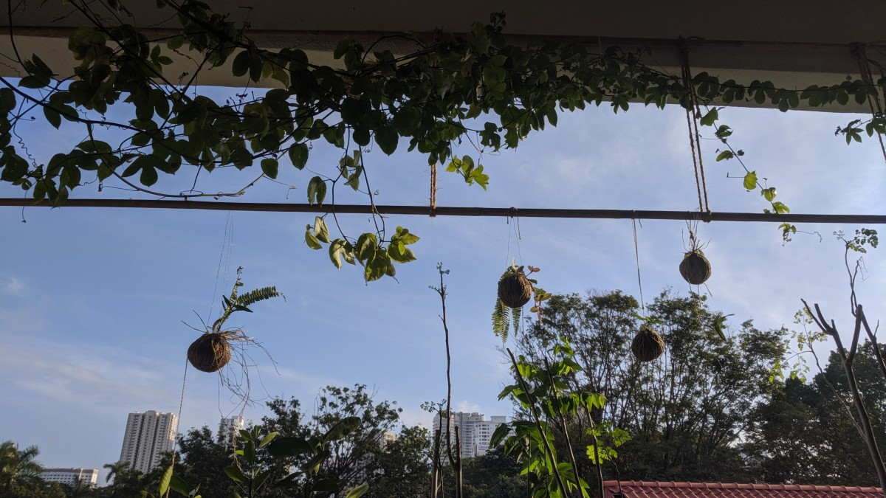

It became difficult to catalog the ever changing garden. Growing a diverse garden is part of what makes it a pleasure and easy to enjoy an Eco-responsible lifestyle. ***The gardens of the Vivarium, once established, was able to provided all nutritional requirements.*** (More details on plant selection and care will follow in a separate post.)

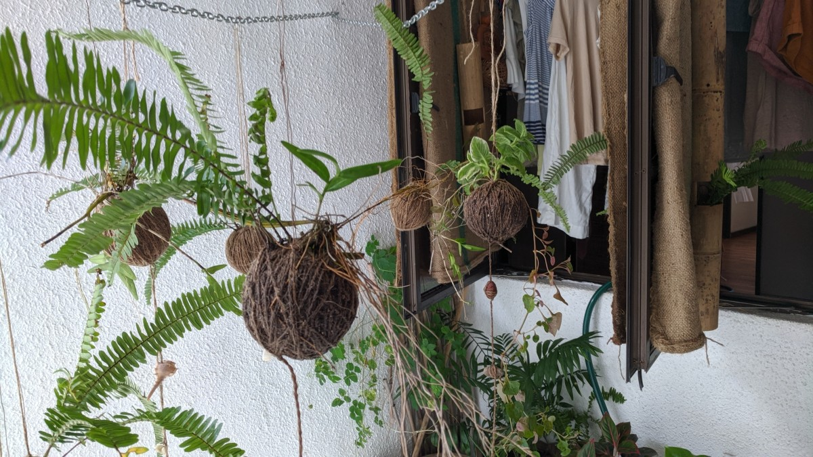

All rooms having several opening windows with large concrete window boxes provided ample space for gardens, easy access and beautiful ambience. The windows being covered in jute became gardens themselves and where home to over ***40+ bamboo hanging planters and Kokedama*** (苔玉, in English, literally "moss ball") a ball of soil, covered with moss, held by being wrapped in coconut cord on which ferns and other medicinal plants grew.

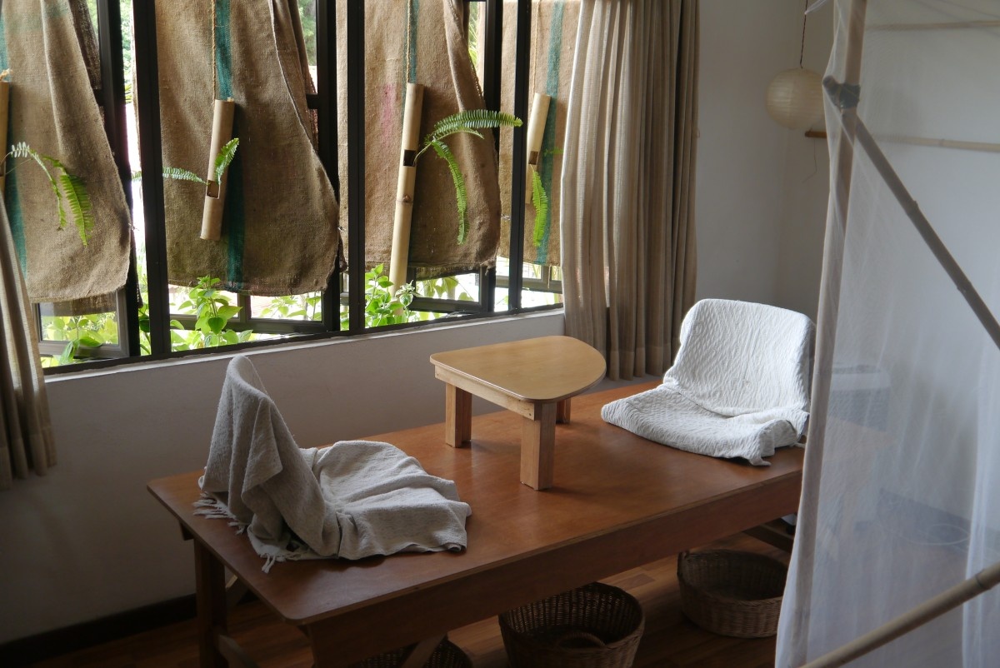

Guests where offered garden care responsibilities and to participate in any activities that may have been happening at the time. Guests where also encouraged to use the in-house [Eco friendly body, home and earth care products.](../lifeStylesForChange/waterAlchemy.md) Bathrooms had bidet water hose installed and small cotton towels were provided in place of toilet paper.

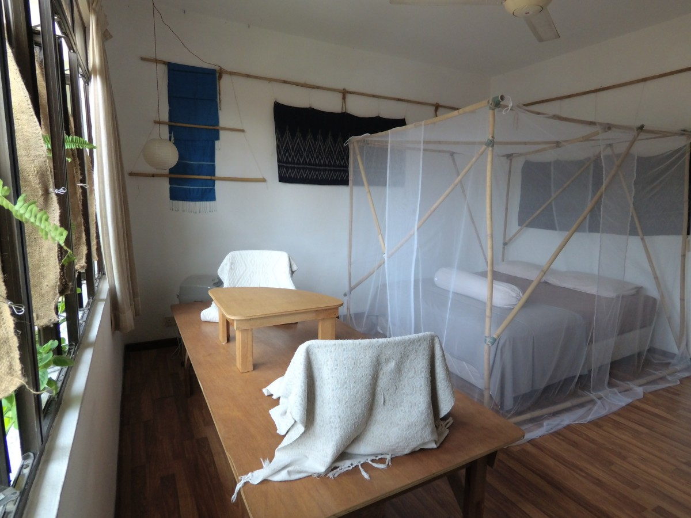

Rooms had low voltage LED lighting providing a pleasant healthy light, a large ceiling fan, and mosquito net to cover the bed.

Kitchen was well supplied for preparing modest meals. Washing machine was locate off the kitchen. Drinking water was arranged for delivery and offered to guests at market rate.

This was a shared private residence. At times the entire space was made available, mostly there was a live in host (curator) or co-host that helped the project literally stay alive, always self selected and in harmony with the concept. Guests where offered laundry service and a small 'A La Carte Menu' was also available for a modest fee.

**Marketing**

The Vivarium experience was marketed to "Creative Eco-Conscious Travelers" using Airbnb and Workaway platforms with a small team of dedicated local friends that helped make it all possible. The Vivarium listings attained "super host" status on the Airbnb platform.

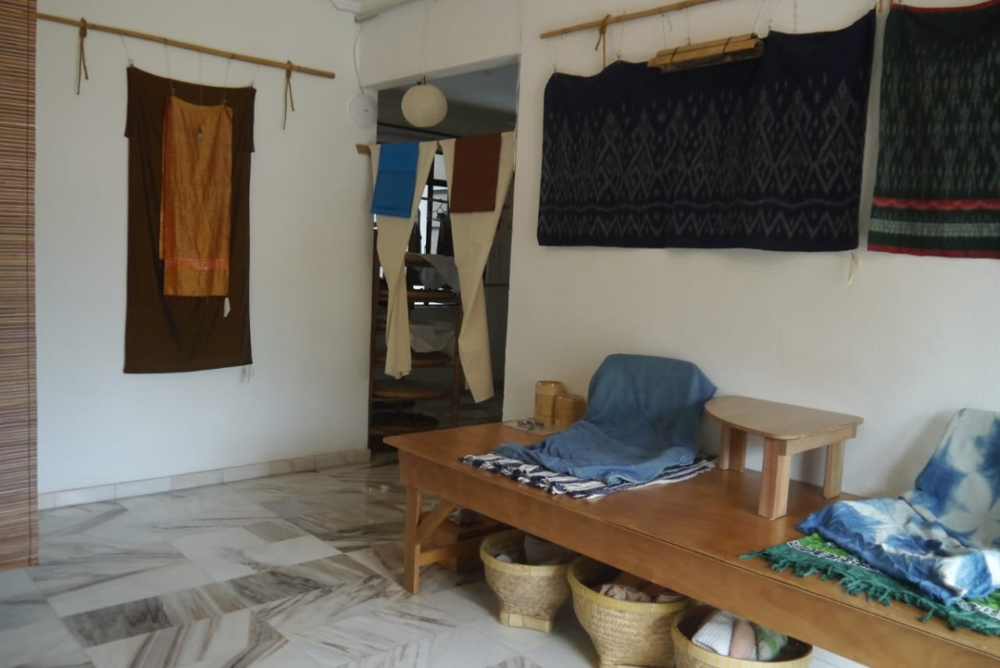

Guests joined a journey of discovery as the Vivarium co-evolved and provided a space to share solutions to everyday environmental impacts; [Bokashi soil building](../lifeStylesForChange/soilAlchemy.md) and [pro-biotic enzyme cleaners](../lifeStylesForChange/waterAlchemy.md) were a large part of keeping the ecological footprint positive. This knowledge was freely shared to inquiring guests.

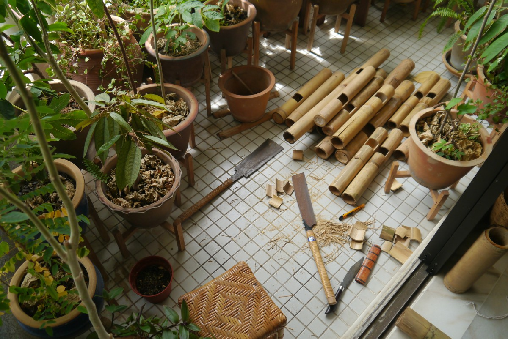

Every stay mattered to this self funded project, contributed and kept this creative living eco space alive, evolving and available to experience.

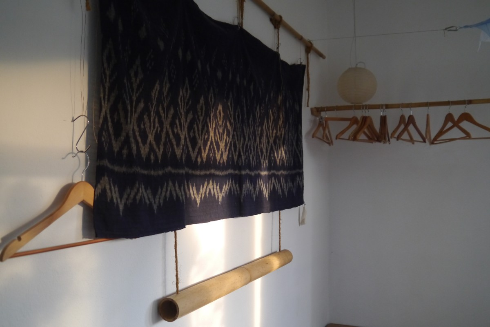

**Vivarium LifeStyle** - Bringing the unique human touch and spirit back from the generic manufactured sea of junk made available by the faceless factory market place. Functional Eco-decor was handcrafted from natural bamboo, wood, coconut and rattan. Handmade textiles of organic cotton, silk and hemp decorated the walls.

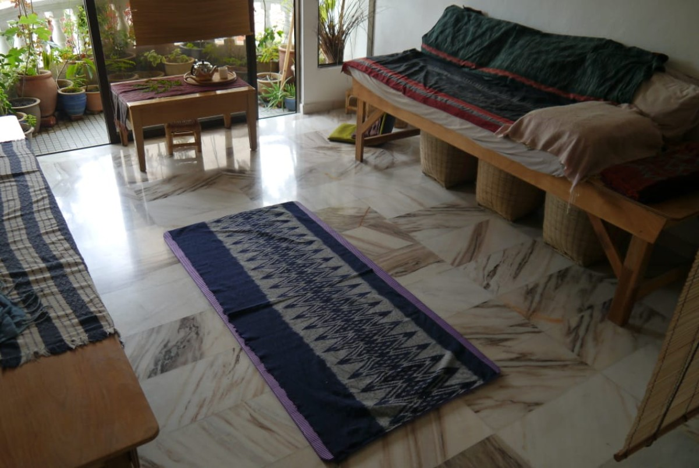

Living room was an open shared space, with beautiful cooling white marble floors, very spacious for any kind of body work. The furniture was locally custom built and designed to encourage healthy body movement, to relax and/or work. Space was ample to enjoy a tea on the patio and experience the company of visiting birds, that where always around, singing, exploring and foraging in the gardens that surrounded the unit.

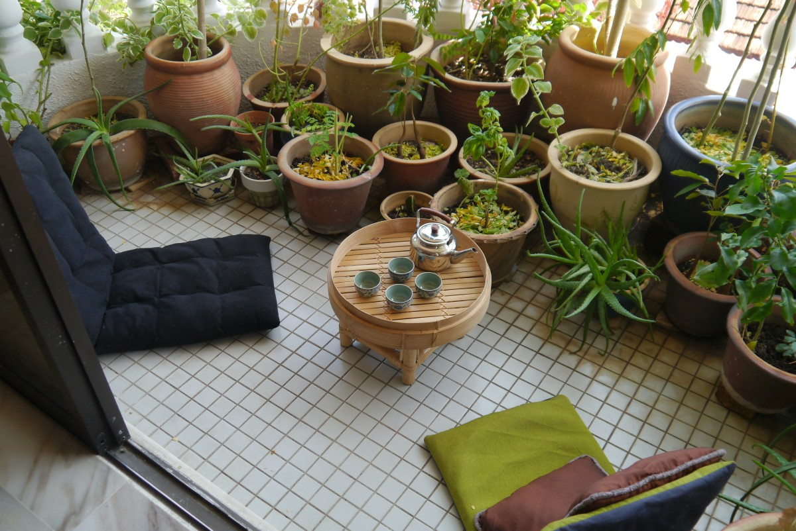

#### Bedroom Options

*A peaceful nights sleep, a little sanctuary in the city, spacious and private.* All rooms included cotton linens and towels.

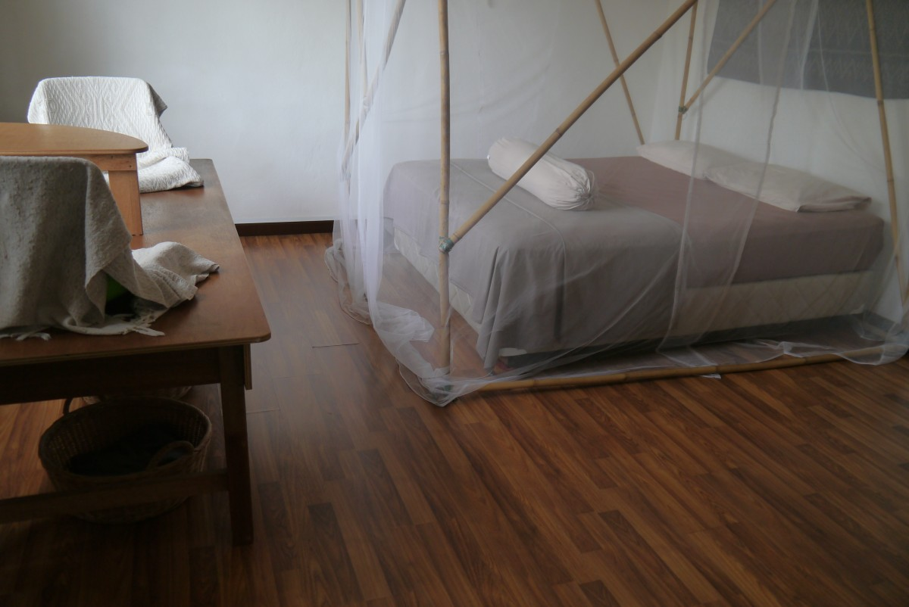

**Queen master bedroom** featured a 4pc ensuite, queen size bed, custom made Polynesian style wood platform and dedicated evaporative cooler. Spacious, even with luggage and two guests in the room one could still easily enjoy yoga. 

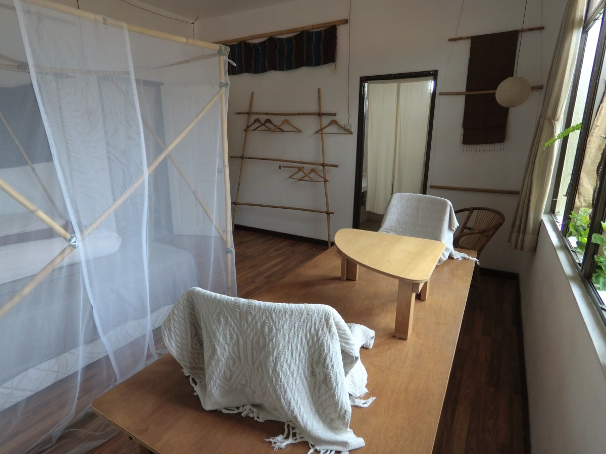

The private attached bathroom has a large vanity, mirror, sink, toilet, small window and full size bathtub with shower. This bathroom did not have hot water, for a hot shower guests accessed the shared 3 piece bathroom just outside the room. This room also featured a dedicated evaporative cooler, the addition of essential oils as part of the experience was offered.

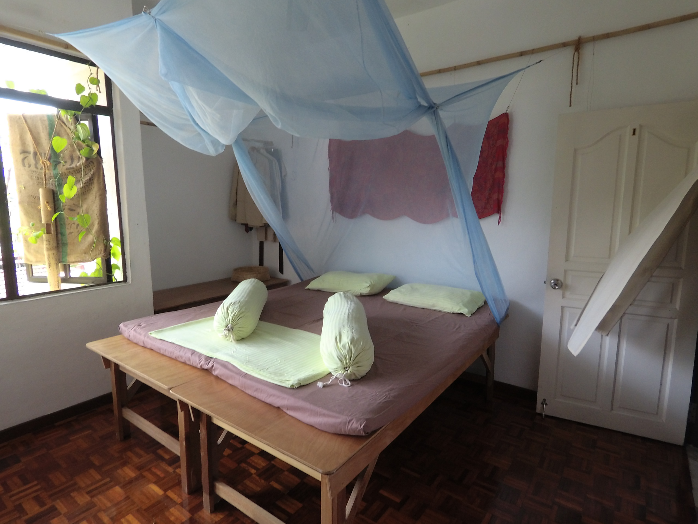

**Double and Single Bedrooms:** each room featured a large corner window garden, natural wood parquet flooring and coconut tatami mats, each on there own custom made Polynesian style wood platform. Two large open custom design closets (double room) and a single large open custom design closet (single room) for easy access with plenty of room to hang clothes.

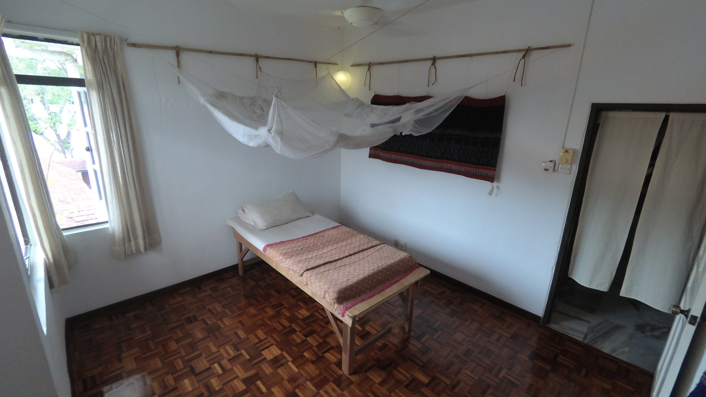

Coconut tatami mats offer spinal support, are naturally breathable and recommended for those that suffer allergies. 

**Shared bathroom** provide a mirror above the sink, toilet and standing shower with hot water, located just outside the bedrooms.

**Vivarium LifeStyle Guidelines**

The Vivarium was a shoe free environment, guests where asked to leave outdoor shoes at the secure entrance to the vivarium.

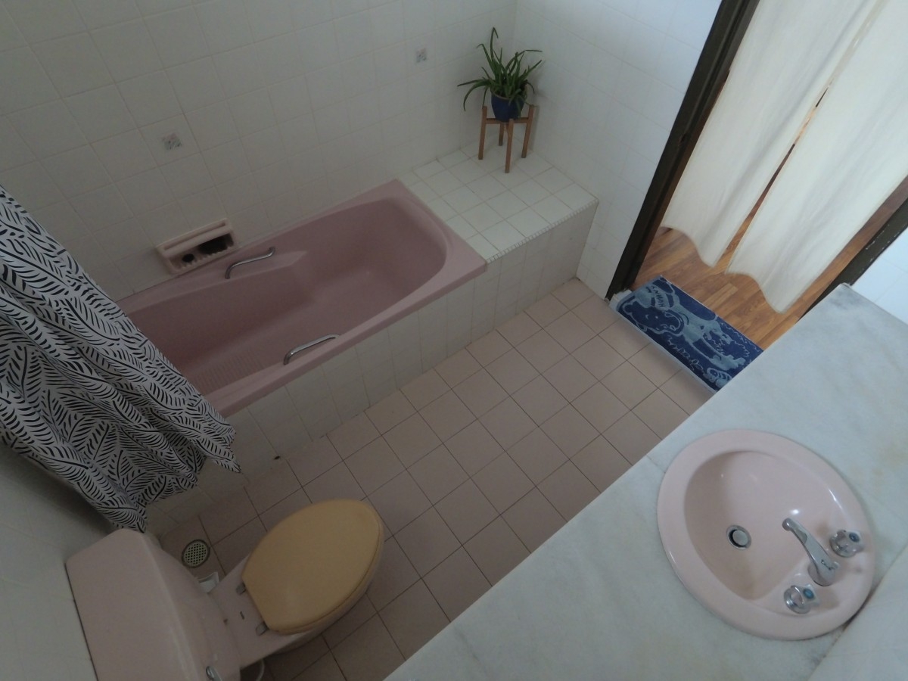

Additionally guests where asked to please shower before laying in the bed, and not lay in the bed with street clothes on (being a hot climate in a shared living space this was a matter of personal requirement). 

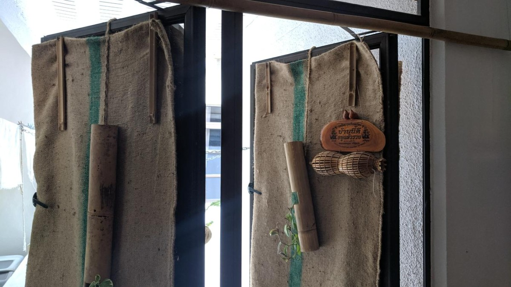

Guests where asked too leave windows open as much as possible for nice air flow and open the door of their room to enjoy and contribute to the flow of the whole space.

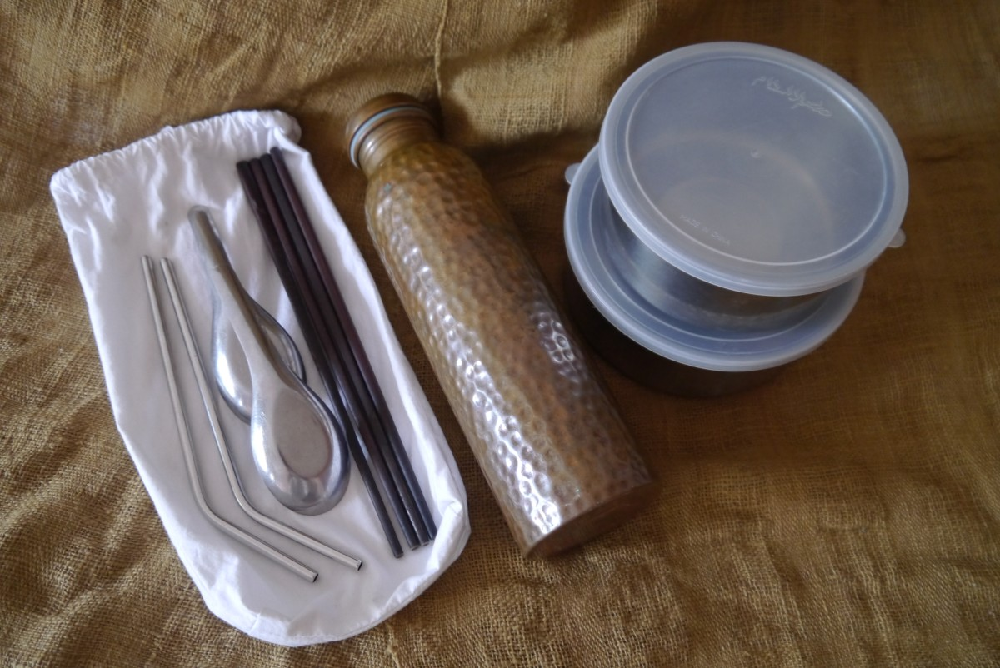

Guest where offered to participate during their stay and refrain from using personal care and body products that contain chemicals, artificial scents and other harmful agents. Eco Eating Out support was also provided with copper water bottle, food containers and utensils.

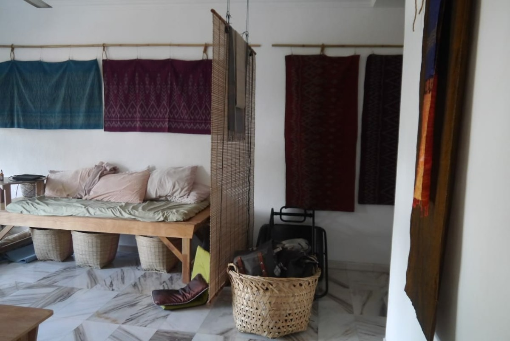

**Guest Access**

Guests had access to the spacious living/dinning rooms. The kitchen was generally not open to guest use, fridge access was made available by request.

**Interaction with Guests**

Host and co-host were often around and someone was always contactable to help with anything guests needed. Host and co-hosts alike all loved good conversation with respect of guest privacy, engagement was at the discretion of the guest.

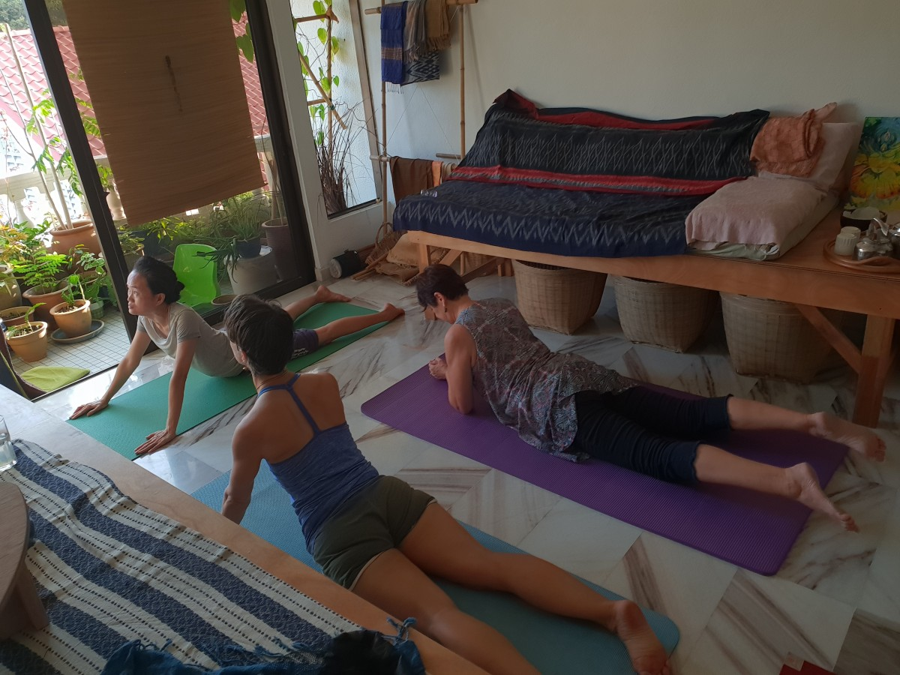

**Other things to note:**

Meals could be arranged.
Drinking water was available for purchase in house.
Laundry service was available for a fee.

This space was mostly shared with the host or co-host, all where quite strict about the house rules. This helped provide a clean and quiet environment for guests to stay. Guests where encouraged to ask questions prior to making a reservation.

#### Resources

[***LifeStyles For Change* Programs**](../lifeStylesForChange)

[***Soil Therapy; Pro-biotic Soil Building with Bokashi***](../lifeStylesForChange/soilAlchemy.md)

[***Water Therapy; Pro-biotic Eco-enzyme Cleaning is Healing***](../lifeStylesForChange/waterAlchemy.md)

#### Explore

[**Guest Reviews**](./proofOfConceptReviews.md)

Many special events took place at the Vivarium in many different forms, Salon Style Programs and Salon Circle Gatherings among them. A few occasions where artfully captured by a talented videographer and photographer, [Hakima.](https://www.lensculture.com/hakima-hamdi)

[***Vivarium Salon Circle*** ~ Singing bowl gathering video compilation](https://youtu.be/7zCHFSwraeY)

[Private Tibetan singing bowl session at the ***Vivarium Salon ~ place of life***](https://youtu.be/ypoLV3G9vRU)

[**Day in the life of an apartment garden**](https://youtu.be/O5F19PW9HsQ)

[**Bokashi Soil Building Instructional Video Link YouTube**](https://youtu.be/6fonPhtzfSc)

#### Connect ~ Ask a question or book an event ...
[Contact Direct on Matrix](https://matrix.to/#/!ibYXXCkubbZiWtkmhX:matrix.org?via=matrix.org)

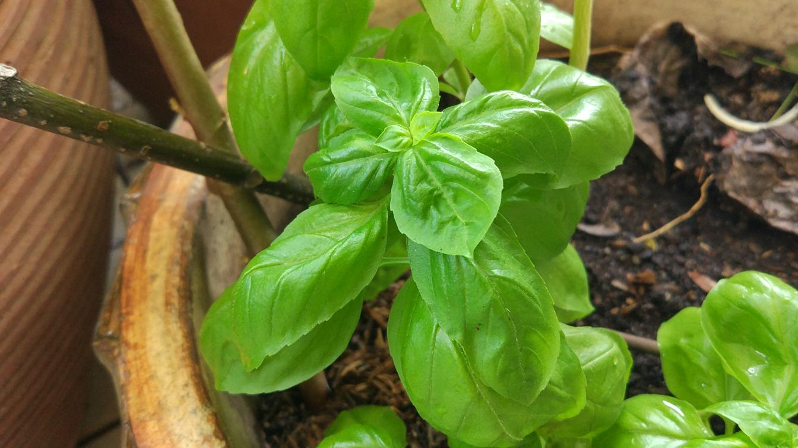

