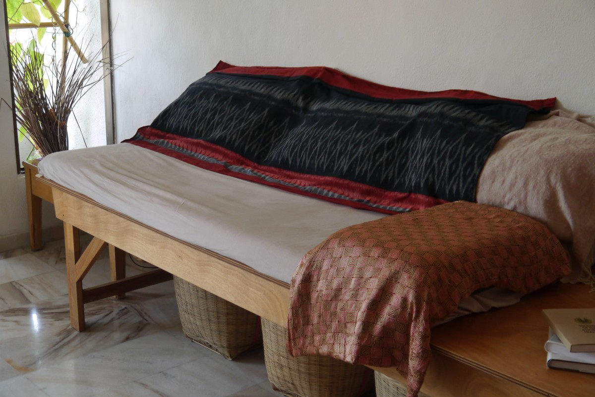

# Bio*Philia* Living: Designing For Connection; The Healing Spirit Of Nature.

***An archaic revival; the sharing of a living language, learning how to discover patterns which are deep and capable of generating life.***

*Proof of concept: Oct 2016 - Jan 2020 (guest reviews available upon request)*

## *Designing Through Spirit; Using curiosity, intuition and imagination, the æsthetics of a natural law.*

**A response to the challenge of her Life; reForming a Relationship With Mother Earth, An Act Of Surrender.**

She does not ask herself what the world needs. She asks herself what makes her come alive, and then begins doing it; what the world needs is authenticity, someone who has come alive.

**The cultivation of a mutually symbiotic habitat, that honors the individual as a *biological organism* in the *built environment*, within the *biophysical environment.***

### Becoming a part of the circle of life. The *symbiotic relationships* and feelings generated between *Wo-Man and Mother Earth* (environment) are highlighted, not human and 'things'.

***Harvesting Knowledge:*** Discovering patterns which are alive, through cultivating the ability of observation, curiosity and intuition. Cataloging felt experiences, sources in the natural environment, of positive biological, physical and emotional states that humans experience then, recreating them in the built and cultivated environments to enhance connection of the emotional, mental, physical and biological health.

#### Living Within The Circle Of Life.

Meaningful living; life-giving and life-sustaining with a high degree of refinement and comfort. Adaptable to all practical needs of life within an attractive built environment.

***Curated to allow the enjoyment of connecting with nature as freely as possible.***

Everyone has an inherit need to connect to nature and other biotic forms due to their *Evolutionary Dependence* on it for *Survival* and *Personal Fulfillment.* This is the shared human birthright; the biological need to connect with things that make living possible.

It is when ones feelings are in touch with the reality of the forces in their environment, that someone can begin to see the patterns which are capable of generating life.

In the process of accepting the truth the deepest passion was reveled. It was in fact a part of the soul that was healed in this process. The compassion of Mother Earth to forgive. And Give. Only when compassion is present will the heart revel the truth, for only then one is capable of facing the truth.

#### *Naturally taping into the abundant emotions of joy, grace, awe, wholeness, passion and compassion that are experienced from recognizing beauty in nature. Bio-logically re-connecting; an archaic revival of Wo-Mans symbiotic microbial Gaian connection, honoring the feminine through feeling, connecting soil to soul.*

***Cross Pollinate; being the gardener, an open hand, bringing seed to soil, the womb of Mother Earth, the beginnings of life, love and endings. Each bloom in the doing of this most holy act.***

Using the biological relationships with *'Mother Earth'* as a path of discovery into the unique characteristics of intentional independent habitats, that not only can influence a spontaneous therapeutic act but can also be used by the designer to open; they are dynamic, adaptable and can be experienced, *generate feelings*, offering a *safe space* and the possibility for trying out inventive solutions and transformation.

#### *Psychobiology, where mind meets matter. The interaction between bio-logical systems and behavior.*

***People are deeply nourished by the process of creating wholeness.***

***Healing environments*** allow someone to draw emotional support from their settings through the Symbiotic Energy, the living energy of the space. One then *feels free* to move around and interact unselfconsciously, to connect and *combine ones life with the life of the living* systems and elements within the built space. Achieved by bringing in a number of high quality visual and intuitive interactions among the bio-logical ecosystems and elements of a built space and its users.

A living design built upon the inherent intuitive 'biophilic' response to natural built forms, natural settings and systems. Designed to generate healthy feeling interactions by encouraging their spontaneous occurrence.

New ways of thinking, seeing and feeling; relating to the Natural World can be expanded, experienced. Causing a total shift of posture, perceptions, beliefs, and thought processes. 

***Transforming ones relationship with the Natural World.*** Making a habit to feel where one is within nature, too understand how they are moving together As One. The 'water', ..., is too polluted ... not just for 'human' consumption.

#### *Authentic Living Design; creating connected living environments that support, restore and regenerate both the physical body and the environment (earth body) have positive effects on the health of a population as a whole, not just the individual within the living design.*

**Just as the ancients danced to call upon the spirits in nature, Wo-Man too, can dance to find the spirits within oneself that have long been buried and forgotten.**

***Discover what kind of meaning to give it ...***

**Life is in motion, every day movement is a dance, what someone sees, smells, hears, how one brings their consciousness to the experience, to a tree, ..., a bird in the garden, and then brings it into the body, that becomes the dance; the felt experience of the shared breath made visible.**

*Preserving the character of somethings true nature is achieved through connection.*

**A ritual is a movement that has a purpose, to achieve something real in someones life. Dancing within life, creates a sense of reverence for the process.**

*... starting over ... nothing lasts ... What someone can have control over is how one copes with what happens, being adaptable to change. ...*

**Art is a way** ...  finding a common way to move forward through to nature ... finding the commonalities.

***Cure is a medical intervention, healing is becoming whole.***

**Recapturing the integration between Life and Style, art ... living the creativity is the most important thing someone has. Dance the essence of things.** *The denial, the courage to confront, the release ... too flow again ...*

Urban environments are not nurturing environments in and of themselves, but with care, can be curated and cultivated into being so. Breaking the role of 'consumer culture,' of 'modern culture,' hanging up the 'cultural costume' and designing a living lifeStyle of ones own, symbiotically connected through too nature. 

***Cultivating intimacy within nature.***

***Honoring the uniqueness of the self,*** breaking free of boundaries, having reverence for ones own body within nature. Avoiding pre-stylization of movement in life, taking off the 'cultural amour', allowing direct experience to evoke feelings. 

Going beyond, using the feelings to expand into the 'living' style of ones life through the kinesthetic sense.

**Love;** to feel how things are, allowing the physical body too recognize itself as part of nature.

***Calling home; Actions that biologically transfer through nature.***

***Contact made manifest.***

#### *Vivarium ~ place of life*

*An interactive space curated to connect; explore, learn, reflect, ... on how people interact, impact and live within personal environments; homes, work, travel, ..., spaces.*

**Vivarium**- (Latin, literally for "place of life"; plural: vivaria or vivariums) is an area, usually enclosed, for keeping and raising animals or (in this case People and biological ecosystems) plants for observation or research. Often, a portion of the ecosystem for a particular species is simulated on a smaller scale, with controls for environmental conditions.

**The way out is a personal responsibility, the way out is in the soil. When the soil is healed the soul follows.**

#### *The Aim; to Harmonize the Natural World Within the Modern World.*

To do it someone need only let it happen in the mind.

**Quality of Life**- *Mind, Body, Earth; Anima Mundi (world soul) Mutually Symbiotic Ecological Connections. Creating live and dynamic, open independent spaces that feel as they have existed long before someones arrival and will remain long after their depart.*

**Environ-mental Health** - An enchanted sensibility can be strategically cultivated to ***'Capitalize On The Use Of The Senses To Create Change'.***

***The Physical Body Is The Placebo;*** the mind’s natural capacity to influence bodily functions and symptoms.

The mind is a medium within which the creative spark that jumps between the pattern and the world can happen. The individual, oneself is only the medium for this creative spark, not its originator.

**Co-evolutionary ecosystems:** Re-establishing and encouraging healthy symbiotic connections within nature (Mother Earth) through sensory experiences; physical and biological interactions, movement, and hands-on meaningful activities. Allowing the brain, body and earth body to establish new, more productive patterns.

The individual is only the medium in which the patterns come to life, and of their own accord give birth to something new.

Inventing a new universe to live in, a universe of possibility. A place where someone is continually discovering how they create their reality, and how they can change it.

#### Location

**George Town, Penang**

Due to the intermingling of the various ethnicities and religions that arrived on its shores, George Town acquired a large eclectic assortment of Colonial and Asian architectural styles. It also gained a reputation as gastronomic paradise.

The Vivarium, central to many George Town attractions and just 500 meters from "Link Bike" a public bike rental station. Pulau Tikus Market/Hawker Center: 1.2km, Botanical Garden: 3.2km and UNESCO World Heritage Site: 2.6km.

**The Neighborhood**

The surrounding low density neighborhood is tranquil with many large trees, and properties with plenty of green space.

#### The Building and Property

A residential, 3-story apartment building with 15 exclusive units, each 1230 square feet in size. With permission, residents were voluntary participants in bokashi soil building and a small food garden was under personal cultivation.

#### *The Vivarium ~ place of life*

In October 2016 occupancy was privately secured for one of the 3rd floor corner units, north-facing with 3 bedrooms.

 

The unique design of the boutique residence offers each corner condo, three outside walls, all with large opening garden windows. Due to this design the Vivarium enjoyed a wonderful open feel, natural light from three sides and fantastic cross breeze.

A conscious decision to experience the smell, sound and feel of an A/C free environment was made (a bold move at 5 degrees north of the equator).

*Intentional privacy screening* was installed allowing guests to keep bedroom doors open; too take advantage and contribute to the *natural flow of fresh air.* 

**Jute window covers where installed, when wet these provide very effective natural air-conditioning,** even when dry keeping the sun off the glass was dramatic, not only to the temperature but also the noise, acting as a natural buffer, the entire vibration was transformed. Additionally, an evaporative cooler was used in the common area that supported the creation of a very pleasant micro climate and natural outdoor feeling. (More details on Eco-deco and micro climates will follow in a separate post.)

**The Private Medicinal Food Garden;** boasted over ***27 large 5 gallon (or larger) containers*** located outside all bedroom windows, as well as ***22+ clay pots*** on the balcony. ***Nearly all plants being edible, medicinal or functional.***

Besides an assortment of herbs, aloe plants, and experimental seedlings like Durian, the garden was home to 23 Moringa oleifera trees, Papaya trees, Coconut seedlings, Sacha inchi vines and a passion fruit vine (that tried to take over the laundry wire) where among the numerous plants.

It became difficult to catalog the ever changing garden. Growing a diverse garden is magical, cultivating pleasure, making it easy for someone to enjoy the discovery process towards an Eco-responsible lifestyle. ***The gardens of the Vivarium, once established, provided (and often exceeded) all nutritional requirements for the host and co-host.*** (More details on plant selection and care will follow in a separate post.)

***Curated Gardens made for eating, smelling and touching flowers.***

All rooms having several opening windows with large concrete window boxes provided ample space for gardens, easy access and beautiful ambience. The windows being covered in jute became gardens themselves and where home to over ***40+ bamboo hanging planters and Kokedama*** (苔玉, in English, literally "moss ball") a ball of soil, covered with moss, held by being wrapped in coconut cord on which ferns and other medicinal plants grew.

Guests where offered garden care responsibilities and to participate in any activities that may have been happening at the time. These activities ranged from harvesting and processing moringa leaf and other medicinal plants, too ***bio-logical body and earth care*** activities; in house organic refuse management, pro-biotic fruit enzyme and soil building production. Guests where also encouraged to use the in-house [Eco friendly body, home and earth care products.](../lifeStylesForChange/waterAlchemy.md) Bathrooms had bidet water hose installed and small cotton towels were provided in place of toilet paper.

Rooms had low voltage LED lighting providing a pleasant healthy light, a large ceiling fan, and mosquito net to cover the bed.

Kitchen was well supplied for preparing modest meals. Washing machine was locate off the kitchen. Drinking water was arranged for delivery and offered to guests at market rate.

This was a shared private residence. At times the entire space was made available, mostly there was a live in host (curator Anna) or co-host that helped the project literally stay alive, always self selected and in harmony with the concept. Guests where offered laundry service and a small 'A La Carte Menu' was also available for a modest fee.

#### *Marketing*

**The Vivarium experience was marketed to "Creative Eco-Conscious Travelers" using Airbnb and Workaway platforms with a small team of dedicated local friends that helped make it all possible. The Vivarium listings attained "super host" status within its first three months on the Airbnb platform, taking 411 bookings with guests from the world (Oct 2016 - Jan 2020).**

Guests joined a journey of discovery as the Vivarium co-evolved and provided a space to share solutions to everyday environmental impacts; [Bokashi soil building](../lifeStylesForChange/soilAlchemy.md) and [pro-biotic enzyme cleaners](../lifeStylesForChange/waterAlchemy.md) were a large part of keeping the ecological footprint positive. This knowledge was freely shared to inquiring guests.

Every stay mattered to this self funded project, contributed and kept this creative living eco space alive, evolving and available to experience.

**Vivarium LifeStyle** - Bringing the unique human touch and spirit back from the generic manufactured sea of junk made available by the faceless factory market place. **Functional Eco-decor was handcrafted from natural bamboo, wood, coconut and rattan. Handmade textiles of organic cotton, silk and hemp decorated the walls.**

Living room was an open shared space, with beautiful cooling white marble floors, very spacious for any kind of body work. ***The furniture was locally custom built and designed to encourage healthy body movement, to relax and/or work.*** Space was ample to enjoy a tea on the patio and experience the company of visiting birds, that where always around, singing, exploring and foraging in the gardens that surrounded the unit.

#### Bedroom Options

*A peaceful nights sleep, a little nature sanctuary in the city, spacious and private.* All rooms included cotton linens and towels.

**Queen master bedroom** featured a 4pc ensuite, queen size bed, custom made Polynesian style wood platform and dedicated evaporative cooler. Spacious, even with luggage and two guests in the room someone could still easily enjoy yoga. 

The private attached bathroom has a large vanity, mirror, sink, toilet, small window and full size bathtub with shower. This bathroom did not have hot water, for a hot shower guests accessed the shared 3 piece bathroom just outside the room. This room also featured a dedicated evaporative cooler, the addition of essential oils as part of the experience was offered.

**Double and Single Bedrooms:** each room featured a large corner window garden, natural wood parquet flooring and coconut tatami mats, each on there own custom made Polynesian style wood platform. Coconut tatami mats offer spinal support, are naturally breathable, cooling and recommended for those that suffer allergies. 

Two large open custom design closets (double room) and a single large open custom design closet (single room) for easy access with plenty of room to hang clothes. Large baskets were provided for smaller items. Unpacking was easy and quick, everything within reach and functional, created a feeling of being at home within moments.

**Shared bathroom** provide a mirror above the sink, toilet and standing shower with hot water, located just outside the bedrooms.

**Vivarium LifeStyle Guidelines**

The Vivarium was a shoe free environment, guests where asked to leave outdoor shoes at the secure entrance to the vivarium.

Additionally guests where asked to please shower upon arrival, before laying in the bed, and not lay in the bed with street clothes on (being a hot climate in a shared living space this was a matter of personal requirement). People often miss how effective it is to **actively cool down the physical body, *arriving* into the space** through this active participation, washing the street off and becoming a-part of the vivarium.

Guests where asked too leave windows open as much as possible for nice air flow and open the door of their room to enjoy and contribute to the flow of the whole space.

Guest where offered to participate during their stay and refrain from using personal care and body products that contain chemicals, artificial scents and other harmful agents. **Eco Eating Out** support was also provided with copper water bottle, food containers and utensils.

**Guest Access**

Guests had access to the spacious living/dinning rooms. The kitchen was generally not open to guest use, fridge access was made available by request.

**Interaction with Guests**

Host and co-host were often around and someone was always contactable to help with anything guests needed. Host and co-hosts alike all loved good conversation with respect of guest privacy, engagement was at the discretion of the guest.

**Other things to note:**

Meals could be arranged.
Drinking water was available for purchase in house.
Laundry service was available for a fee.

This space was mostly shared with the host or co-host, all where quite strict about the house rules. This helped provide a clean and quiet environment for guests to stay. Guests where encouraged to ask questions prior to making a reservation.

#### Resources

[***LifeStyles For Change* Programs**](../lifeStylesForChange)

[***Soil Therapy; Pro-biotic Soil Building with Bokashi***](../lifeStylesForChange/soilAlchemy.md)

[***Water Therapy; Pro-biotic Eco-enzyme Cleaning is Healing***](../lifeStylesForChange/waterAlchemy.md)

#### Explore

***Guest Reviews Available Upon Request***

Many special events took place at the Vivarium in many different forms, Salon Style Programs and Salon Circle Gatherings among them. A few occasions where artfully captured by a talented videographer and photographer, [Hakima.](https://www.lensculture.com/hakima-hamdi)

[***Vivarium Salon Circle*** ~ Singing bowl gathering video compilation](https://youtu.be/7zCHFSwraeY)

[Private Tibetan singing bowl session at the ***Vivarium Salon ~ place of life***](https://vimeo.com/549198724)

[**Day in the life of an apartment garden**](https://vimeo.com/549190610)

[**Bokashi Soil Building Instructional Video Link Viemo**](https://vimeo.com/549116720)

#### Connect ~ Ask a question or book an event ...
[Contact Anna Direct on Matrix](https://matrix.to/#/!ibYXXCkubbZiWtkmhX:matrix.org?via=matrix.org)

