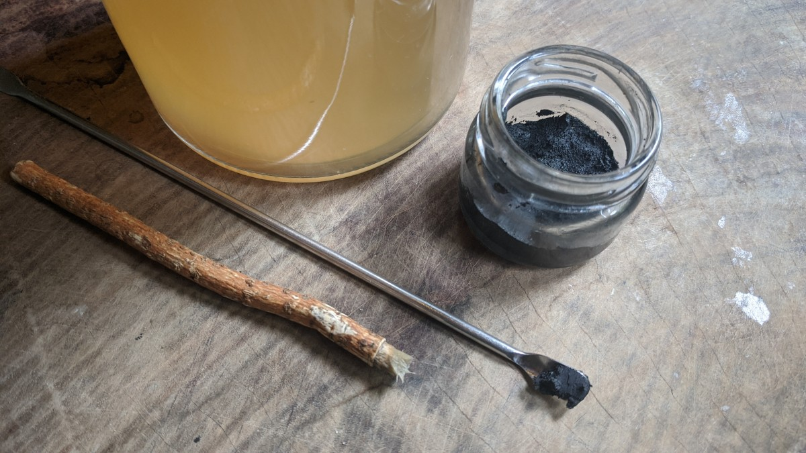

# *Legendary Beauty Lives In The Alchemy Of Fermentation.*
*Practical guide to incorporating fermented plant based essences as part of a Living lifeStyle.*
***Naturally; Antiseptic, Anti-Bacterial, Anti-Fungal and Anti-Viral.***

## *Bio-Logical body and earth care,* going far beyond the physical body, connected through too nature.

**An essence of transformation; Naturally heal and protect the skin while uplifting the ancestral spirits, a power to illuminate beauty that transcends definition.**

### *Conservation as a consequence of production.* [Pro-biotic Eco-enzyme](./waterAlchemy.md) plant based essences are high quality nourishing and gently therapeutic skin care treatments that produce results, *soul food* for the micro-biome, skin care and earth care excellence.

#### *Refinement of the ancestral senses; from the physical body through to the earth body, connecting with things that make living possible, created by harnessing the trans-formative power of fermentation to illuminate the beauty within, soil to soul.

***Radical self care that biologically re-connects.** A way to heal and support the physical body that transfers through too nature, the earth body. Remarkably enough the Skin, the rivers and all that come in contact, the birds ... the earth soil, find natural healing benefits from using pro-biotic fermented essences.*

***A pro-biotic rich super food for the micro-biome of the whole body, soil to soul.***

Its remarkable ability to increase the nutrient value of food has led to vast in-depth and broader studies of fermentation. Home fermenting enables one to re-discover and understand the multiple benefits of this living archaic ***goddess technology.***

#### *Since ancient times, Women have explored the skillful ways of beauty through nature.*

Cleopatra and Consort Yang Gui Fei, exalted women of great beauty, by no surprise were accomplished alchemists. Both experimenting with various methods of natural beauty care, incorporated fermented ingredients into their beauty regimes, making them forerunners in the art of beauty and skincare.

According to ancient legend, while Cleopatra and Consort Yang lived in different eras and civilizations they shared a similar 'spa menu' that included; fermented milk baths, drinking pearls dissolved in fermented vinegars, and consumed beverages made from fermenting a mixture of honey and water known as 'mead'- the oldest alcoholic beverage in the history of humankind.

****Mother Earth Is A Living Technology;*** fermentation is an ancient alchemical art with its first documented use by humans around 7,000-8,000 years ago.

***Illuminated Essences*** embody the wisdom of plants through fermentation, refined and elevated by nature they can heal and nourish in deep and trans-formative ways. Every drop engineered by nature to breathe the vitality of life through the physical skin body. Cultivating luxurious formulations to deeply illuminate and fortify, dynamically restoring sensations of confidence throughout the whole body.

**From the Physical Body to the Earth Body, a Bio-Logical potential to large to ignore.** Fermentation is a porthole to the most intimate relationships between Wo-Man, microbe and Mother Earth. A tangible way to bio-logically re-connect and interact, becoming apart of the larger web of life. **A way to cultivate and reclaim a bio-logical relationship within Nature, Mother Earth.**

#### The link between fermentation and the skin micro-biome and why they work so well.

***Fermented ingredients are like a supercharged turbo boost for any skincare routine, capable of restoring natural skin flora.***

The alchemy of fusing with the wisdom of plants, generated by the trans-formative power of fermentation, produce essences that can be combined with modern cosmetic ingredients, as well as a host of other ingredients including those that occur naturally in the skin and are indispensable for skin health. 

***Fermented essences, when used correctly create a healthy environment, essential for the recovery of domesticated skin flora.***

As macrobiotics are to the digestive track they are to the skin; the largest organ of the body and the most exposed to the elements. The skin, akin to the digestive track has its own immune system. Much of the skins flora are bacteria of which there are around 1,000 species from 19 phyla. Base line microbial culture only makes up 5% of the skin biota. Much of the rest can change rapidly depending on environmental changes and many other factors. Moreover, there are 20 different sights on the human body that provide different conditions as such, bacterial makeup, skin biota at these locations differ greatly. There are three main ecological areas: sebaceous, moist and dry. A sebaceous gland is a microscopic exocrine gland in the skin that opens into a hair follicle to secrete an oily or waxy matter, called sebum, which lubricates the hair and skin of the body.

The skin is an ecosystem composed of approximately 1.8 m2 of diverse habitats that support a wide range of microorganisms. The primary role of the skin is to serve as a physical barrier, protecting the body from potential assault by foreign organisms or toxic substances. The skin is also an interface with the outside environment and, as such, is colonized by a diverse collection of microorganisms including bacteria, fungi and viruses.

***To perceive the skin as an ecosystem***; composed of living biological and physical components occupying diverse habitats, can help advance ones understanding of the delicate balance between host and microorganism. Cosmetics, soaps, hygienic products and moisturizers are also factors contributing to the variation of skin micro-biota. These products alter the conditions of the skin barrier, their effects on skin micro-biota and overall long term health remain unclear.

***The skin is a continuously self-renewing organ,*** constantly shedding, the skin surface is the final stage, skin cells having begun their migration from the basal layer 4 weeks earlier. These cells constantly divide to form new cells to replace the squamous cells that wear off the skin's surface. As these cells move up in the epidermis, they get flatter, eventually becoming squamous cells, the skins outermost surface, where they are eventually shed.

#### *Fermentation: the alchemy that imbues the skin with power.*

- By replenishing moisture deep in the stratum corneum epidermis, outer layer of the skin. Feel uplifted as it plumps and firms skin, creating skin that feels soft and bouncy.

- Skin becomes prone to dryness with age. Fermented essences smooth skin through re-hydration and minimizes the appearance of fine lines due to dryness.

- Tightens the skin, creating a visage that appears more contoured, defined, and bright.

#### *Fermentation applied to transform natural plant based skincare ingredients bring many benefits to the skin.*

**Fermentation increases the quality and quantity of useful components, creates new more potent ingredients and increases the ease of ingredient absorption.**

Fermentation is a form of biological activity that occurs when material to be fermented is combined with live fermenting agents, such as naturally occurring yeast that act to acquire energy. 

Plant based organic ingredients in their original form contain useful nutritive components in fixed quantities and some harmful components. Through fermentation, nutrient enhancement and detoxification occurs. The quantities of such components are enhanced and can be raised, other harmful components are detoxified and further transformed.

This process generates new ingredients which were not originally present in the material. The process changes the chemical structure of the ingredient by breaking them down into basic building blocks. These “basic building blocks” include vitamins, essential minerals, and amino acids in their purest form. Broken down by the microbes, bacteria, and yeast, long before they are actually applied to the skin. Nutrients are smaller, more concentrated molecules that are ready to get to work within the skin. Given the fact that fermentation causes the molecules to be smaller, they tend to absorb better. The lightweight essence is readily accepted and absorbed, immediately seeping deep into the skin.

Because of this natural process, fermented skin-care products generally contain higher, more ***potent concentrations of vitamins and antioxidants**, which help to fight free-radical damage and protect against UV damage. Fermentation also produces naturally gentle fruit and sugar acids, which exfoliate skin for a healthy glow. Amino acids, act as the building blocks of peptides which help fight fine lines and wrinkles.

***Deliciously rich, gourmet food for the micro-biome of the skin.*** Teaming with antioxidants that decelerate the aging of cells. Leaving a refreshing, soothing sensation as it gently conditions the skin. Its non-sticky finish allows users to follow with the application of natural plant oils or cream products.

#### The link between fermentation and the skin micro-biome.

**Fermentation naturally produce: amino acids and peptides that promote healthy cellular renewal.**

**Fermented essences have the ability to re-colonize the skin flora, helping to naturally balance the skin micro-biome.** The fermentation process creates something called post-biotic metabolites, the chemical byproducts of bacteria, which show up in the form of peptides, enzymes, and acids. This vast array of compounds play an extremely important role in the regulation of health and in the maintenance of a healthy micro-biome. The side effects of these chemical reactions also have **anti-inflammatory benefits**. Enhancing the skin flora with a better environment for calmer, less inflamed skin, and a more intact skin barrier. 

**Alpha hydroxy acid-** AHA, the all-important ingredient that **mildly exfoliates**. Working by accelerating skin cell turnover gently exfoliating, helping slough away dead skin cells to reveal its natural gorgeous glow. **Acts as a moisturizer and humectant, meaning it draws water into the skin**, helping to plump-up the skin producing a smooth, luminous appearance.

**Glycolic and Lactic acid-** are both known for making the skin extremely soft while also brightening. Both are members of the AHA family. Glycolic is derived form sugar cane while lactic acid is from milk. Both help prevent and reverse signs of aging by **increasing the collagen production** of the skin. Effectively improving skin tone of post-inflammatory hyper-pigmentation (the darkness that gets left behind after acne, a burn or injury to the skin), pigment issues like melisma, sun spots and dull looking skin.

Like AHAs it also helps with acne, blackheads, and whiteheads. Working to clear pores and control breakouts without stripping moisture levels. Gently removes dirt and oil without over-drying the skin, and helps protect skin from environmental aggressors.

**Vitamin B3** from kefir whey, B3 is converted to niacinamide in the body and can help **boost immunity and build proteins in the skin** and lock in moisture to prevent environmental damage. Niacinamide helps build keratin, a type of protein that keeps the skin firm and healthy. Niacinamide can help the skin grow a ceramide (lipid) barrier, which helps retain moisture. This is beneficial for all skin types, especially suitable for those with eczema or mature skin. **Minimizes redness and blotchiness, and reduces inflammation. Keeping skin smooth and moisturized over time reduces pore size.**

The benefits of moisture retention aren’t just for those with dry skin types. Niacinimide can also **help regulate oil production of the sebaceous glands,** naturally preventing the glands from over producing.

Niacinamide can simultaneously rebuild healthy skin cells while also protecting them from damage caused by ultraviolet rays and is an effective treatment for hyperpigmentation, lightening dark spots. **Niacinamide increases collagen production, minimizes fine lines and wrinkles, protects against oxidative stress and helps build cells in the skin while also protecting them from environmental stresses, such as sunlight, pollution, and toxins.** Over time, one may see fewer lesions and improved skin texture.

**This is why properly fermented essences are so good at fighting the signs of aging.**

**A perfect balance for the most sensitive skin. Used as a *whole body* therapeutic healing wash,toner, moisturizer, serum or mask.**

#### *Spa Quality Gently Therapeutic Treatments For Daily Use.*

There is a stage of transition, as the skin detoxifies and comes back into equilibrium with it own natural healing abilities. Many things can and will feel and look different as the skin flora adjusts to the new nutrients.

**Starters and ingredients.**

**Some Powerful Fermentation Starters:** dark sugars, molasses, [kefir whey](./kefirMilkAlchemy.md) or rice water can all be used interchangeably.

Rice water is obtained from washing rice; before cooking rice, first rinse the rice with water, then submerge rice in water so rice is about one inch below the surface, stir vigorously and allow to rest for 5 to 30 minutes depending on the rice. (Some rice will start to swell faster that others.) Stir once more before filtering. Reserve this water for the starter. Cook rice as per normal.

**Ingredients** can vary greatly, some recommendations can include: spent green or black tea leaf, aloe vera gel from live plant, flowers fresh or dried, fresh or dried whole or crushed remnants from herbal infusions such as aromatic flowers, ginger, crushed long pepper, whole or crushed spices ... citrus and pineapple remnants are especial powerful. The whole idea here is to upscale organic bio-remnants or otherwise under-utilized organic matter in ones environment, such as collecting plant matter from the surrounding ecosystem that are otherwise discarded or unused. Caution should be taken when wild harvesting to not cause depletion, unless intentional (such as removal of non-native and invasive species).

**Follow fermentation instructions in ["Water Alchemy"](./waterAlchemy.md).**

Once the essence is filtered a number of products can be further created using this base. **Three distinct base components can be captured form this initial ferment. 1) solid filtrate, 2) paste or sediment essence and 3) clear liquid essence.** All three components are viable, alive and can be used in different ways to create a myriad of novel therapeutic body products. 

What is skin's pH? The optimal pH value of skin on most of the face and body lies between 4.7 and 5.75. A pH of 7 (that of pure water) is considered neutral. Anything below that is acidic and above it alkaline, so skin's natural pH is mildly acidic. Fermented essences fall in the lower range, 3 to 5 which is ideal for skin care. PH strips to check the levels of ferments are very helpful.

No special care is required other than a clean space to work. The liquid essences and their counterparts are safe even in this undiluted form. If contact is made within the eyes it will sting, simply dilute, wash the face with fresh water. There is absolutely no risk of injury even to the most sensitive age.

#### *Using fermented essences and their counterparts to heal and clean the body can take many forms, this will cover some basics.*

Firstly, this is not soap, it will not lather, however, it also will not degrade or strip the skin of its natural moisture. All dilution ratios are a guide. Keeping things modular for creative flexibility is a personal preference, mixing in small batches also helps to avoid waste. The consistency, working with liquid essences is one of the biggest hurdles to mentally overcome.

#### *Body And Hair Wash* 

Pure clear liquid essence can be used **full strength or diluted**, and are gentle enough for the most sensitive of areas. Essences can correct and balance the PH of the skin and most importantly cleanse and close the pores.

**A dilution ratio of 1:1 essence to clean water is a good place to start.** 

The essence can also be combined with ones favorite shampoo or body wash, a ratio of 100 parts essence to 3 parts manufactured agent is a nice place to start (30ml agent to 1000ml full strength pure clear essence or diluted). Play with the ratio and find the sweet spot for ones self. This is a great way to introduce fermented essences and wean the body from using manufactured agents all together.

**For hair application;** dampen the hair evenly, then with a spray bottle or with a repurposed shampoo bottle, apply liquid essence directly, massage into the scalp, go slowly and apply more if needed. Try to avoid the eyes, or if appropriate keep them closed and apply to the face at the same time, giving the face a nice massage with a face cloth and rinse with water. 

Pure fermented essences, diluted with clean water or full strength, can be left in the hair or on the surface of the skin for as long as desired, however one will want to have a face cloth handy to clear and dry around the eyes to avoid discomfort. Rinsing the essence from the hair is also optional.

**For the body** two methods, shower and bath. **For the shower,** dampen the skin and turn off the water. Using a spray bottle, a repurposed shampoo bottle or a bowl, get the entire body wet with the essence. Starting from the neck down, using a body cloth or soft body brush, wash and massage the body moistening the skin with the essence. Taking some time to enjoy the aromatic process, giving the essence an opportunity to enter the skin while applying the essence to the entire body. Brush or with the cloth apply strokes in an upward motion, up the neck and up the arms starting from the hands, all the way along to the feet massaging or brushing in the essence in the opposite direction to gravity. Once complete turn the water on and rinse off. **The bath** is a much easier process of simply adding as much essence to the bath water as desired, using a similar method of attention to brushing or cleaning the body as described above.

**Facial Toner and makeup remover;** pure clear liquid essence can be used full strength or diluted at a ratio of 1:1 with clean water. Apply with a clean cloth or cotton ball. This toner can be combined with facial oils such as almond oil, coconut oil, or moringa oil and clear alcohol for a powerfully gentle makeup remover.

#### *Facial Mask and Body Scrub*

**Facial masks** using any of the three essence, each can be used full strength or diluted as desired, combine with powdered manufactured or hand crafted facial masks. Facial clays or powdered herbal masks, all are easily blended into the fermented essences. Undiluted essence paste or solid filtrate is ideal for this application, used on their own or blended together as a mask. Simply massage into the skin, allow to dry or rinse off after massage is completed. 

**For a body scrub.** Mixing spent dried coffee grounds with undiluted essence paste or solid filtrate is a personal favorite that is often used as a facial and whole body treatment.

**Pedicure Treatments** are a simple and easy process, add desired amount of clear essence or paste essence to a foot bath and soak. Brush and trim nail ... as per ones usual process. Body scrub can also be used for this application.

When using solid filtrate ensure the pieces are small enough to easily flow down the drain or place a screen over the drain to catch them.

#### *Therapeutic Personal Hygiene, oral care, wound care, diaper rash, fungal treatments, yeast and bacterial infections.*

Fermented essences are a powerful tool for wound healing and bringing the body back into balance. From diabetic wounds, fungal infections, bacterial infections, yeast infections to diaper rash or a simple cut, fermented essences are magical. Washing with full strength or diluted essences and applying as a 'toner' prior to covering is very effective for covering a wide range of skin issues. 

**Fermented essences when brewed properly, having a PH range of 4 to 5, ideal for the most sensitive of areas and makes for a super therapeutic vaginal wash and baby care, gentle enough for daily use they maintain microbial and ph balance deep into the skin body.**

Yeast infections are fungal in nature, whereas Bacterial vaginosis (BV) is bacterial.

An overgrowth of Candida fungus causes yeast infections.

An overgrowth of bacteria in the vagina causes BV.

Changes in vaginal pH may trigger BV. Changes in pH can cause the bacteria that naturally grow inside the vagina to become more dominant than it should.

The most common culprit is an overgrowth of the Gardnerella vaginalis bacteria.

Vaginal pH can fluctuate for many reasons, including:

- hormonal changes, such as menstruation, pregnancy, and menopause
- douching or other excessive “cleansing” methods
- having penile-vaginal intercourse with a new partner

Yeast infections can develop if there’s an overgrowth of Candida fungus in the vagina.

This may result from:

- high blood sugar
- antibiotics
- birth control pills
- hormone therapy
- pregnancy

**Fermented essences are a treasure trove of health for vaginal health. Perfectly balanced and gently therapeutic, healing and preventative care.**

Studies have shown that when taken, probiotics will improve symptoms for those who already have a yeast infection or bacterial vaginosis. Probiotics are also able to prevent a potential infection. These bacteria work to balance out the pH level of the vagina, which makes for a healthy and hospitable environment.

**Oral Care**
Pure clear essence made from orange and pineapple are especially powerful and are effective after care treatment of root canals, can be used as a seriously powerful therapeutic mouth wash for wound care, and as a replacement for tooth paste.

Adding 100ml of clear alcohol (sake) to 1000ml (1 liter) of pure clear essence is a favorite recipe for oral hygiene. To use first, rinse the mouth out with full strength or diluted pure clear essence or alcohol blend, upon spitting that out, taking another small sip begin to brush the teeth as normal. Paste essence can also be used for this application. Once brushing is complete, rinse once more with pure clear essence, alcohol blend or clean water.

**Blending essence paste with a small amount of remineralizing tooth powder/paste is a wonderful experience.**
 
Giving up store bought toothpaste, ... its been a journey to find the magical combination.

YEARS of hunting and blending, seeking for a toothpaste! YEARS! Finally, after suffering to the bottom of many containers of attempted toothpaste experiments ... Voilà! It appeared. Can not wait to brush the teeth! **It feels like just getting out of the dentist chair from a cleaning!!!!**

***What's inside this mighty little jar!?***

**Illuminated Therapeutic Oral Care - Whitening and remineralizing tooth paste/powder.**

- Moringa oil- enough to just bring together but sill crumbles, added by the drop
- Activated Charcoal- 1 tsp
- Bentonite Clay- 1 tbsp or more if omitting SB
- Organic Egg Shell (fine powdered)- 1/8 tsp
- Himalayan Salt- 1 tsp
- Sodium Bicarbonate- 1 tsp (optional)

*Optional Essential Oils*
- Myrrh oil- 5 drop
- Oregano oil- 5 drop
- Clove oil- 5 drop

Blend essential oils into a small amount of moringa oil, add the blend by dropper to powder, finishing with pure moninga oil to bring to desired consistency. 

**Keeping the mixture slightly dry to use in combination with pure clear essence, essence blend or essence paste. Blending toothpaste with essence of choice at time of use.**

#### *Prevention Is Power!*

Fermented essences, enzymes derived from pineapple (Ananas comosus) and orange (Citrus aurantium L.) peels have been well studied, shown to have antimicrobial as well as anti-inflammatory properties. The synergistic effect of the two fermented essences increases the potency of their **antimicrobial activity against a wide range of bacteria. The high content of polyphenolic compounds and flavonoids in pineapple and orange peel fermented essences are found to be responsible for their excellent antimicrobial and antioxidant activities. Bromelain enzymes from fermented pineapple essence are shown to be effective in killing Enterococcus faecalis** by disrupting the peptidoglycan and polysaccharide components of bacterial cell membranes.

Enterococcus faecalis up until 1984 was commonly called Streptococcus faecalis.

With the advent of antibiotic therapy, it has emerged as a multi-drug resistant, hospital-acquired pathogen.

While there are 17 or more species of Enterococcus, only two are commonly found in humans: E. faecalis and E. faecium.

Enterococcus faecalis is a type of bacteria, typically present in the gut and bowel. In some cases, this bacterium can also be found in the mouth or vaginal tract.

In healthy people, when present in normal colony counts, E. faecalis does not usually cause a problem.

However, if colony counts become to high, it can easily spread to other areas of the body, and can cause life-threatening infections. People in hospital settings or who have underlying health conditions are at a higher risk of developing such an infection.

**Enterococcus faecalis, while normally a gut commensal, is a frequent cause of many serious human infections, including urinary tract infections, endocarditis, bacteremia, and wound infections.**

The bacteria can cause infection in people when it enters wounds, blood, or urine. People with weakened immune systems are particularly at risk, such as those who:

- have weak immunity due to disease or surgery
- are undergoing cancer treatment
- are on dialysis
- are receiving an organ transplant
- have HIV or AIDS
- have had a root canal

People in hospital settings are particularly vulnerable to E. faecalis infection as hospitalized patients tend to have reduced immunity. The common use of intravascular and urinary catheter devices are also contributing factors to the spread of infection, as these instruments are known to frequently harbor the E. faecalis bacteria.

**E. faecalis is believed to be one of the top three leading causes of hospital-acquired infection.**

**E. faecalis is known to cause:**

- bacteremia: the presence of bacteria in the blood
- abdominal and pelvic infections
- urinary tract infections
- oral infections (particularly with root canals)
- septicemia: blood poisoning
- wound infections
- endocarditis: an infection of the lining of the heart
- enterococcal meningitis: an uncommon form of meningitis

**Using Fermented Essences to clean and heal the body and home are a powerhouse of prevention for whole health.**

#### **Drinkable Fermented Shrub/Tonics**

While the very first shrubs, dating back to Roman times were fermented directly from the fruits themselves, it is more common these days to use pre-made vinegar as a base into which the fruit flavors can be infused. The word shrub is derived from the Arabic word sharab, which means “to drink.”

Vinegar infused medicinal drinks have a long history and can be found in cultures spanning the globe.

Shrubs can be enjoyed straight, or used as a base for vibrant cocktails, mocktails (alcohol free), gourmet soda, dressings, and sensational components in entrees and sides. Fermented shrubs or tonics are teaming with friendly bacteria to promote a healthy gut microbiome and help keep the immune system in tip top shape.

The American version of the shrub has its origins in 17th century England where vinegar was used as an alternative to citrus juices in the preservation of berries and other fruits. Fruit preserves made in this fashion were themselves known as shrubs, and this practice carried over to colonial America. By the 19th century, typical American recipes for shrubs used vinegar with berries, left to infuse anywhere from overnight up to several days; afterwards, the fruit would be strained out and the remaining liquid could be mixed with a sweetener and then reduced to make a syrup. The sweet-and-sour syrup would then be mixed with either water or soda water and served as a soft drink, or used in alcoholic cocktails. Shrubs eventually fell out of popularity with the advent of home refrigeration.

Traditional Fermented shrub or tonic can be used in the same way and in place of traditional bitters. Brewing in traditional way is superior to using manufactured vinegars.

 

