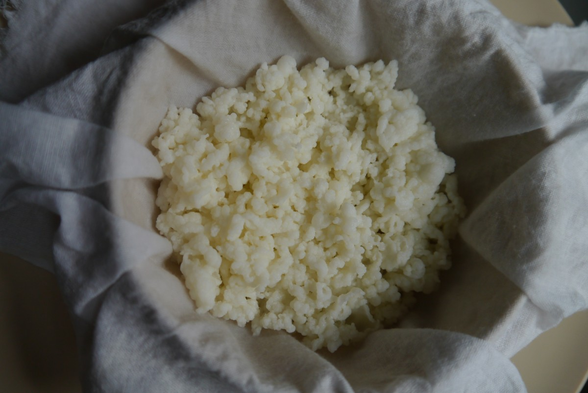
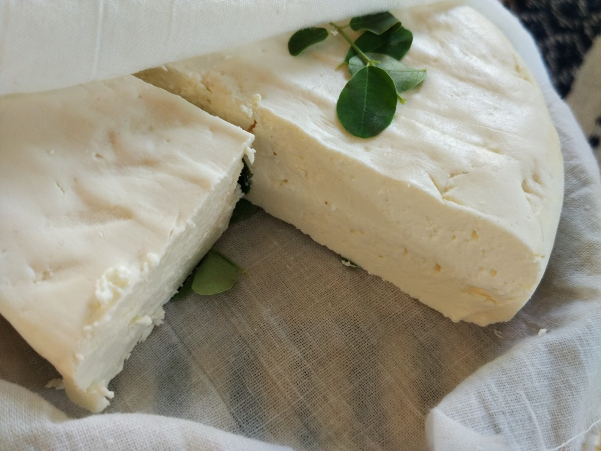
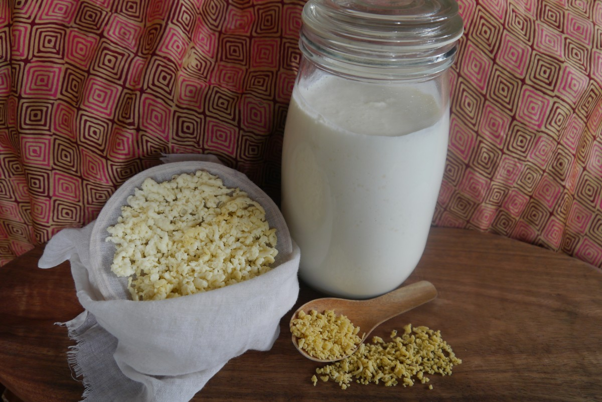

# *An Ancient Living Legacy - The Miracle Of Kefir Milk Culture*

## *A Powerful Therapeutic Food Medicine.*

***Kefir exhibits many health benefits due to extraordinary pro-biotic power.***

**Naturally antibacterial, antifungal, anti-oxidant, anti-allergic, anti-inflammatory, anti-diabetic, anti-mutagenic,... are some of the beneficial properties of the ancient kefir grains.**

### Kefir Milk is a unique bacterial fermentation from a naturally occurring Mother Culture called "Kefir Grains" and produces one of the most *Pro-biotic Rich Therapeutic Food Medicine On The Planet.*

Its name comes from the Turkish word “keif,” which means “good feeling.” Kefir is also known as "Tibetan Milk Mushroom" or "Tara" in Tibetan milk culture. Tara- originating from Sanskrit, meaning "star" and symbolizes *"the light of the soul."*

*Freshly washed kefir grains prepared for natural dehydration.*

#### A Culinary Culture Of Delight ~ The Champagne Of Milk
Producing a beverage thicker than milk that can be made from ever so mildly tart to super-sour and if properly prepared is effervescent.

The symbiotic community of organisms that ferment milk into kefir includes yeasts, which produce alcohol at levels ranging from tenths of a percentage to as high as 3 percent (depending upon length of fermentation and other factors). Because of its alcohol content and effervescence, kefir has been called “the champagne of milks.” Kefir pairs wonderfully with raw or cooked vegetables, fruits and meats, makes beautiful salad dressings, dips, cold soups and can be further cultured into artisan cheese and bread starters.

*Freshly Pressed Kefir Cheese*

***Before the 'fridge' there was Fermentation. Kefir milk cultured and stored properly, remains safe to consume for Over A YEAR with No Refrigeration. Kefir cheese can be aged nearly indefinitely.***

For centuries, it’s been used in European and Asian folk medicine due to the wide variety of conditions it’s been known to cure. Kefir milk benefits are broad and can impact the state of daily life and health dramatically, healing issues like leaky gut and strengthening the immune system.

### *Milk Alchemy* 

***Culturing Kefir requires cycles, to return to, to inspect, to refresh and renew.* The processes required for fermentation were present on earth when Wo-Man appeared on the scene. Bacterial fermentation; The alchemy of the most intimate relationships between Wo-Man, microbe and food.**

#### *A Symbiotic Gaian Connection; Coevolution.*

**Ancient descendants of the living *Mother-culture,* "kefir grains" are a true *Living Legacy* that can theoretically live forever! Symbiotic human engagement keeps this culture alive. Given adequate nutrition and tolerable environmental conditions, healthy kefir grains grow and reproduce rapidly.**

#### Biologically kefir grains evolved from spontaneous symbiosis, are a symbiotic entity that self-reproduces and can not be recreated by science.

***Kefir is a living demonstration of the integration processes by which symbiotic cells evolving from bacteria still occur.***

Kefir grains are soft gelatinous clusters of microorganisms, bacterial and fungal cells that has evolved an elaborate symbiotic arrangement; sharing nutrients, coordinating reproduction and co-create a shared physical form that varies in appearance.

Called grains solely due to the granular structure and appearance. Kefir grains often grow into clumps measuring up to a few inches. Some are smaller and grow in small clusters. Some clumps can be spread out like a sheet. The variation is vast, as in all biological creations, exhibit diverging branches of the family tree.

The dominant micro-flora are Saccharomyces kefir, Torula kefir, Lactobacillus caucasicus, Leuconnostoc species and lactic streptococci. Some yeast are also present. These many beneficial microorganisms are what separates kefir from virtually all other cultured milk products, which typically use only one, and rarely more than three species in the culturing process.

This unique synergy of bacteria and yeasts interact with the milk to make the lightly fermented drink. Kefir can be cultured from any source of animal milk, such as goat, sheep, cow, buffalo and camel, even human milk. Kefir grains can also ferment other non dairy beverages such as; rice or coconut milk and many other nut milks as well as coconut water and herbal teas. The medicinal profile of these will be much different and grain growth will stop, details shared here is in regards to Traditional Kefir Milk, milk being naturally from an animal.

*Kefir milk under ferment, grains in process of drying and grains fully dehydrated for storage or further processing.*

#### *There are many benefits to pro-biotic foods and Kefir is a Star among them.*

Kefir is one of the factors associated with the long life expectancy of the people of the Caucasus, owing to its many health benefits such as anti-stress properties, immune-modulation, cholesterol-lowering, anti-allergenic, anti-asthmatic, anti-microbial, anticancer properties and chemo-prevention against colon cancer, aside from its gastrointestinal beneficial effects.

This pro-biotic packed, nutrient dense, medicinal food, holds the key to helping improve many immune and digestive linked health issues. Kefir contains many bio-active compounds, including as many as 30+ strains of beneficial bacteria that help fight against pathogens, tumors, viruses, carcinogens, ... .

Kefir also contains partially digested proteins (e.g., caseins) that aid in its digestion and absorption by the body. The essential amino acids found in abundance in kefir also regulate protein, glucose and lipid metabolism and exhibit a positive effect on the regulation of body weight, maintenance of immune response and energy balance. Amino acids prevent disability and prolong the healthy life expectancy of elderly. The branched-chain amino acids that are also found in kefir improve cognitive recovery of patients with severe traumatic brain injury.

### *Top Kefir Benefits*

#### *Boosts Immunity*

Kefir contains compounds and nutrients, that support and enhance the immune system and protect cells. It has a large amounts of pro-biotics, the special forces of the microbial world. One in particular that’s specific to kefir alone is called Lactobacillus Kefir, it helps defend against harmful bacteria like salmonella and E. Coli. This bacterial strain, along with the various others, work *symbiotically* to modulate the immune system and inhibit many predatory bacteria growth.

Kefir also contains another powerful compound found only in this pro-biotic drink, an insoluble polysaccharide called kefiran, shown to be antimicrobial and help to fight against candida. Kefiran has also shown the ability to lower cholesterol and blood pressure.

#### *Builds Bone Strength*

Calcium is essential for bone health. 

Kefir made from whole fat dairy has high levels of calcium and holds bio-active compounds that improve nutrient absorption. With all of the most important nutrients including phosphorus, calcium, magnesium, vitamin D and vitamin K2, which are vital in improving bone health and density.

#### *Fights Cancer**

Kefir can be a seriously effective weapon against the spread of these multiplying and dangerous cells.

Some of the bio-active compounds of kefir such as polysaccharides and bio-active peptides have great potential for inhibition of proliferation and induction of apoptosis in tumor cells. Kefiran is also used as an antioxidant and anti-tumor agent. Many studies revealed that kefir acts on different cancers such as colorectal cancer, malignant T lymphocytes, breast cancer and lung carcinoma. 

Kefir benefits in the fight against cancer are due to its large anti-carcinogenic role inside the body, slowing the growth of early tumors.

#### *Supports Digestion and Combats IBS*

Give the alimentary canal, the main digestive passageway in the body, an easy boost with kefir. 

Bacteria in the gut is a tricky balance. Kefir milk helps restore that balance and fight against gastrointestinal diseases like irritable bowel syndrome, Crohn’s and ulcers. Drinking kefir, naturally loaded pro-biotics, also helps your gut after taking antibiotics. The pro-biotic compounds help restore the lost flora that fight against pathogens and aids against the disruptive diarrhea and other gastrointestinal side effects caused by these types of medications.

#### *Improves Allergies*

Various forms of allergies and asthma are all linked to inflammatory issues on the body.

The live microorganisms present in kefir help promote the immune system to naturally suppress allergic reactions and aid in changing the body’s response to the systemic outbreak points for allergies. Some scientists believe these allergic reactions are the result of a lack of good bacteria in the gut. Taking pro-biotics improves allergic symptoms and quality of life.

#### *Heals Skin*

When the gut is out of whack, it can send signals to skin cells that disrupt its natural balance and cause all sorts of problems like acne, psoriasis, rashes and eczema. Kefir is a natural anti-oxidant and helps bring good bacteria back to the forefront bringing homeostasis (stable equilibrium) to the bodies largest organ, the skin. Kefir also benefits the skin as burn and rash treatment.

Kefiran, aside from aiding in the immune system, helps improve the quality of skin wound healing and protective for connective tissue.

#### *Improves Lactose Intolerance Symptoms*

The active ingredient in kefir helps break lactose down into lactic acid, reducing overall content and making it easier to digest. Kefir has a larger range of bacterial strains and nutrients, some only specific to kefir, that help remove almost all of the lactose in the dairy, improving lactose digestion and tolerance.

#### *Kefir Nutrition Facts*

Like all home ferments kefir milk does not have a standardized nutrition content.

*The quality of milk used in the process, preparation method and the presenting microorganisms in the kefir grains determine the quantity and the type of vitamin and mineral compositions.* 

**- Vitamins:** carotene, vitamins A, K, B 1, ­B 2, ­B 5, B 6, C, B 12 and folic acid.

**- Minerals:** Mg, Ca, P, Zn, Cu, Mn, Fe, Co and Mo.

***Rich in amino acids-*** ammonia, serine, lysine, alanine, threonine, tryptophan, valine, lysine, methionine, phenylalanine and isoleucine. Which play a major role in the central nervous system. 

**Beneficial bacteria and yeasts may include the following:**
Kluyveromyces marxianus/Candida kefyr, Lactococcus lactis subsp. lactis, Lactococcus lactis subsp. cremoris, Streptococcus thermophilus, Lactobacillus delbrueckii subsp. bulgaricus, Lactobacillus casei, Kazachstania unispora, Lactobacillus acidophilus, Bifidobacterium lactis, Leuconostoc mesenteroides subsp. and Saccaromyces unisporus.

#### *Its easy to ascertain that kefir is one of the best therapeutic natural ingredients on the planet.*
**Even with the range in values, kefir produces superior nutrition and easily outranks any store-bought variety.**

**Kefir is easy to prepare and can be cultured to personal taste. Fermenting for a shorter period produces a less sour Kefir. Longer fermentation produces more sourness, also accomplished by using larger amounts of Kefir Grains.**

### *Culturing Traditional Milk Kefir*

**Ingredients & Utensils for 2 cups of Milk Kefir**

- Milk Kefir Grains: 1 - 2 tablespoons 
- Glass jar with lid, 3 - 4 cup volume
- Mesh strainer, nylon or stainless steel 
- Spoon (wood or plastic)
- Wide bowl to strain Kefir
- 2 cups Fresh Milk 

Suitable milk types: Raw, unpasteurized or pasteurized whole milk. Goat, Cow, Sheep, Buffalo, Camel and Mare’s milk...

#### *Method*

1. Place fresh Kefir Grains in clean glass jar and add fresh milk.

2. Gently stir contents, cover with a secure lid, and let sit at room temperature for about 24 hours, or until product thickens or sours to liking.

Traditional kefir was made in goatskin bags hung near a doorway as to be knocked by anyone passing through and keep the milk and kefir grains well mixed.

3. Straining Liquid Kefir

Once Kefir has fermented to taste, separate the Kefir Grains from the Liquid Kefir. First, stir or shake to gain an even consistency. Placing a strainer over the open mouth of a wide container, pour the whole contents through the strainer. If necessary use a spoon to gently encourage the kefir milk through the strainer. Do Not press the grain into the strainer. 

4. Store the Kefir Milk in a clean airtight sealed bottle. Kefir milk may be consumed at once. 1 to 2 days storage in the fridge or ripened at room temperature improves flavor and increases nutritional value. Vitamins B1, B6 and B9(folic acid) increase during storage.

5. Wash the fermenting jar and repeat.

After straining, the grains are placed back into a clean fermenting vessel with fresh milk, repeating the process without rinsing the grains.

**A Note on Strainers:**
Use plastic, bamboo, cane, or high quality stainless steel strainers for straining Kefir, so long as the holes in the strainer are no larger than 2mm in diameter. Otherwise risk losing grains as they will pass through.

#### *Other Tips:*

Designate a spot away from direct sunlight for Kefir fermentation. Do not fill the fermenting jar more than 3/4, leave room for expansion otherwise the milk can overflow after some hours of fermentation. If the jar is sealed tight, a slightly carbonated Kefir can result. 

Kefir grains increase in overall volume, numbers of, and by weight as the grains are self-perpetuating when continually cultured in fresh milk. Because of this, a point comes where a portion of kefir grains have to be removed from the batch, in order to prevent overcrowding of kefir grains, and to maintain a reasonable constant grain-to-milk ratio. Preventing overcrowding of grains to avoid over fermentation and to produce a consistent kefir on an ongoing basis. Traditionally, excess or spare kefir grains were either eaten, dehydrated and stored as a back-up source, shared among family members, or traded among the tribes-folk of Caucasus, in exchange for other basic essentials. Dehydrated kefir grains can be ground into a pro-biotic condiment by blending them with other dry herbs and spices.

Aerobic, a ferment with oxygen is usually done with a cloth lid. Anaerobic, without oxygen is done with a closed lid or airlock. Airlock is ideal but not necessary, kefir can be fermented closed or with a cloth cover. 

