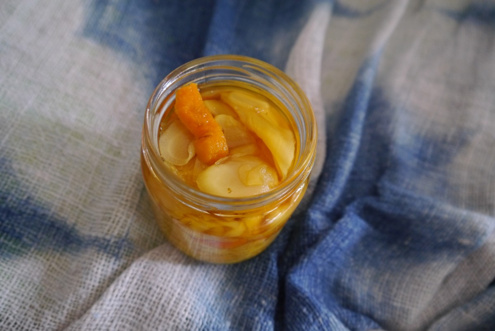

# Cultivating Functional Food Based Pro-biotics From Anywhere

**Fermentation is a natural phenomena that our Neolithic ancestors observed and learned how to cultivate.**

## *Lacto-Fermentation Is A Natural Symbiotic Method Of Food Preparation and Preservation.* 

> “To ferment your own food is to lodge an eloquent protest of the senses against the homogenization of flavors and food experiences now rolling like a great, undifferentiated lawn across the globe. It is also a declaration of independence from a group of fraudsters that would much prefer we were all passive consumers of its commodities, rather than creators of unique products expressive of ourselves and the places where we live.” ~ MICHAEL POLLAN, from the Foreword (The Art of Fermentation)

*Processed foods starve the micro-biota of genetic stimulation, live-culture foods are rich depositories of bacterial genes that are part of the human cultural legacy.*

### The Alchemy Of Fermentation ~ Gaia's Kitchen

Fermented foods were reportedly first consumed by humans around 7,000-8,000 years ago. A technique of traditional culinary wisdom that not only preserves but increases nutrition value, and imparts unique flavors to food, fermentation continues to be widely employed today.

**Fermentation is a porthole to the most intimate relationships between Wo-Man, microbe and Mother Earth. A tangible way of interacting with the larger web of life, a way to cultivate and reclaim a relationship with Nature, Gaia.**

**An archaic revival, food preservation with Gaia, food that almost makes itself. Transforming simple raw vegetables like cabbage into *functional food medicine* that does not require a Modern Kitchen nor Fire (electricity).**

#### Cultivate cultures that heal.
 
Lactic Acid Bacteria (LAB), one of the most well studied bacterial groups known from ancient times. *Lactic acid - this molecule occurs in almost every living organism and it plays an essential role in the anaerobic energy metabolism of billions of life forms.* These valuable micro-organisms are used in numerous areas, especially food industry and medicine. LAB produce a wide range of compounds for food upgrading.
 
A healthy microbiome of the physical body is like a healthy microbiome of the soil, when cared for correctly creates space for more healthy lifeforms to exist. When cleaning with harsh chemicals all microorganisms are killed off, everything, and over time members of the morcobiome can't grow back. The flora and fauna, healthy bacteria and yeast of the body and soil, actually can, do and have gone extinct! Especially in the gut, from a life time of unhealthy eating they just become eliminated. Fermentation is the way to bring that balance back, body and soil, all life is 'built' the same.
 
LAB(lactic acid) fermentation is a symbiotic relationship between humans and bacteria that preforms three basic functions.

(1) Pre-digestion of nutrients into more accessible and bio-available forms.
(2) Nutritional enhancement and creation of unique
micro-nutrients.
(3) Detoxification and transformation of anti-nutrients into nutrients.

The natural microbial process involves conversion of the starches and sugars of organic fresh vegetables into lactic acid through a succession of acid producing anaerobic bacteria. 

The key component of lactic fermentation is the creation and maintenance of an anaerobic and acidic environment in which lactobacillus can thrive. 

The lactic acid creates an environment so acidic that putrefying bacteria cannot survive. In this way lactic acid works as a natural preservative.

*Ginger and Turmeric.*

#### Basic materials needed:

**- Vegetables to ferment.** Virtually any vegetable  can be fermented, but some can develop a mushy texture, carrots, beets and cabbage are easy for beginners.

**- Sea salt or mountain salt (non iodized)** inhibits many organisms and is tolerable up to a point by lactobacilli.

**- A high quality fermentation vessel;** ceramic, glass, stainless steel, enameled steel (inspect for cracks) or plastic (food-grade HDPE, LDPE, PP or polycarbonate) and some kind of weight, called a follower, to keep vegetables submerged. Often made of glass or ceramic. The core of the cabbage or a slice of apple can also be used.

#### Method

**1. Prepare the vegetables.**
Chop vegetables to easily fit in the vessel making sure they can be submerged.

**2. Salt the vegetables.**
Salt draws water out of the vegetables creating a brine.
There’s a great deal of flexibility with salt brine, experiment to find personal preference.

**Method one: Sprinkled with sea or mountain salt.** About 1 tablespoon salt per two pounds of cabbage is a good rule of thumb. Massage the cabbage by hand, gently pound with a wood pestle or mix thoroughly with a spoon, to break down the cell wall of the cabbage and draw out water.

**Method two: Create a brine** by mixing 2-3 Tablespoons of Salt in 4 cups of non-chlorinated water. Store in a sealed jar at room temperature, use as needed. 

Most vegetables are fermented between 2.5%-5% brine solution. Some vegetables like olives are fermented at 10%.

Chlorinated water can be boiled in an open pot to evaporate. Cool water to body temperature before use.

**4. Pack the fermentation vessel.**
The vegetables are then put into the vessel and pushed down until the brine completely covers the vegetables, about two inches. The brine creates the anaerobic environment that favors the growth of lactobacilli, and serves as a protection against the growth of unwanted microorganisms.

**5. Add the follower.**
Once the vessel is filled and the brine is completely covering everything, a weight (follower) should be placed on top, to keep everything submerged under the brine. Without a weight (follower) and cover the vegetables may float to the top, where exposure to air can cause mold. A sacrificial cabbage core or leaf can also be used for the job.

**6. Wait. ... Leave the vessel to ferment!**
Lacto-fermentation happens faster in warmer temperatures. A cooler, slower fermentation will take longer. All last longer in cold storage.

Temperature ranges for fermentation; minimum is 50-65 F, optimal is 65-90 F and maximum is 90-112 degrees Fahrenheit. 

The ferment should be inspected daily.

After about three days the ferment will taste acidic, and will increase in acidity overtime. The longer kraut is left to sit the more time it will have to go through all its microbial transformations and produce the most pro-biotic kraut.

Vegetables under the brine will remain edible for up to eight months before they begin to get softer. Cold storage helps slow the ferment to retains the crispness a little longer.

## Tips For Beginners
- Colder and saltier = slower ferment. Warmer and less salt = faster ferment.

- Check & taste the ferment daily and skim off any film that forms, get a sense for the fermented flavors desired (flavors change daily).

- When fermenting, particularly with vegetables and fruits, at one point or another a white film may form, this is called kham yeast. It often covers the top of the ferment. It is sometimes confused for mold, it’s not something that is harmful to the body or the ferment but if not removed it can make the ferment bitter. Skim off the film, remove any discolored/darkened vegetables, wash the follower and replace as usual.

- Avoid antibacterial soaps. For sterile jars and hands, use vinegar to rinse or [Pro-biotic Eco-enzyme.](./waterAlchemy.md)

- All the “starter” needed is on the vegetables, there is no need to buy anything special or keep a starter culture alive between ferments.

- Add spices and aromatic seasonings like garlic, onion, fennel, dill, whole pepper, cloves, ... .

## Health and Nutrition

Eating live, fermented foods directly supplies the digestive tract with living cultures that helps build and develop the bodies cultural ecology. Eating a variety of live fermented foods promotes diversity among microbial cultures in the body. The main byproduct of lacto-fermentation is lactic acid which promotes the growth of healthy flora throughout the intestine. 

This flora inhibits the growth of diarrhea related bacteria such as Shigella, Salmonella, and e.coli. Human intestines are lined with a mucosal cell surface which acts as a protection against stomach acids, lactobacillus compete with potential pathogens and protect the mucosal cell surface. They are essentially occupying space that pathogens would be occupying. Eating fermented foods is recommended to prevent a variety of gastrointestinal conditions including diarrhea, constipation, ulcers, and various other digestive disorders.

Fermented foods are highly nutritious. Fermentation improves bio-availability of minerals present in food. As they go through their cycle of succession, microbial cultures create B-vitamins including folic acid, niacin, thiamin, and biotin. Lactobacilli creates omega 3 fatty acids, essential for cell membrane and immune system function. Lacto-fermentation can also remove toxins from food. 

