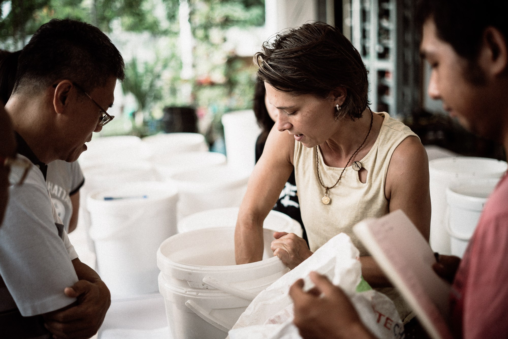

# *The Soil Rehabilitation Miracle of Bokashi*

## *A Revival Of The Gaian Connection; a journey of symbiotic healing, Soil to Soul.*

**Soil Alchemy; Humans and Humus are Symbiotic Body and Soil Microbial Gardens.**

***Ninety percent of cells contained in the human body are microbes.*** Microbes produce hormones that regulate growth, stress
response, and immunity in plants and animals. *All components of an ecosystem are dependent on healthy soil for the system to function optimally.* ***Soil Life Matters to everyone,*** life is not possible without Rich Fertile Soil.

### Bokashi is *Soil Therapy;* Forgiveness and healing through nature. 

***Connecting with things that make living possible, the practice of spending time *cultivating fertile soil* for the purpose of enhancing whole health.***

***Ancestral Healing-*** *Bio-logical Body and Earth care,* wellness, and happiness. A practice of *symbiotic connection* within the natural world and with each other.

**Soil life is fragile,** an estimated one third of global soils are degraded. Moreover, each year an estimated 24 billion tonnes of fertile soil are lost due to erosion alone.

Building up, maintaining and conserving the fertility of different soil types around the world in the face of diverse climatic conditions is the biggest challenge of agriculture today. 

**The key to soil fertility lies mostly in the humus content of soils.** 

Humus is the organic component of soil, formed by the decomposition of leaves and other plant material by soil microorganisms.

Cultivating Probiotic Soil rich in color, free of chemicals and teeming with beneficial bacteria, protozoa, fungi and nematodes. Without them soil is dead. Chemical fertilizers are like feeding the body highly processed foods, empty calories that fill one up in the short term but leave one vulnerable to disease and other problems over time. The life of the soil is part of the life of the plants grown in it, part of the body tending it, and part of the body eating from it all, soil to soul food.

***Humility:*** The state of being Humble; Middle English, from Anglo-French, from Latin humilis low, humble, ***from humus earth;*** akin to Greek chthōn ***earth,*** chamai on ***the ground.***

**Components of humus; organic matter reduced until it can break down no further. In this state of evolution its appearance is unified. Ranging in color from brown to black, consisting of about 60 percent carbon, 6 percent nitrogen, and smaller amounts of phosphorus and sulfur. Its the basic final stage of soil life, broken down to its smallest constituents. Ashes to ashes this is where *all* organic life ends up, and begins from, Humus, the womb of mother earth.

*The Soil is a dynamic and complex cycle of life, death and rebirth. Of which humans have yet to understand.*

#### Soil Return - 30% of soil is fungal mass, microbes and other soil organisms that are capable of producing all the nutrients plants need. Bokashi pro-biotic soil offers *soul food* to the field.

**Bokashi gives a finished pro-biotic, living soil in 30–45 days all in.** The speed of the fermentation process is a big advantage, cycling organic remnants faster by going straight from kitchen to fermentation, to soil, over and over again in small batches. With out the need to collect a critical mass of scraps to start, the fermentation process starts right away. Scale the fermentation vessel to the amount of scraps being generated, going straight into the bokashi bucket as soon as they are produced.

**Commonly known as topsoil and essential for all life. Creating fertile terrain for new growth, strengthening immunity and offers nutrients needed for soil organisms to regenerate.**

The current high erosion rates throughout the world are of great concern because of the slow rate of topsoil renewal; it takes approximately 500 years for 2.5 cm layer of fertile topsoil to form under agricultural conditions.

Due to rapid urbanization the amount of *arable land* available for each person is continually dropping. Currently, each human being has only 2,000m² at their disposal; in 1961, that figure was 4,000m². At current rates, the amount of arable land available per person will decrease to 1,500m² by 2050.

Pro-biotic fluffy soil.

#### *What is Bokashi?*

**Pro-biotic Soul Food For The Soil.**
Bokashi is a Japanese term meaning fermented organic matter and refers to a 2-step method of ***indoor soil building.*** Using the many beneficial micro-organisms mother earth provides to quickly ferment many types of organic matter, including all food remnants, fruit, vegetables, meat, dairy, bread, raw or cooked as well as forms of manure, human, cat, dog, bird, rabbit and many others are safely processed through the system.

Although the terms humus and compost are informally used inter-changeably, they are distinct soil components with different origins; humus is created through anaerobic fermentation, while compost is the result of aerobic decomposition. 

Fermentation is the very important difference between bokashi method and composting. There is *no putrefaction or toxic leaching* happening here, such that often occurs in conventional composting, producing heat. *Bokashi is pro-biotic,* working symbiotically with nature to accelerate the process of anerobic fermentation using beneficial microbes.

#### *The Soil Is A Garden.*

***One handful of healthy soil contains more micro-organisms than there are humans living on earth.***

Fermentation naturally produces Lactic Acid Bacteria (LAB), one of the most well studied bacterial groups known from ancient times. ***Lactic acid - this molecule occurs in almost every living organism and plays an essential role in the anaerobic energy metabolism of billions of life forms.*** LAB can find special applications like generation of bio-energy not affecting the surrounding environment.

#### *Benefits of Bokashi*

**Bokashi is therapeutic, providing essential nutrients to rebuild soil organic matter content, and re-establish microbial populations. Benefits directly associated with improved organic matter content are: enhanced water infiltration and moisture-holding, aggregation, aeration, nutrient supply for plant growth, and microbial activity.**

Bokashi conserves water in the ground, probiotic soils are not as water soluble, nutrients are less prone to leaching and run-off because the organic nutrients literally are the soil after Bokashi fermentation is complete.

***Bokashi Is A Solution To Some Very Big Problems; Regenerative Urba-culture, healing from the inside out.***

**Responsible management of organic kitchen remnants can reduce 70% of the total waste production and reduce the bad gases produced during organic decomposition, all while revitalizing the environment by creating bio-active probiotic soil and liquid fertilizer to combat the negative use of toxic chemicals and pollutants.**

**Probiotic Living Soils store more than 4000 billion tonnes of carbon. By way of comparison; forests store 360 billion tonnes of carbon as woody biomass, and the atmosphere more than 800 billion tonnes in the form of carbon dioxide.**

**Bioremediation**- Biotechnology employs the use of living organisms, microbes and bacteria, in the removal of contaminants, pollutants, and toxins from soil, water, and other environments.

#### *Conservation as a consequence of production.*

***Probiotic soil cultivation practices can have a significant impact on urban ecosystems.***

Bokashi is the ecologically responsible option for all organic food remnants, perfect for someone living in an apartment/condo. Giving someone the opportunity too transform organic biomass into a nutrient rich pro-biotic soil amendment for the larger garden, the surrounding local environment (ecosystem) as a gift of thanks, fertile pro-biotic soil for Mother Earth. No *modern garden* is required, being creative with whats around ...

A healthy microbiome of the physical body is like a healthy microbiome of the soil, when cared for correctly creates space for more healthy lifeforms to exist. The flora and fauna, healthy bacteria and yeast of the body and soil, actually can, do and have gone extinct. Especially in the immune system, the gut of the physical body, and the soil, the immune system of Mother Earth. From *A life time* of unhealthy eating, consuming chemical laden *food* body and soil, they just become eliminated. Fermentation is the way to bring that balance back. Body and soil, all life is *built* upon the laws of Nature.

**Bokashi can be:**

- fairly easy to maintain
- can be done indoors, suitable for urban environments
- very affordable
- can use most food remnants (including meat, dairy and cooked foods)
- provides a rich pro-biotic soil amendment for remediation, revitalization and reuse
- emotionally nutritive 

**Note:** Fresh citrus and pineapple remnants are packed with powerful organic cleaning enzymes that can be easily fermented to produce luxury [Pro-biotic and multi purpose; Symbiotically Healing and Cleaning Products.](./waterAlchemy.md) (That produces a probiotic byproduct that can be added to the bokashi system or can be used directly in the environment.)

#### *Bokashi Method*

**Step 1: Anaerobic Fermentation - *takes place indoors* in a sealed Bokashi bin.**
Layering food remnants with a starter mix, the microbes present in the starter mix quickly ferment the food remnants. Once filled set the bin aside for 10 - 14 days and start using another bin. Two weeks later the initial bin of organic matter will be fully fermented and ready for Step 2.

**Step 2:** - is done in the garden, compost pile, or an ***indoor semi closed soil building system for year round soil production.*** Shallow bury the contents of the bin in the garden or compost bin. Up to 1/3 can be added to the bottom of indoor or outdoor pots.

In the garden, dig a shallow trench, deposit contents and cover with soil.

Most food remnants will be indistinguishable from the soil in a week or two, although certain items like bones, egg shells, and corn cobs will take longer to disappear, acting as a slow release fertilizer. While the organic matter is converted into soil it is somewhat acidic, waiting 10 days before planting allows the pH to find a natural balance.

The active ingredients in the process are the effective microorganisms – a combination of lactic acid bacteria (also found in home kefir whey and lacto ferments), photosynthetic bacteria, and yeast - that ferment the organic matter. These microbes, present in the Bokashi Starter Mix, are sprinkled over the layers of food remnants as the bin is filled.

A healthy Bokashi bin does not create bad odors,  greenhouse gas, or heat - uses no power, no aeration is required (no turning) and is completely natural. The aroma of the open bin is slightly sweet, fermented (sour), perhaps slightly alcoholic odor and should not be offensive.

#### *Materials and Tools Needed*

- A minimum of two 5-gallon (or suitable size) nesting bins with tight fitting lids (three is best to have a rotation)
- Absorbent material (peat moss, coconut coir, shredded newspaper, sawdust, dried small leaf or grass...)
- Bokashi starter mix (can be purchased or home cultured)
- Food remnants chopped into small pieces
- drill or soldering iron
- clay building brick or same size rock

#### *Setting up The Bokashi Bins*

Making holes in the *inner* bins for bokashi fermentation to have good drainage.

- On the bottom of the inner bin, drill or melt with a soldering iron, 20 to 30 holes with a 1/8- to 1/4-inch drill bit.
- Place a brick or rock in the bin with no holes.
- Set the bin with holes into the solid bin, with no holes.
- Cover the bin with a tight-fitting lid.
- Start adding food remnants, layering with bokashi inoculant *Starter Mix* after each deposit. Compact and close the bin.
- Harvest liquid fertilizer (bokashi tea) by lifting the inner bokashi bin from the outer bin. Harvesting any liquid into a separate container. Observe on a regular basis.

Note: The brick creates space for the liquid fertilizer to collect and to ensure the bins do not get stuck together as the inner bin fills. 

Apartment setup is easy, clean and scalable.

#### *Making Bokashi Bran / Starter Mix*

**Molasses : EM/Serum : Warm water(pure) : Absorbent material**

EM means effective micro-organisms. EM is a laboratory cultured mixture of naturally occurring micro-organisms consisting mainly of lactic acid bacteria, photosynthetic bacteria (purple bacteria) and yeasts which co-exist for the benefit of whichever environment they are introduced. EM can be purchased or easily cultured in house with readily available ingredients (instructions provided below). 

Molasses have several uses beyond that of a straightforward food additive. It can be used as the **base material for fermentation** into rum and as the carbon source for in situ remediation of chlorinated hydrocarbons. (It can be used as a chelating agent to remove rust where a rusted part stays a few weeks in a mixture of 1 part molasses and 10 parts water.)

Making Bokashi starter using small dry leaf as a substrate.

**50ml molasses : 50ml EM/Serum : 250-300ml water : 5kg absorbent material**

- Combine all liquids starting with 250ml of warm water.

- Pour over the absorbent material so that when squeezed together some of it holds but no liquid comes out. Add more water if needed.

- Seal in a bag or use a sealing bin, *NO Air* or as little as possible. Seal and ferment for 10 - 14 days.

- Sniff testing, the bokashi should smell a little sour, like apple cider vinegar. Its ready to use! For long term storage, lay the fermented material out on shallow trays for drying in the shade. Once dry it can be stored in containers.

*Voila "Bokashi Bran"*

#### *Home Fermenting Bokashi Serum = E/M*

*Two Options*

**Option 1) Fermented Rice Water and Milk Ferment**

- Making Fermented Rice Water:

- 1:2 rice to water ratio 
- soak rice for about 15 minutes
- stir vigorously
- strain, catching the rice water in an open air vessel *(rice can be cooked and consumed)*
- cover vessel with a dish towel, securely tied in place
- allow the rice water to ferment for 5 - 8 days
- shake before each use adding an appropriate amount of sugar to feed the ferment inspect regularly.

**Next combine:**

- 1 part fermented rice water to 10 parts whole milk, cover and allow to ferment 10 - 14 days. The ferment may separate into three distinct layers. Use a turkey baster or some such device to retrieve the middle layer. If there is not a distinct layer pass the contents through a fine mesh, collecting the liquid. (Solids can be processed through the system as food remnants.)

- Bottle, cap and store in a cool dark place.

- For long storage of bokashi serum add a little molasses.

**Option 2) Home fermenting for Kefir "Milk Whey" or Sauerkraut "Juice"**

[Kefir Milk](./kefirMilkAlchemy.md) "Whey and juice" comes from straining live cultured home fermented kefir milk or sauerkraut through a cloth to separate the organic solids from the liquids. If neither kefir milk or sauerkraut is available then use above rice method.

#### *Inside the Bokashi Bucket*

 
Apartment bokashi setup, adding kitchen remnants.

- Assemble buckets and start adding food remnants and compact.

- Dust compacted food remnants with the bokashi starter and secure lid.

- Repeat until the bin is full.

- Once full seal and set aside in a warm, dark corner to ferment for 2 weeks.

- Bury in the garden, add to a compost bin, move into a bokashi soil building system or use in pots (up to 1/3 by volume).

Bokashi soil building system in action.

#### *Bokashi Probiotic Tea* the ultimate gold standard in organic liquid fertilizer.

The liquid or Bokashi Tea that collects during the process must be removed on a regular basis. Bokashi tea contains nutrients from the fermented food remnants, alive with micro-organisms, a rich pro-biotic natural fertilizer.

Bokashi tea has millions of microbes, an incredibly beneficial soil enhancer that can be used too accelerate decomposition in compost piles by pouring directly into the compost. The beneficial bacteria help to speed up the composting process, adding bokashi tea is a great way too add moisture to the compost pile, if needed. Use fresh bokashi tea for best results.

***Watering the garden: Bokashi tea is strong and must be diluted with water at a 100:1 ratio.*** 100 parts water to 1 part bokashi tea, approximately 2 teaspoons of tea for every liter of water.

If the bokashi tea can not be used straight away, simply poor it down the drain. It is completely natural and will not pollute. The bokashi bacteria  help to unblock clogged drains and are beneficial to the water. Bokashi tea contributes to cleaning up waterways as the good bacteria compete with the bad bacteria.

Checking on the bokashi tea. Bokashi bin is open to use lid as a trivet to catch any liquid as the bottom bin is emptied.

The concentrated Bokashi tea can also be deposited directly into kitchen and bathroom drains, toilets and septic systems. It will help prevent algae build-up and control odor.

#### *Resources*

**Soil Seekers on Vimeo**

[**Bokashi Soil Building Instructional**](https://vimeo.com/549116720)

[**Day in the life of the Vivarium apartment garden**](https://vimeo.com/549190610)

#### Connect ~ Ask a question or book an event ... 

[Soil Makers On Open Collective](https://opencollective.com/soil-makers)

Contact Anna directly on Matrix @bird:matrix.org or [Connect in the Vivarium Salon](https://matrix.to/#/!LSpVaMCiYQehpJONFF:matrix.org)

