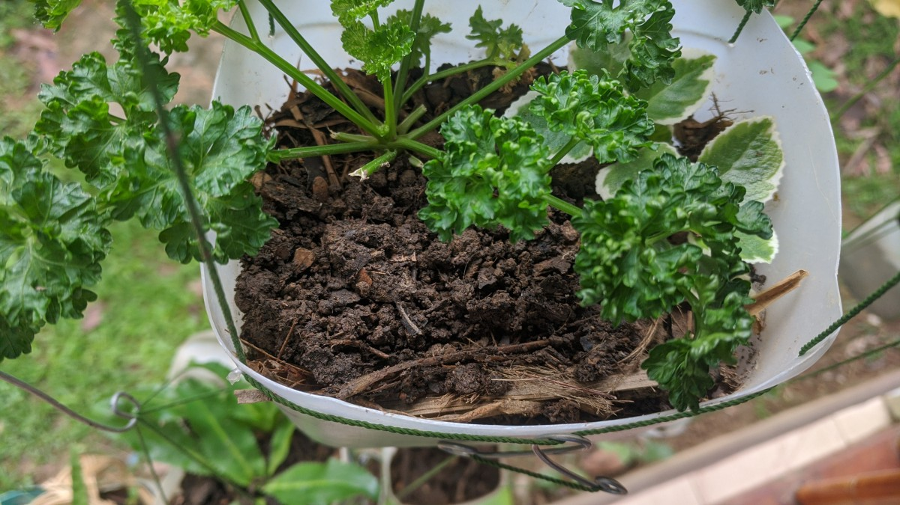
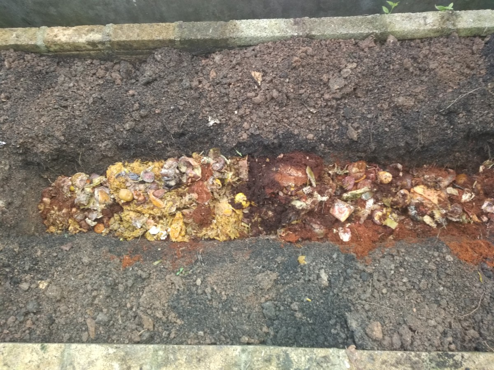
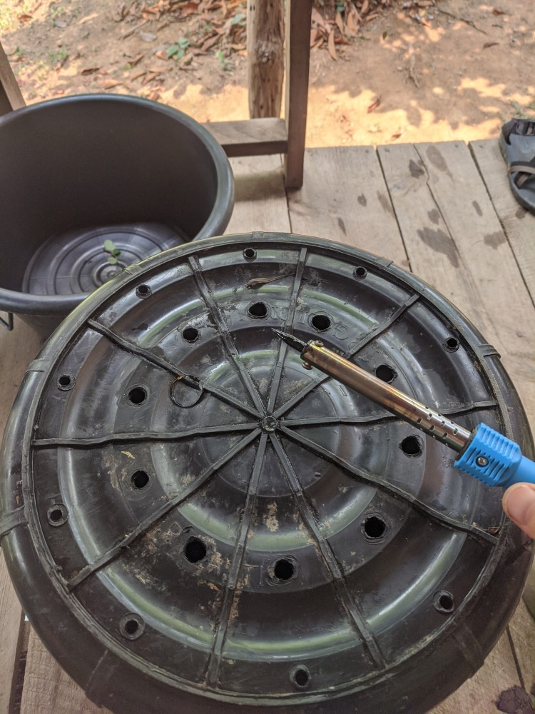
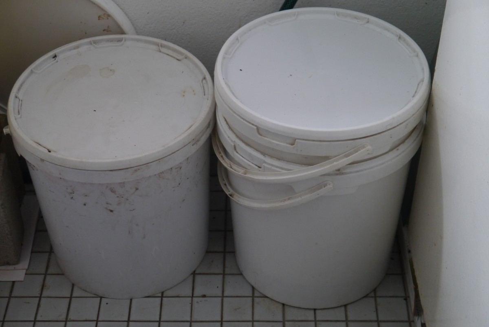
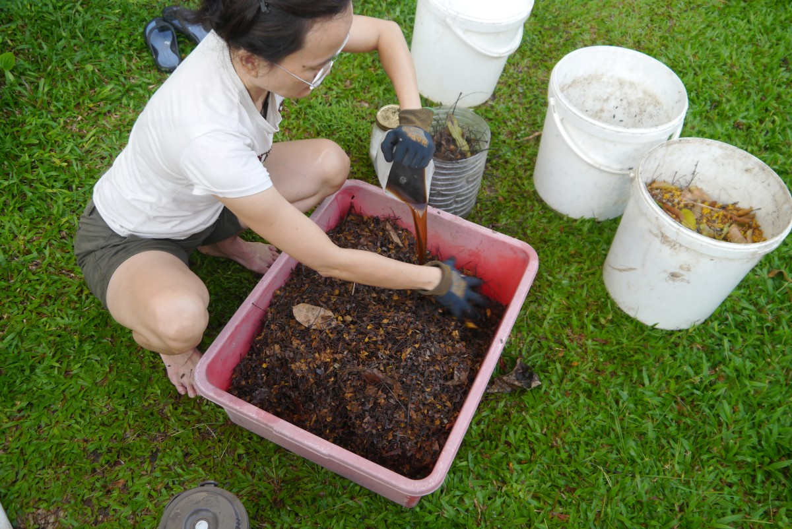
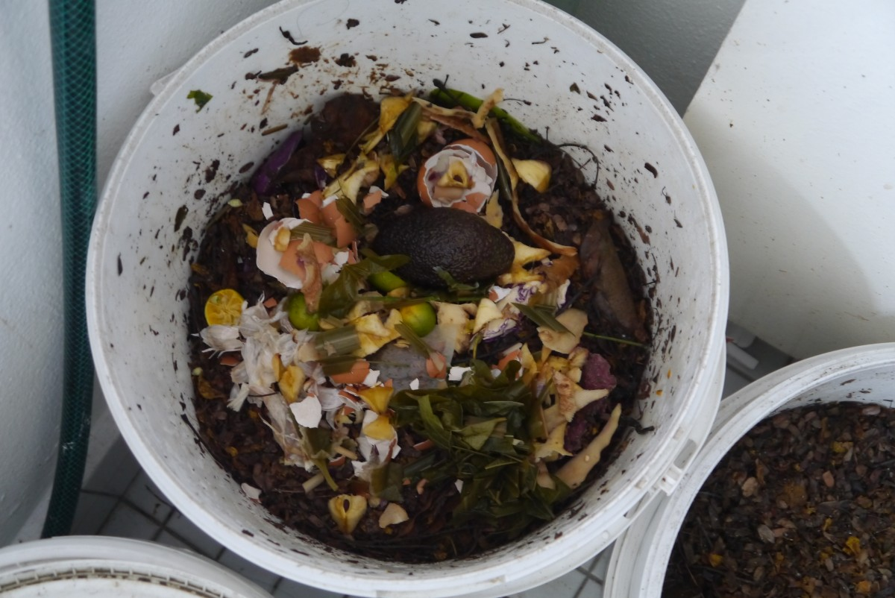
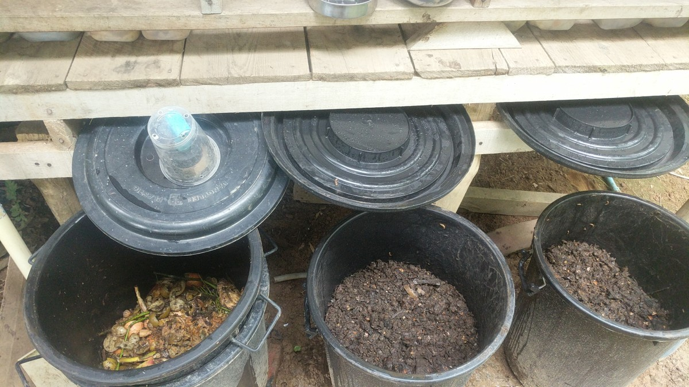
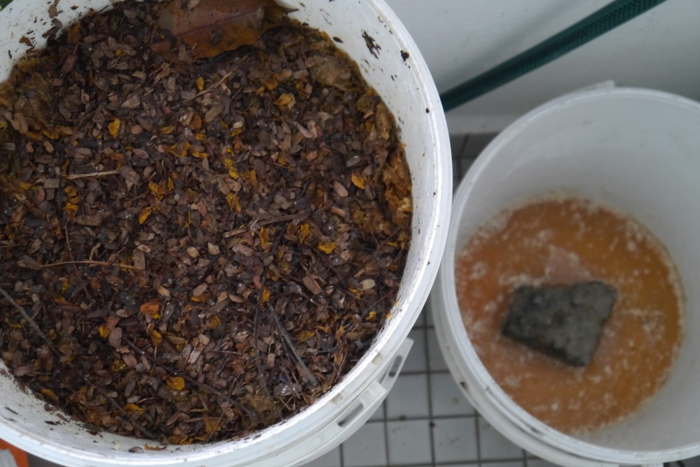

# *The Soil Rehabilitation Miracle of Bokashi*

## *A Revival Of The Gaian Connection; a journey of symbiotic healing, Soil to Soul.*

**Humans and Humus are Symbiotic Body and Soil Microbial Gardens. Life is not possible without Rich Fertile Soil.**
*All components of an ecosystem are dependent on healthy soil for the system to function optimally.*

***Soil Alchemy*** is the ongoing exploration of what happens when people connect head, heart, and body in the crucible of the soil. The ancient alchemists combined substances and used the influence of their own minds to study the transmutation of matter and of spirit. Observe when the discursive mind becomes quieter and the intelligence of the heart comes to the foreground, a new *ecologically symbiotic consciousness* emerges. Work in *symbiotic partnership with the more-than-human world* and make incredible discoveries.

### Bokashi is *Soil Therapy;* the practice of spending time *cultivating fertile soil* for the purpose of enhancing whole health, *Earth Care,* wellness, and happiness. A practice of *symbiotic connection* with the natural world and with each other, healing soil to soul.

A series of guided invitations, natural cycles, bring one into the present moment, opening the doors of symbiotic communication with the soil, waters, and landscapes explored. Encounter not just the soil, but the many ways nature mirrors humans, encountering oneself, Soil to Soul Food.

Soil, life is fragile, its easy to destroy something, the challenge is to create something meaningful. To bring something back to the Village that people can live from.

#### *Ancestral Healing; Cultivating cultures that heal cultivates compassion for mother earth, an act of humility.*

***Humility:*** The state of being Humble; Middle English, from Anglo-French, from Latin humilis low, humble, ***from humus earth;*** akin to Greek chthōn earth, chamai on the ground.

#### Soil Return - A soul united, offer light to the field essence like humus. Soil is the ultimate store of energy. It holds history in its molecules, vital energy that flows forever, transporting light energies.

**Humus is organic matter reduced until it can break down no further. In this state of evolution its appearance is unified. Commonly known as topsoil, humus is essential for all life. It creates fertile terrain for new growth, strengthens immunity and offers nutrients needed for soil organisms to regenerate.**

Pro-biotic fluffy soil.

#### **What is Bokashi?**

**Pro-biotic Soul Food For The Soil.**
Bokashi is a Japanese term meaning fermented organic matter and refers to a 2-step method of ***indoor soil building*** that uses beneficial micro-organisms to quickly ferment many types of organic matter including food remnants, fruit, vegetables, meat, dairy and bread.

Although the terms humus and compost are informally used interchangeably, they are distinct soil components with different origins; humus is created through anaerobic fermentation, while compost is the result of aerobic decomposition. This is the very important difference between composting and bokashi method. There is no purification or desegregation happening here. Bokashi is pro-biotic, working symbiotically with nature to accelerate the process using beneficial microbes. 

***The Soil Is A Garden.***
Bokashi conserves water in the ground, nutrients are less prone to leaching and run-off because the organic nutrients literally are the soil after Bokashi fermentation is complete. Humus soils are not as water soluble and less prone to leaching away with watering and run-off after rains.

#### *Method*

**Step 1: Anaerobic Fermentation - *takes place indoors* in a sealed Bokashi bin.**
Layering food remnants with a starter mix, the microbes present in the starter mix quickly ferment the food remnants. Once filled set the bin aside for 10 - 14 days and start using another bin. Two weeks later the initial bin of organic matter will be fully fermented and ready for Step 2.

**Step 2:** - is done in the garden, compost pile, or an ***indoor semi closed soil building system for year round soil production.*** Shallow bury the contents of the bin in the garden or compost bin. Up to 1/3 can be added to the bottom of indoor or outdoor pots.

In the garden, dig a shallow trench, deposit contents and cover with soil.

Most food remnants will be indistinguishable from the soil in a week or two, although certain items like bones, egg shells, and corn cobs will take longer to disappear and will act as a slow release fertilizer. While the organic matter is converted into soil it is still quite acidic so wait 10 days before planting.

The active ingredients in the process are the effective microorganisms – a combination of lactic acid bacteria (also found in home kefir whey and lacto ferments), photosynthetic bacteria, and yeast - that ferment the organic matter. These microbes, present in the Bokashi Starter Mix, are sprinkled over the layers of food remnants as the bin is filled.

A healthy Bokashi bin does not create bad odors,  greenhouse gas, or heat - uses no power, no aeration is required (no turning) and is completely natural. The aroma of the open bin is slightly sweet, fermented (sour), perhaps slightly alcoholic odor and should not be offensive.

#### *Benefits of Bokashi*

***A solution to some very big problems.***

**Responsible management of organic kitchen remnants can reduce 70% of the total waste production and reduce the bad gases produced during organic decomposition, while saving the environment by creating bio-active humus soil and pro-biotic liquid fertilizer to combat the negative use of toxic chemicals and pollutants.**

**Bokashi provides essential nutrients to rebuild soil organic matter content, and re-establish microbial populations. Benefits directly associated with improved organic matter content are: enhanced water infiltration and moisture-holding, aggregation, aeration, nutrient supply for plant growth, and microbial activity.**

**Bioremediation**- Biotechnology employs the use of living organisms, microbes and bacteria, in the removal of contaminants, pollutants, and toxins from soil, water, and other environments.

Fermentation naturally produces Lactic Acid Bacteria (LAB), one of the most well studied bacterial groups known from ancient times. *Lactic acid - this molecule occurs in almost every living organism and it plays an essential role in the anaerobic energy metabolism of billions of life forms.* LAB can find special applications like generation of bio-energy not affecting the surrounding environment.

#### *Conservation as a consequence of production.*
***Urban soil cultivation practices can have a significant impact on urban ecosystem.***
Bokashi, the ecologically responsible option for all food remnants, perfect for those living in apartments/condos and those looking to use their food remnants as a nutrient rich pro-biotic soil amendment in their garden, plant pots or the surrounding environment (ecosystem) as a gift of thanks, fertile pro-biotic soil for Mother Earth. No modern garden is required, be creative, whats around ...

A healthy microbiome of the physical body is like a healthy microbiome of the soil, when cared for correctly creates space for more healthy lifeforms to exist. The flora and fauna, healthy bacteria and yeast of the body and soil, actually can, do and have gone extinct! Especially in the gut, from a life time of unhealthy eating they just become eliminated. Fermentation is the way to bring that balance back, body and soil all life is 'built' the same.

**Bokashi can be:**

- fairly easy to maintain
- can be done indoors, suitable for urban environments
- very affordable
- can use most food remnants (including meat, dairy and cooked foods)
- provides a rich pro-biotic soil amendment for remediation, revitalization and reuse
- emotionally nutritive 

**Bokashi gives a finished pro-biotic living soil in 30–45 days all in.** The speed of the fermentation process is a big advantage, cycling organic remnants faster by going straight from kitchen to fermentation, to soil, over and over again in small batches. With out the need to collect a critical mass of scraps to start, the fermentation process starts right away. Scale the fermentation vessel to the amount of scraps being generated, going straight into the bokashi bucket as soon as they are produced.

**Note:** Fresh citrus and pineapple remnants are packed with powerful organic cleaning enzymes that can be easily fermented to produce luxury [Pro-biotic and multi purpose; Symbiotic Healing and Cleaning Products.](./waterAlchemy.md) That can be added to the bokashi system as a byproduct.

#### *Materials and Tools Needed*

- A minimum of two 5-gallon (or suitable size) nesting buckets with tight fitting lids (three is best to have a rotation)
- Absorbent material (peat moss, coconut coir, shredded newspaper, sawdust, dried small leaf or grass...)
- Bokashi starter mix (can be purchased or home cultured)
- Food remnants chopped into small pieces
- drill or soldering iron
- clay building brick or same size rock

#### *Setting up The Bokashi Buckets*

Melting holes in larger bins for bokashi.

- On the bottom of one bucket, drill or melt with a soldering iron, 20 to 30 holes with a 1/8- to 1/4-inch drill bit.
- Place brick or rock in the bucket with no holes.
- Set the bucket with holes into the solid bucket, with no holes.
- Cover the bucket with a tight-fitting lid.
- Start adding food remnants and bokashi inoculant, Starter Mix to the bucket.
- Harvest liquid fertilizer (bokashi tea) by lifting the top bucket off of the bottom bucket, pouring any liquid into a separate container. Observe on a regular basis.

Note: The brick creates space for the liquid fertilizer to collect and to ensure the buckets do not get stuck together as the inner bucket fills. 

Apartment setup is easy, clean and scalable.

#### *Making Bokashi Bran / Starter Mix*

**Molasses : EM/Serum : Warm water(pure) : Absorbent material**

EM means effective micro-organisms. EM is a laboratory cultured mixture of naturally occurring micro-organisms consisting mainly of lactic acid bacteria, photosynthetic bacteria (purple bacteria) and yeasts which co-exist for the benefit of whichever environment they are introduced. EM can be purchased or easily cultured in house with readily available ingredients (instructions provided below). 

Molasses have several uses beyond that of a straightforward food additive. It can be used as the **base material for fermentation** into rum and as the carbon source for in situ remediation of chlorinated hydrocarbons. (It can be used as a chelating agent to remove rust where a rusted part stays a few weeks in a mixture of 1 part molasses and 10 parts water.)

Making Bokashi starter using small dry leaf as a substrate.

**50ml molasses : 50ml EM/Serum : 250-300ml water : 5kg absorbent material**

- Combine all liquids starting with 250ml of warm water.

- Pour over the absorbent material so that when squeezed together some of it holds but no liquid comes out. Add more water if needed.

- Seal in a bag or use a bucket and put a bag over it and then a lid, NO Air or as little as possible. Seal and ferment for 10 - 14 days.

- Sniff test, the bokashi should smell a little like apple cider vinegar. Its ready to use! For long term storage, lay the fermented sawdust out on shallow trays and dry in the shade. Once dry it can be stored in containers.

*Voila "Bokashi Bran"*

#### *Making Serum = E/M*

**1) Rice Water**

- To Make Rice Water:

- 1:2 rice to water ratio, soak rice for about 15 minutes, stir vigorously then strain and ferment the water in a open air vessel with a secured cloth cover to allow exposure to the air for 5 - 8 days. (rice can be cooked and consumed)

**2) Home ferment Kefir Milk Whey or Sauerkraut Juice**

[Kefir Milk](./kefirMilkAlchemy.md) Whey comes from straining kefir milk through cloth to separate the milk solids from the liquid whey. If neither whey or sauerkraut juice is available then add 1 part fermented rice water to 10 parts whole milk, cover and allow to ferment 10 - 14 days. The ferment will separate into three distinct layers. Use a turkey baster or some such device to retrieve the middle layer.

**Next combine:**

**1 part rice water : 10 parts Kefir Whey, sauerkraut juice or above milk/rice culture**

- Bottle, cap and store in a cool dark place.

- For long storage of bokashi serum add a little molasses.

#### *Inside the Bokashi Bucket*

 
Apartment bokashi setup, adding kitchen remnants.

- Assemble buckets and start adding food remnants, compact with a potato masher or use the bottom of a cup.

- Once the bin is about 1/2 inch of compacted food remnants dust with the bokashi starter.

- Repeat until the bin is full.

Once full seal and set aside in a warm dark corner to ferment for 2 weeks.

Bury in the garden, add to a compost bin, move into a bokashi soil building system or use in pots (up to 1/3 by volume).

Bokashi soil building system in action.

#### *Bokashi Tea*

The liquid or Bokashi Tea that collects during the process must be removed on a regular basis. Bokashi tea contains nutrients from the fermented food remnants, alive with micro-organisms, a rich fertilizer.

Bokashi tea has millions of microbes, an incredibly beneficial soil enhancer. Accelerate decomposition in compost piles, pour directly into compost. The beneficial bacteria help to speed up the composting process. Adding bokashi tea is a great way to add moisture to the compost pile, if needed. Use fresh bokashi tea for best results.

Watering the garden... Bokashi tea is strong and must be diluted with water at a 100:1 ratio, 100 parts water to 1 part bokashi tea, approximately 2 teaspoons of tea for every liter of water.

If the bokashi tea can not be used straight away, simply poor it down the drain. It is completely natural and will not pollute. The bokashi bacteria  help to unblock clogged drains and are beneficial to the water. Bokashi tea contributes to cleaning up waterways as the good bacteria compete with the bad bacteria.

Checking on the bokashi tea. Bokashi bin is open to use lid as a trivet to catch any liquid as the bottom bin is emptied.

Pour the concentrated Bokashi tea directly into kitchen and bathroom drains, toilets and septic systems. It will help prevent algae build-up and control odor.

#### *Resources*

**Private Bokashi Soil Building Lessons Available.**

[**Bokashi Soil Building Instructional Video Link YouTube**](https://youtu.be/6fonPhtzfSc)

[**Day in the life of an apartment garden**](https://youtu.be/O5F19PW9HsQ)

#### Connect ~ Ask a question or book an event ...
[Contact Direct on Matrix](https://matrix.to/#/!ibYXXCkubbZiWtkmhX:matrix.org?via=matrix.org)

