# *The Water Rehabilitation Miracle Of Pro-Biotic Eco-Enzyme*
***A pro-biotic rich super food for the micro-biome of the Physical Body and Mother Earth.***

## *Conservation As A Consequence Of Lifestyle.*

**Cultivating cultures that heal; Symbiotically clean, heal and support the physical body in a way that cleans, heals and supports the environment.**

*Multi Purpose: Body Care, Built Environment and *Earth Care* Products. Naturally; Anti-Bacterial, Anti-Fungal, Anti-Viral and a Natural Antiseptic.*

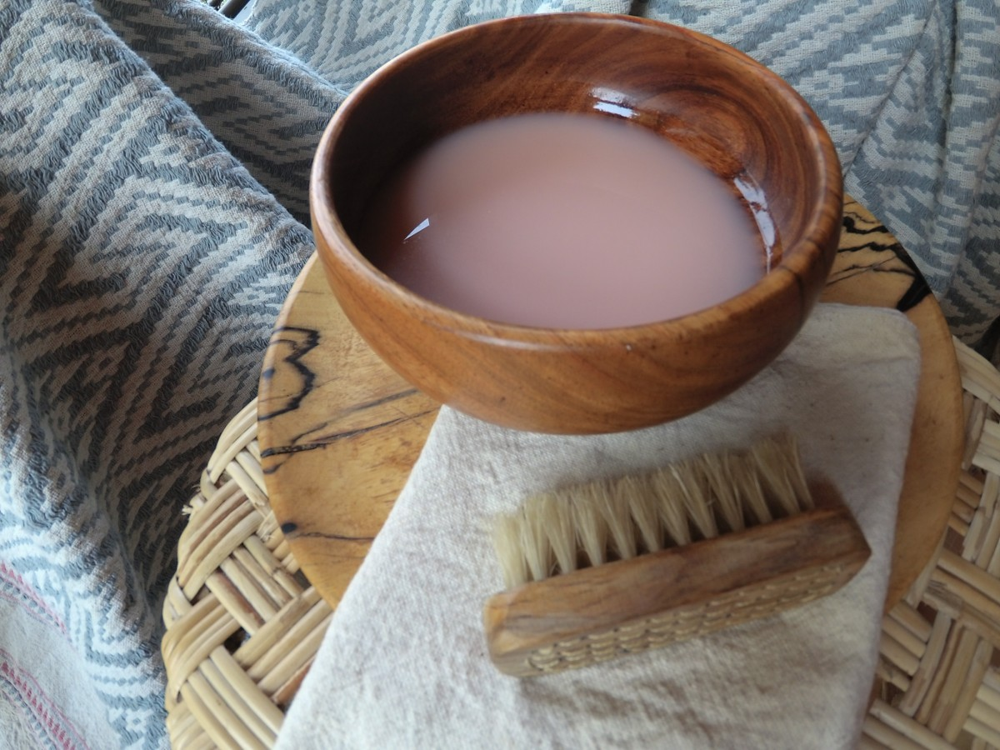

### *Water Alchemy - Recycling organic materials through living organisms naturally purifies water.*
***Water Alchemy*** is the ongoing exploration of what happens when someone connects head, heart, and body in the crucible of the water. The ancient alchemists combined substances and used the influence of their own minds to study the transmutation of matter and of spirit. Working in symbiotic partnership within Mother Earth too cultivate incredible discoveries. Observing the discursive mind become quieter as the intelligence of the heart comes to the foreground, feeling through nature an ancient *ecologically symbiotic consciousness* reemerges.

#### Pro-biotic Eco-enzyme is *Water Therapy;* forgiveness, healing water to soul. Connecting with things that make living possible, the practice of spending time *cultivating living healing water* for the purpose of enhancing whole health, *Bio-logical Body And Earth Care,* wellness, and happiness. A practice of *symbiotic connection* within the natural world and with each other.

***Bio-Logical Freedom; feeling free to swim in the rivers of Mother Earth without fear of reprisal.***

People connect through water, the universal solvent. Water speaks, it takes the knowledge of the leaf from the mountains to the sea, and the rain takes it up from the sea back to the mountains.

***Water- is a bio-logical need,*** freely having access to it, ***playing in it; liberates essential subconscious processes, especially in children.*** Generated by nature through people, there is a spontaneous confirmation of the life giving pattern, born directly out of people's feelings. 

Scientific experiments are not capable of generating a phenomenon of this extraordinary level of agreement.

Once discovered as a fluid field of relationships, one can redefine it, as an entity; something that has a real existence, making it operational.

Wo-Men don't have to abandon their 'modern' lives but they do have to protect the water.

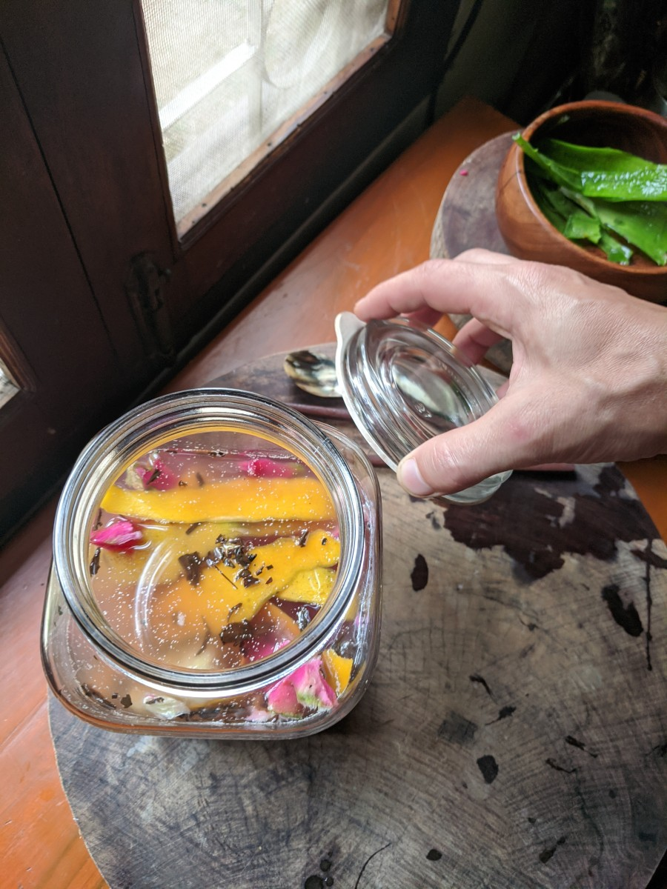

***Symbiotically nourishing, fortifying and gentle. Self-care that goes far beyond the self, bio-logically re-connecting. Remarkably enough the Physical Body and Mother Earth find natural healing benefits from this one easy process.***

*Yes, Nature is that simple, effective and synergistic.*

#### *What is Pro-biotic Eco-enzyme*

**A simple process of encouraging natural fermentation by lactic acid-forming bacteria such as Lactobacillus species and naturally-occurring wild yeasts of fruit and plant food remnants and brown sugar.**

**Through fermentation, the ingredients used for making Pro-biotic Eco-enzyme will have effect on each other, creating a complex but stable enzymatic ecosystem.** 

The microbes eat the sugars, digesting them and excrete metabolites. A detoxification and transfer of anti-nutrients into nutrients occurs, with nutrient enhancement and the creation of micro-nutrients. An abundance of LAB lactic acid bacteria, yeasts, and molds that produce enzymes, break down and alter the original foods. 

As fermentation progresses, the natural anti-bacterial properties of fruit peels are further enhanced as organic substances are decomposed, yielding secondary metabolites known as bio-active compounds or phytochemicals. The process creates new amino acids, organic acids, and antioxidants that didn’t originally exist in the raw material, naturally optimized to provide the most nutrition.

*Like wine, sediment is normal and can be left in or allowed to settle for ease of separation.*

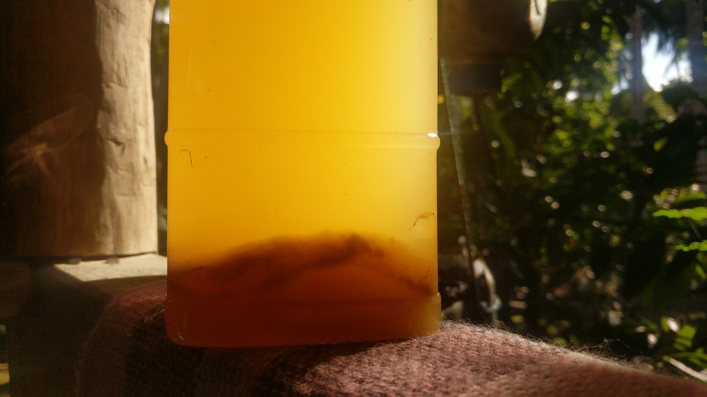

**A pro-biotic power house is born.**
The fermentation process naturally increases the bio-availability, making it so the physical body and Mother Earth are able to absorb the nutrients.

There are many targeted uses for these metabolites. LAB are applied in food production and preservation, companies package them and sell them at a high cost. The majority of products on the market are powdered or freeze-dried, this process causes damage to the microbes, resulting in 90 to 95% die off. This means, even though colony counts are high, only 5 to 10% of the microbes are actually alive.

**Few create a product that can truly rival real, live home ferments. Teaming with antioxidants, Pro-Biotic Eco-enzyme is a powerful multi-functional tool.**

#### *Why make Eco-Enzyme?*

***The Gift of Life is in the giving, conservation is the consequence of production. Cultivating cultures that heal, symbiotically keep the body healthy while restoring vitality and strength to the environment. It is easily done at negligible cost, free of harmful pollutants, effective, and multipurpose.***

***WATER***

**It is very difficult to reverse the effects of water pollution.** Natural processes that cleanse the water can take years, decades, or even centuries, and even with costly technological processes, it can take years to remove all of the harmful substances from the water. There are many aspects of the contamination that must be removed. **First, and most importantly, the source of the water pollution must be removed, so that additional water contamination does not occur.**

*Every part of the World is given its character, essentially, by a small number of patterns which repeat themselves over and over again.*

**Home Cleaning products and fertilizers made with chemicals and pesticides pollute the underground water, rivers and surrounding ecosystems.** Pharmaceutical drugs and personal care products, also manufactured by many pharmaceutical companies (such as sunscreen lotions, lipsticks, deodorants, perfumes, body soaps, and shampoos, ...), are produced in staggeringly huge quantities; **often equaling or surpassing agrochemicals in tonnage.** The volume consumed is simply astounding. All of these go into the ecosystem, most of them into waste treatment systems. These conventional body and home cleaning products contain harmful amounts of chemicals such as phosphate, nitrates, ammonia, chlorine etc. The accumulated effect of these chemicals released from every household causes significant damage to the health of the environment and the body.

**Clean Water Is Clean Air.**

**Polluted bodies of water are toxic hot-spots for greenhouse gas emissions.** 

**The fact is that rivers are being polluted by human activities, especially in urban areas. More than half of the world's population lives closer than 3km to a freshwater body, many are river networks.**

**Mother Earths Rivers Are Breathing, fresh water lakes, rivers, streams ... breath, however they are now so toxic they are exhaling all that humanity has given them, toxic water is toxic air and rain. This is the current toxic trend, a rape and pillage lifestyle of using Mother Earth, giving nothing meaningful in return.**

Increased urbanization has introduced a staggeringly large volume of contaminants to rivers, more than 80% of municipal wastewater is still directly discharged into the environment. Most of the pollutants come from untreated wastewater, agricultural runoffs, and increased sediment accumulation.

***River restoration begins with reducing pollution.***

**Waterborne infections account for 80% of all infectious diseases.**
There is a serious global environmental resource problem of water, soil and energy that are now coming to bear down on *Life As People Know It:* food production, malnutrition, the incidence of diseases, ... . ***By 2025, half the world population will be living in water-stressed areas.***(WHO) People are literally killing the micro-biome with chemicals that alter this grand vast unknowable microbial balance of Mother Earth.

**Water, the “universal solvent,”** is a major constituent of the soil and exerts a strong influence on soil biota because many of the biota are adapted to life in a saturated atmosphere.

By no surprise, improving water quality makes a significant difference.

**Pro-biotic Eco-enzyme is a viable solution to some very big problems. Re-use of wastewater, to recover water, nutrients, or energy, is becoming an important strategy.**

#### *Life-long symbiosis. The micro-biome connection between Humans and the Soil.*

**Pro*Biotic*; For Life.**

**Science defines Pro-biotic as live micro-organisms that, "when administered in adequate amounts, confer a health benefit on the host."**
 
**A healthy micro-biome, which consists of an overwhelming majority of beneficial pro-biotic bacteria, is one of the most fundamental aspects of health.**

**Body and Soil, Symbiotic Microbial Gardens.**

**The human body contain 10 times more bacteria than human cells, meaning around 100 trillion microbes make up the physical human body. Humans are Wild in this way, symbiotically connected to the environment.** The largest colony is located in the stomach and intestines. The bacteria digest substances that help the immune system defend against invaders. This exact same process happens symbiotically, in soil, water and the food that comes from it. Protect the microbes with Pro-biotic Eco-enzyme. Doing so will keep the micro-biome full of live beneficial organisms, which will help keep digestion, immunity and overall health on track. **Body, Soil and Water encourage the growth of healthy bacteria.**

**Pro-Biotic Eco-Enzyme are therapeutic *soul food* for the micro-biome, Soil to Soul.**

Fermentation naturally produces Lactic Acid Bacteria (LAB), one of the most well studied bacterial groups known from ancient times. ***Lactic acid - this molecule occurs in almost every living organism and it plays an essential role in the anaerobic energy metabolism of billions of life forms.*** These valuable micro-organisms are used in numerous areas, especially food industry and medicine. LAB can also produce a wide range of compounds for special applications like generation of bio-energy not affecting the surrounding environment.

**Re-Act To The Environ-Mental Realities**

**Lifestyles For Change, bringing life to style. Eco-Enzyme is an ecologically responsible solution,** perfect for those living in urban or rural environments, as a way to use their fresh fruit and vegetable remnants as a **nutrient rich pro-biotic water and soil amendment.** Use in the garden, plant pots or the local environment as a gift of thanks, pro-biotic water for Mother Earth. No traditional 'garden' is required. Be creative, whats around ...

**Fermenting fresh organic kitchen matter can reduce 70% of the total waste production and reduce the bad gases produced during organic decomposition, all while saving the environment by creating a beneficial, symbiotic substance to combat the negative use of toxic chemicals and pollutants.**

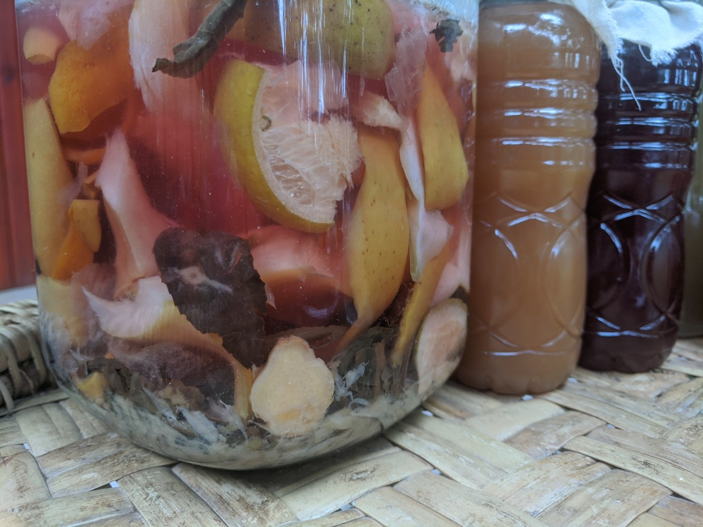

#### *Physical body and Earth body Benefits:*

***Naturally; Anti-Bacterial, Anti-Fungal, Anti-Viral and a Natural Antiseptic.***

**Stable**- If the ferment is full of its necessary nutrients, it can survive even at pH value below 3.5, this ferment usually produces a beautiful safe and stable pH range of 3 to 4.5. The fermentation can remain active even at temperatures as high as 100C.

**Safe**- Naturally teaming with antimicrobial goodness, these bacteria inhibit the growth of pathogens naturally eliminating the need for preservatives. Ferments are toxic free and perfect for the most sensitive at any age.

**Medicinal**- LAB ferments are part of normal micro-flora of the skin, gastrointestinal and genitourinary (the urinary and genital organs) tracts, hence they are used as components of many medical pro-biotic products. Rich in antioxidants that decelerate the aging of cells, fermentation produces amino acids and peptides that promote healthy cellular renewal.

**Bioremediation**- Biotechnology employs the use of living organisms, microbes and bacteria, in the removal of contaminants, pollutants, and toxins from soil, water, and other environments.

**Reduce Water Pollution**- Water pollution is a major global problem, **one of the leading worldwide causes of death and disease**, accounting for the deaths of more than 14,000 people daily(2006). Eco-Enzyme is utilized as a low-cost alternative to improve wastewater treatment processes. One study showed: A 9% solution of Eco-Enzyme has been effective in removing ammonia, nitrogen and phosphorus, and in neutralizing municipal wastewater, within a period of 5 days. The enzyme converts ammonia to nitrate (NO3-), a natural and useful hormone and nutrient for plants.

**Multiple Usage**- Natural household cleaner, body wash, mouth wash, wound healing, air purifier, laundry detergent, fabric softener, de-scaler, organic fertilizer, etc. Adding pro-biotic Eco-enzyme to food and water for feeding domestic animals can boost their immune system, improve the quality of poultry or meat and can be used as an egg wash.

**Purify Underground Water**- Eco-Enzyme residues flow underground and help to purify ground water they come in contact with. 

**Purify Air**- Cleaning with Eco-enzyme remove odors from toxic air released from smoking, car exhaust, chemical residues of household products, etc. 

**Clearing Drains**- Eco-enzyme can be used for clearing urban drains after a storm.

**Any plant matter can be used in this process, choose fruits such as citrus and pineapple peel for there powerful cleaning and healing abilities and pleasing aroma.**

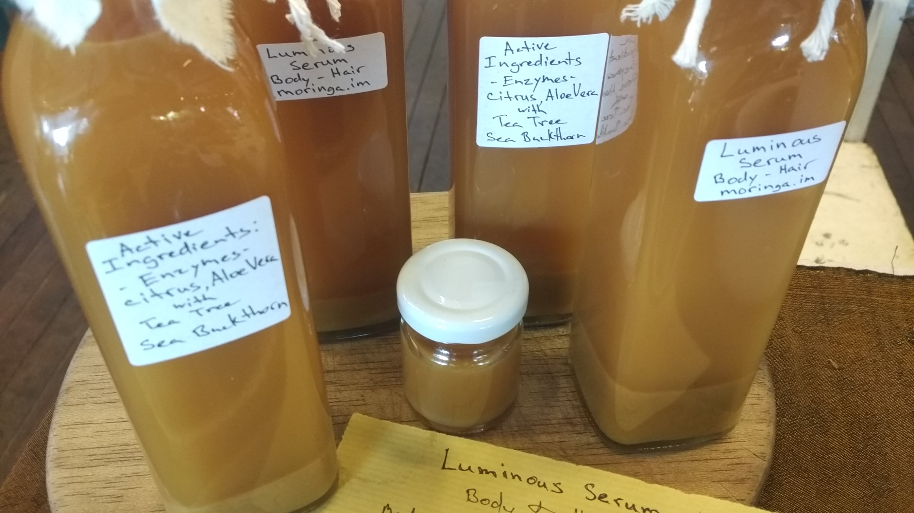

#### **Functions**

*What can be done with it:*

- Cleansing the body, natural conditioner and moisturizer for the hair and skin.
- Wound clean and heal; mouth wash, burns, cuts, abrasions, diaper rash, bed soars, diabetic wounds ...
- Treatment for warts and fungal infections
- Cleansing the built home & drainage systems
- Kill and Repel Insects
- Fertilize plants, Rehabilitate Soil and Water
- Purify Aquatic systems
- Cleanse Pet & Animal Cages
- Natural De-scaler
- Leather conditioner
...

#### *Method*

**How To Make Pro-Biotic Eco-Enzyme**

**The 1:4:10 Ratio**

- Molasses or brown sugar: 1 part
- Organic food remnants: 4-5 parts
- Water: 10 parts

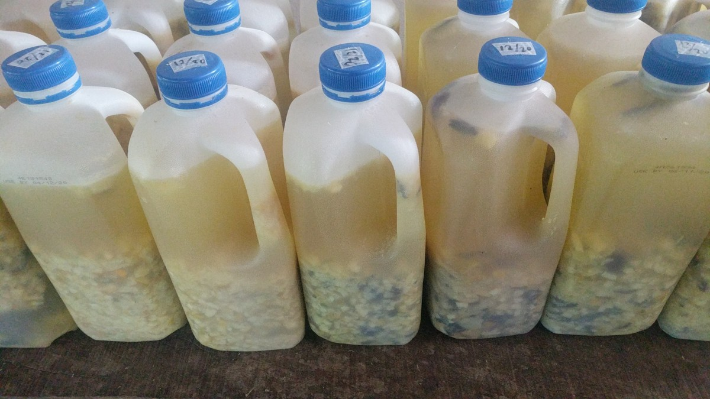

**Step 1:**
- Fill container half way with water, leaving room for expansion and fresh fruit remnants (50% of the volume).

**Step 2:**
- Add 1 part (or less) brown sugar to the container and stir.

**Step 3:**
- Add 4-5 parts fruit remnants into the container. The smaller chopped the pieces the better the ferment.
This is just a guideline, experiment and play with the ratio.

**Step 4:**
- Top up with water if needed, close the container and let the mixture **ferment for 3 months.** It’s important not to expose the ferment to the air. During the first month, gases will be released during fermentation process. **Pressure will built up in the container, release daily to avoid rupturing or use an airlock.** Leave the cap a little lose or put a balloon over to avoid an explosion. A cloth with elastic is not suitable for this type of fermentation. Date the bin!

Fermentation time & environment: 3 months minimum, from the time stopped adding food remnants. Store in a dark environment away from excessive heat.

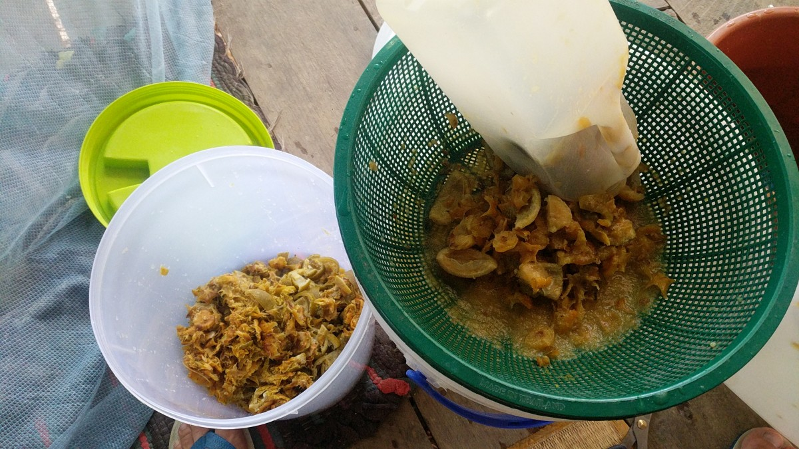

**Step 5:**
- Harvest Day! In a suitable size vessel with a suitable size strainer, separate the solids form the liquids. The filtered Eco-enzyme can be bottled and is ready for use. For a more polished product allow the filtered liquid enzyme to rest overnight (or longer) so the sediment can settle to the bottom. Repeat straining this time through a microfiber cloth, taking care to not disturb the sediment.

A portion of filtered solids or sediment can be used as a starter for the next batch, dried and used as a powdered fertilizer, or add them to the [Bokashi](./soilAlchemy.md) bin, garden compost or turn them directly into the soil. Even dumping them down the toilet is perfectly fine.

Example harvest ratio: From 14 liters of enzyme under ferment; 12 liters of liquid enzyme was harvested with 2 liters of solid fermented fruit remnants. Further filtration yielded 9 liters of clear enzyme and 3 liters of fine fermented fruit sediment. 

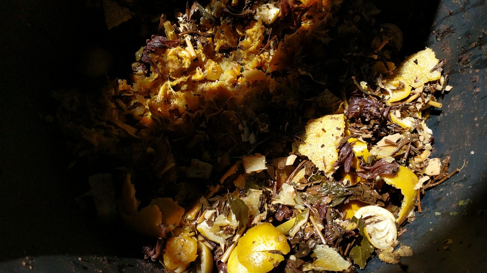

#### *TIPS and Details:*

**Sugars**- For best results try use molasses, brown sugar, jaggery or some similar sugar, as they are full of minerals and will create a more rich product.

**Separating kitchen remnants**, think aroma.
Different organics have different benefits, aromas and textures. Separating citrus fruits like Orange, Lemon, Lime and Pineapple into a dedicated bin creates a fantastic and powerful cleaning enzyme. Other aromatics and medicinal plants and flowers such as Ginger, Aloe Vera Lemongrass, Tea, Plumeria, Rose ... can be added for a luxurious whole body healing wash product.

One can create a separate catch-all bin for everything else like veggie scraps, purely for 'compost', garden use and drains. Or these can be added to the [Bokashi](./soilAlchemy.md) pro-biotic soil building bin.

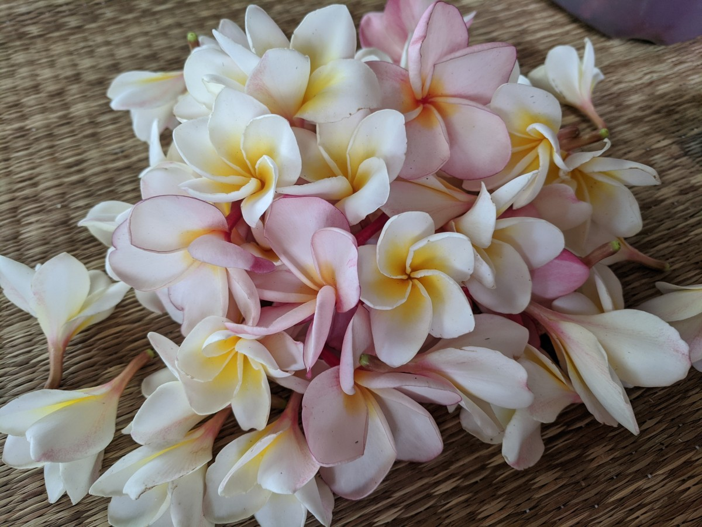

**Using Airlocks for an anaerobic environment.** Keeping the ferment clean and free of insects. This is important for a nice functional product and for safety, **containers may burst if the gasses are not released.** Plastic containers are best suited for this reason. Repurposed plastic milk containers are perfect for the job.

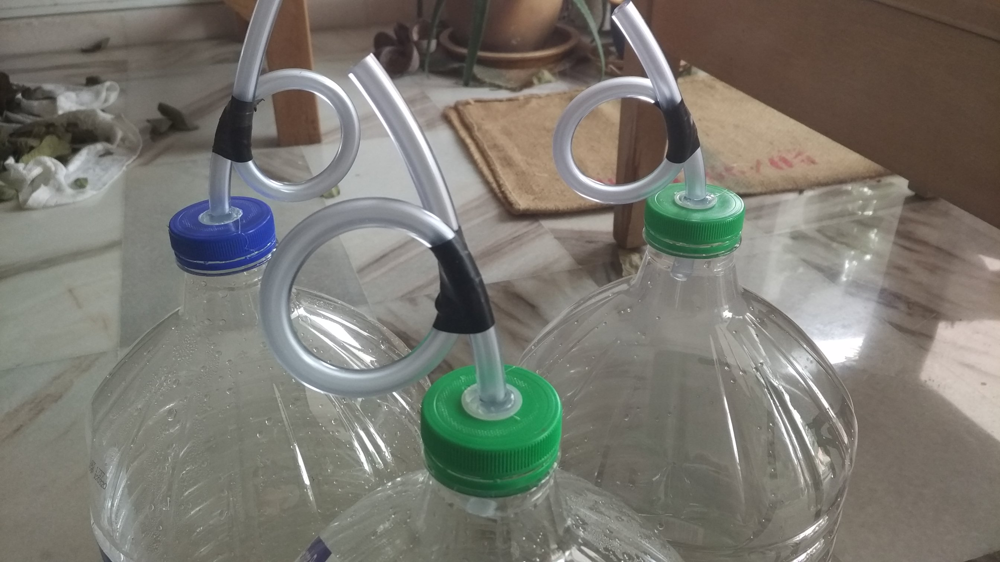

- Cutting the ingredients into small pieces allows them break down faster.
- Ensure all the organic ingredients are freely moving in the sugar water.
- Using oily food remnants (fish and meat) as ingredients will create a bad smell, these are not suitable for this type of application, but can be processed through the bokashi soil building system.
- Leave some air space to allow for natural fermentation expansion.
- During fermentation its best to keep away from direct sunlight.
- If small insects are found in the container, close the lid tightly and let those insects decompose. (Increasing protein content)
- A white layer on the surface of Eco Enzyme is a sign that fermentation is healthy and underway. This is a natural and harmless Kahm yeast.
- Label the ‘Start Date’ on the container.
- The best Eco-Enzyme ferments are 3 months and longer, fermentation starts once the last organic ingredients are added into the container.

**Micro fiber works great for filtering the white 'kahm yeast' that naturally forms on the surface.**

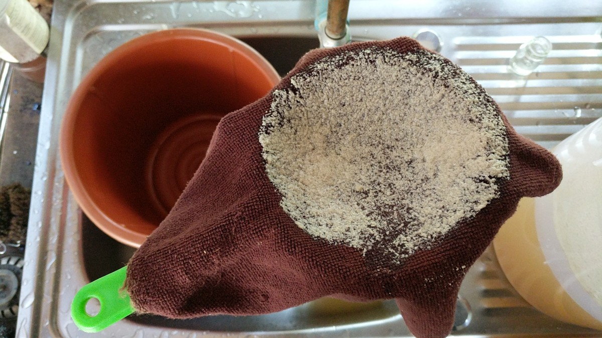

#### *Using Eco-Enzyme*

Eco-Enzymes can be used safely at full strength, undiluted, on the most sensitive skin. Ratios provided are a personal preference, experiment to discover what works best, allow intuition to be the guide. Keeping things modular helps to retain creativity.

**Enzyme to Water dilution ratios:**

- Hair and body wash - 1:1
- Mouthwash/Toothpaste - 1:1 or undiluted
- Warts and fungal infections - undiluted
- Wound healing, diaper rash wash - 1:10 or undiluted
- Dish washing - 1:500
- House hold surface cleaning - 3:100
- Laundry detergent, natural fabric softener - 1:500
- Evaporative cooler - air freshener - 1:500
- Insect replant and fertilizer for the garden - 1:500
- Fruit and vegetable wash (submerge for 5 min) to remove chemicals and pesticides - 3:100 (30ml enzyme to 1 liter water)

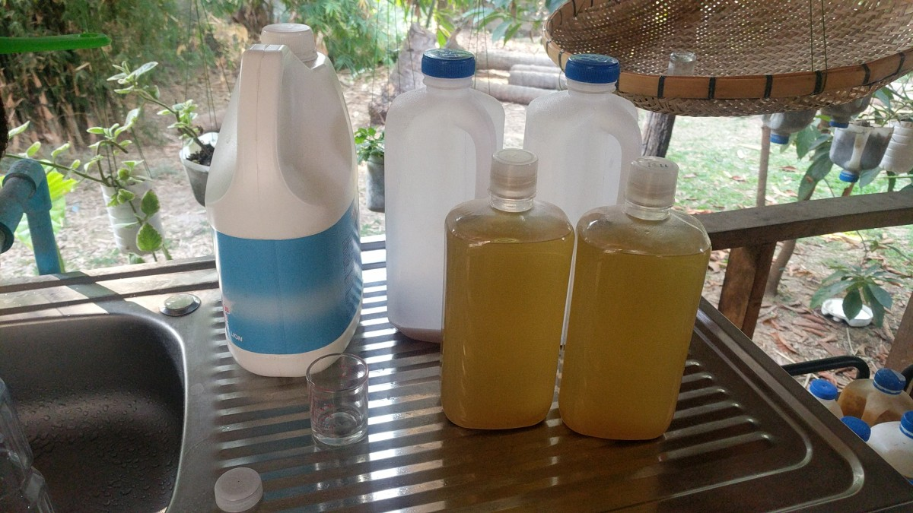

***Adding 30ml to 50ml of liquid store bought detergent/shampoo to 1000ml of Eco-Enzyme makes a great concentrated de-greaser/cleaner/shampoo. Drastically reducing consumption and mitigating harmful effects. Perfect for dish washing, laundry, shampoo and body wash.***

... The list goes on.

#### *Frequently Asked Questions*

Q: Use only one kind of fruit peels, or many different kinds?

A: Using various ingredients can create complex and stable enzymatic ecosystems. Therefore, it is better to use different kinds of fruit peels and herbal leaf. However! If looking for a product with more specific healing and fragrance profiles be more selective.

Q: Will there be bacteria in Eco-Enzyme after fermentation?
Is it safe to be used for personal cleaning?

A: Eco-enzyme contains natural acetic acid, bromelain (from pineapple), probiotics and antioxidants, which help fight bad bacteria on the skin’s surface. Eco-enzyme can reduce allergies caused by chemicals, eliminate harmful microorganisms and enhance cell regeneration. It is important to remember that the acidic value of Eco-enzyme sits at or below PH 5.0 if it has been fermented well. Remember to dilute accordingly. Eco-enzyme is very safe and makes a wonderfully gentle yet powerful wash for wound cleaning and healing. Safe for all family members to use.

The acetic acid in Eco-enzyme kills many strains of bacteria on household surfaces and inhibits the growth of new bacteria and mold. Eco-enzyme is natures all-natural cleaner. 

Eco-enzyme derived from pineapple (Ananas comosus) and orange (Citrus aurantium L.) peels have been shown to have anti-microbial as well as anti-inflammatory properties.The synergistic effect of the two Eco-enzymes increases the potency of their anti-microbial activity against a wide range of bacteria. The high content of poly-phenolic compounds and flavonoids in pineapple and orange peel extracts are found to be responsible for their excellent anti-microbial antioxidant activities.

Q: How to insure the Eco-enzyme is well fermented?

A: If the fermentation is successful, the liquid will turn yellowish to brown and will form a white layer on the surface. Otherwise, it will turn black or become moldy. If mold is black add brown sugar (same amount) and ferment for another month.

#### *Resources*

**Private Pro-biotic Eco-enzyme Lessons Available.**

#### Connect ~ Ask a question or book an event ...
Contact directly on Matrix @bird:matrix.org or [Connect in the Vivarium Salon](https://matrix.to/#/!LSpVaMCiYQehpJONFF:matrix.org)

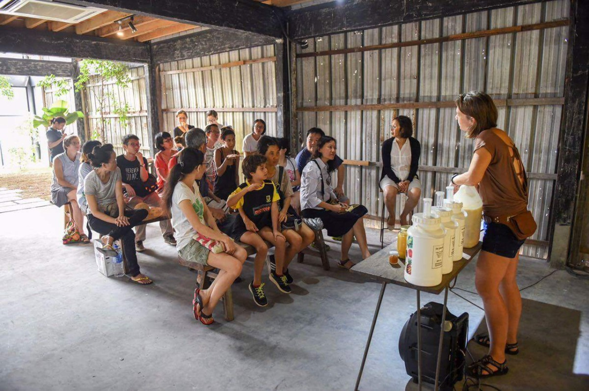

