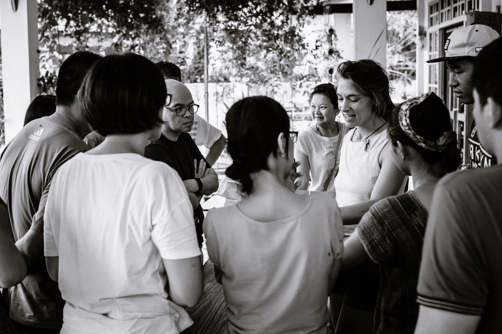

# *Soil Seekers ~ Cultivating Ecological Literacy*

**A Living Legacy - Ecology As Art; curating symbiotic relationships between Wo-Man, organisms and their environments.**

## *Bio-Logical Body And Earth Care, Living Soil To Soul.*

***Acting as curator, one who has the care of something.***

*An Archaic Revival; the sharing of a living language, learning how to discover deep patterns, which are capable of generating life.*

Giving someone courage; for changing what must be altered, empathy for accepting what cannot be helped, and the insight for knowing one from the other.

[Live Blog On Matrix - Soil Seekers](https://matrix.to/#/!EwezVvVjpxKVCMIuRM:matrix.org?via=matrix.org&via=kde.org&via=converser.eu)

### *Vivarium Salon (Circle/Programs) ~ place of life*
*Global Communities For Local Impacts. Cross-pollinate and connect, sharing diverse feelings about the ecological future.*

**Vivarium Salon Culture; Bringing Life To Style. *Art,* as the vehicle for working through feelings of living in a damaged world, cultivating cultures that symbiotically connect, healing soil to soul.**

[Real time on Matrix; Join the conversation in the interactive **Vivarium Salon**](https://matrix.to/#/!LSpVaMCiYQehpJONFF:matrix.org?via=matrix.org&via=t2bot.io&via=stux.chat)

### *Salon Circle;* A renewed culture of *Artful Conversation,* honoring someone's intention within a group process, were each idea is valued for itself, creating appreciated forums.

At a time of ecological and economic precarity, *salon style* "wisdom/council circle", offer space for sharing feelings, rethinking and remaking symbiotic relations within the body of one-self, one-another and Mother Earth.

### *Salon Programs;* Designed to be Fun, Creative, Interactive and Resourceful.

To awaken possibility and creative insight, refine the taste, and increase the knowledge of the participants through guided conversation organized around living cultures and ideas reflective of the era in which one lives.

#### Accepting personal responsibility; truthful living.

*Love and labor are inseparable, calling forth deep bravery from within.*

**Harvesting Knowledge.**

Designing for re-connectedness in contrast to designing for sustainability.

*Cultivating a more desirable, fulfilling, life supporting; Ecologically Modern and Realistic Lifestyle.*

**Tools For Understanding.**

*An integrated set of processes that allow the often hidden insight of human expertise to be captured and converted into specific actionable know-how that can be transferred to someone.*

[**Life*Styles* For Change ~ Becoming a part of the circle of life.**](./lifeStylesForChange)

#### *The Ecology Is The Economy.*

**Conservation as a consequence of lifestyle/production.**

***Producing Something Real.*** Projecting ones lifestyle into a future possibility, connected with things that make living possible. Living the creative process of a lifestyle that feeds the Soul and honors the Soil, that pays the Bills.

**Examining ecologic behaviors.**

*Loss of biodiversity is directly related to the lifestyles of human beings.*

*It's time to start comparing consumption and lifestyle, and checking this against nature's ability to provide for this consumption. Humans have destroyed and continue to destroy the habitats of species on a daily basis. It's time to own up to the realities of what that translates to for the generations to come, aesthetically and otherwise. It's time to be *Ecologically Realistic* and get back to the *heart* of what *life* is all about.* 

**This is about honesty and responsibility. Honesty; admitting to what is. Responsibility; not blaming someone else.**

# *Soil Sisters ~ Eco-Logical Movement And Enterprise*
*Directly addressing the bio-logical effects of climate change.*

## Cultivating a *Bio-logical Economy* creates the market for an *Ecologically Sustainable* future.

### *A mutually beneficial; 'symbiotic legacy venture' with Mother Earth. An Eco system that operates to deliver a positive bio-logical impact; symbiotically profiting through seeding the soil, the Womb of Mother Earth.*

#### *Cultivating The Mother Tree;* An archaic revival of Wo-Mans Gaian connection through honoring the feminine. Soil Sisters cultivate an ally; bonding with Mother Earth as *'The Live And Dynamic Co-evolutionary Partner'* in the shaping of the set, setting and the process.

***Creating co-Evolutionary Leaders;*** Revolutionary Eco-logical Actions that are transferable through to nature. ***Bio-Logical Earth Care Systems*** provide the environment for an enlightening, sustainable future.

*An opportunity for the creation of something new and beautiful.*

Being responsible stewards of the Earth means taking to heart the current planetary healing crisis. Having accepted this circumstance *responsibility* then means *ability,* to have a *creative response* to the situation as it is *now.* 

The *seeds of opportunity* and awareness, to take the moment and transform it into a better situation.

#### Putting nature on the balance sheet.

***Bio-Logical Earth Care System Services; Transforming an Environ-mental withdraw to an Environ-mental Deposit for the future. Mobilizing bio-resources (organic refuse) and converting this into bio-gold, Bio-Logical Earth Care Services & Commodities.***

***Power as responsibility rather than domination.*** A radical sift from 'dominator' Bio-Logical Warfare; built on guilt, fear and force. To an 'Eco-logical Partnership', *Bio-Logical Freedom; feeling free to swim in the rivers of Mother Earth without fear of reprisal.*

*Partnership systems support mutually respectful and caring relations.* 

***Reconciliation; forgiveness, free to turn and question: Where does someone go from here?***

#### *Environ-Mental Health*

*The ethics of ecology;* Learning to live in the light of Nature.

The cultivation of a more attuned and responsive awareness of Wo-Mans ecological interconnections, recognizing feelings which are in touch with reality. Feelings provide a powerful way of finding out which lifestyle patterns are balanced and which are not.

***The fundamental human birthright; freely connecting with thing that make living possible.*** Being attracted to all that is alive and vital, the human tendency to relate with life and natural processes - ***Is The Expression Of A Bio-Logical Need.***

#### *Quality Of Life*

It's ones alone, that's why it takes a common unity, a partnership of people doing the right things.

Loss of biodiversity and ecosystems are catastrophic, impacts are symbiotic and happen within the physical body through too *Mother Earth,* far into future generations.

Today’s young generation are being handed the biggest challenge of all; ***'Cultivating Biodiversity'*** the symbiotic living ***'Fabric of Life'*** of this planet.

Not addressing immediate needs is an insult to the young. Individuals with passion, purpose and practical skills make the world a better place.

**It's time to call home. To Act and for those acts to transfer through to Mother Earth, soil to soul cultivating cultures that are healing.** Knowing what to do, and doing it. Taking the steps, teaching what one needs to learn.

#### Explore

[**Follow the Food; The Alchemy of soul food, from soil to plate to soil.**](./soulFood/followTheFood.md)

[**BioPhilia Living Design - *Proof of Concept* Urban Sustainable Eco-Living**](./bioPhiliaLivingDesignProofOfConcept/creativeEcoLivingProofOfConcept.md)

#### [Programs/Resources](./lifeStylesForChange)

- [Soil Alchemy - The Soil Rehabilitation Miracle Of Bokashi](./lifeStylesForChange/soilAlchemy.md)

- [Water Alchemy - The Water Rehabilitation Miracle Of Pro-Biotic Eco-Enzyme](./lifeStylesForChange/waterAlchemy.md)

- [Kefir Milk Alchemy - An Ancient Living Legacy, The Miracle Of Kefir Milk Culture](./lifeStylesForChange/kefirMilkAlchemy.md)

- [The Alchemy Of Food Preservation - Cultivating Pro-biotic Functional Foods](./lifeStylesForChange/lactoFermentbBasicMethod.md)

- [Soil Seekers / Vivarium Salon Circle Elements, Etiquette and Governance](./lifeStylesForChange/vivariumSalonCircleElements.md)

[**Soil Seekers on Vimeo**](https://vimeo.com/soilseekers)

#### Connect ~ Ask a question or book an event ...
Contact directly on Matrix @bird:matrix.org or [Connect in the Vivarium Salon](https://matrix.to/#/!LSpVaMCiYQehpJONFF:matrix.org)

