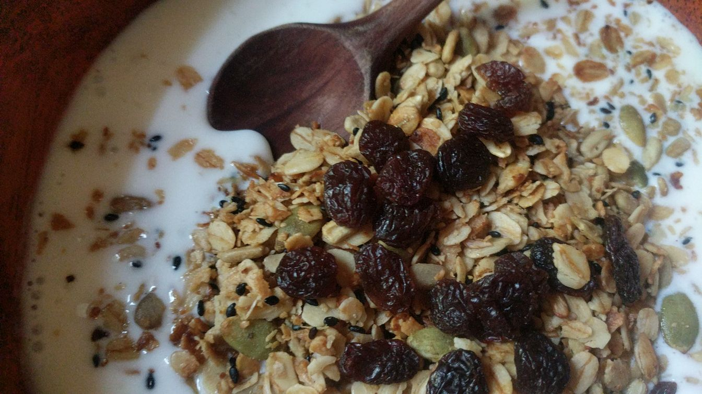

# *Scrumptious to all the senses, the flavor is an aromatic aphrodisiac.*

## *Spiced Honey toasted oats, nuts and seeds mixed with sun dried fruits.*

### *Prepared with heart, nutritiously fulfilling and oh so satisfying to create.*

#### *The technique for granola.*

***Ingredients***

Makes about 10 cups

- 6 cups whole rolled oats (or blend 4 cups oats with 2 cups rye) 1.4 L
- 1 cup sunflower seeds 240 mL
- 1/2 cup pumpkin seeds 120 mL
- 1/4 cup undulled sesame seeds 60mL (or any combination of appropriate raw nuts and seeds)
- 2 tsp cinnamon 10 mL (or a combo, ginger and clove ...)
- 2/3 cup sunflower, safflower or coconut oil 160 mL
- 1/3 - 2/3 cup honey 160 mL (to taste)
- 2 tsp vanilla 10 mL
- 1 cup unsweetened shredded dry coconut 240 mL
- 2 cups of dried fruit: raisins, blueberries, cranberries, cherries, chopped dry apricots, various wild foraged and dried berries, ... . 

Dried fruit, toasted seeds or nuts are added after the granola has been cooked and cooled.

To avoid shredded dry coconut becoming over cooked toast on its own or add raw. 

The granola will keep well for one month in a sealed container. 

#### Method

***In the oven***
Preheat the oven to 250 degrees.

In a large oiled roasting pan (or mix in a bowl and transfer to baking sheets), combine oats, nuts and seeds.

In a small saucepan, warm the oil and honey under low heat, stir continuously until blended. Take the honey and oil off the stove, blend in the vanilla and spices (or add spices later). Pour mixture over dry ingredients, with a large spoon, toss well until granola is shiny and well coated. 

Bake until golden, stirring every 15 - 20 minutes in the oven. The granola may still be slightly soft but will crisp up as it cools. It takes about an hour to bake at 250 degrees, less time at a higher heat.

***For stove top;*** using a deep dish fry pan or stock pot, warm the oil and honey under low heat, stir continuously until blended then add vanilla. Add oats, nuts and seeds directly to the pan. With a large flat edge spoon, toss well until granola is shiny and well coated. Raise the heat and toast until golden, (before it becomes dry add the spices) stirring regularly as needed to not over cook. Cool completely before storing in an airtight container.

***Served with fresh Kefir Milk.***

