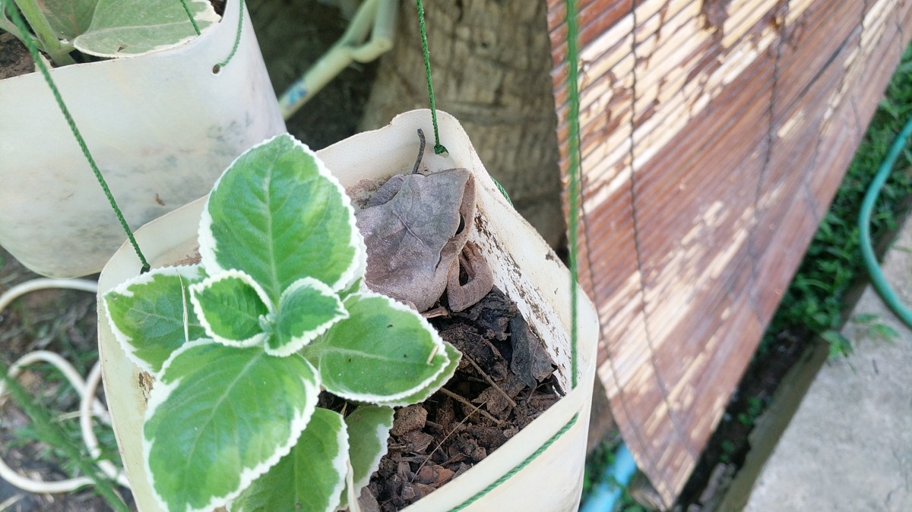
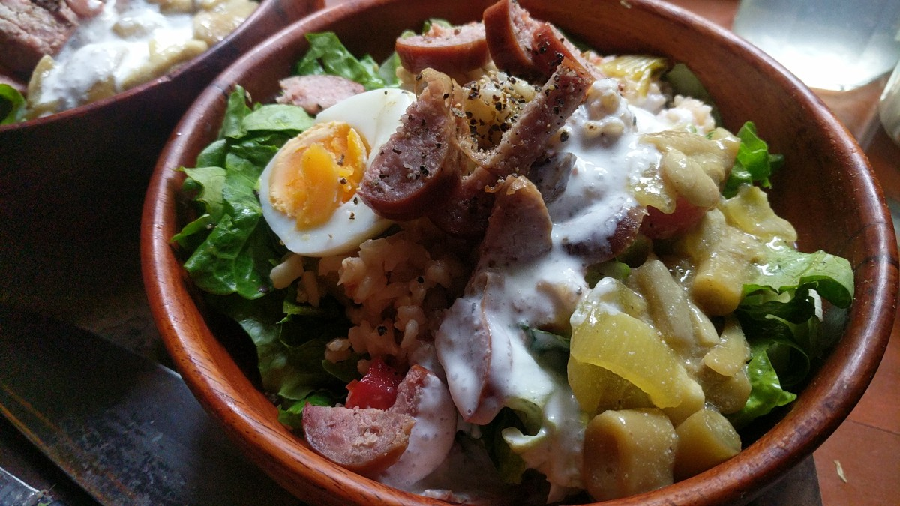
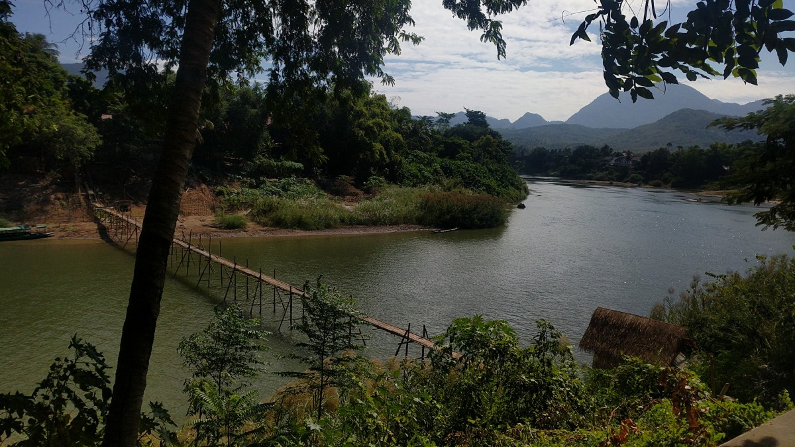

# From Soil To Plate To Soil

## The *Life - Death - Life* Cycle Of Soul Food.

### *To whence it comes from, to wherein its going, and to whither it will become.*

#### Nature creates conditions for life, she can't force it and she can't fake it. Things must undergo the formality of actually occurring. Its the soil and plants as part of a symbiotic partnership that make soul food plausible.

***Its not that nature is alive its that its intelligent. Woman is nature and as such, can speak for Mother Earth.***

**Woman is A Religion of; The redemption of earth through magic.**

The Womb of the Earth is the Soil, the tomb of Wo-Man is the Womb of Mother Earth. 

The felt experience of being in organism, standing as a mirror before nature as its object, for its the object that creates the subject. Its not to see life, its to recognize it when its seen.

**This will document the alchemical journey of *Soul Food,* from its soil source, cultivation, harvest, preservation/preparation to culinary delight, and its multi dimensional return back to source, soil.**

#### The Return: The journey through alchemy *of kind,* the redemption of earth through magic.

**Alchemy of soil;** Plant knowledge distilled through the tomb of the physical body, cultivated into living soil, and returned to the womb of Mother Earth *in-kind,* as something useful. A microbial messenger, from human to hums with a different local and unique healing microbial make up, contact with the divine made into matter. To be indigenous to a land means caring for it's next generations use.

**And as such this journey will take her to a field,** the soils of the [Nam Khan Eco Lodge and Farm.](https://www.namkhanecolodge.com/) The Nam Khan River is a major tributary of the river Mekong, with which it joins at Luang Prabang. A journey 6.5km up river to harvest soil knowledge at the source, and document cultivation from seed to harvest.

#### *Empowering direct experience.* What ever the physical mind feeds upon is what the *earth body* calls to Wo-Man, soil too soul they receive.

