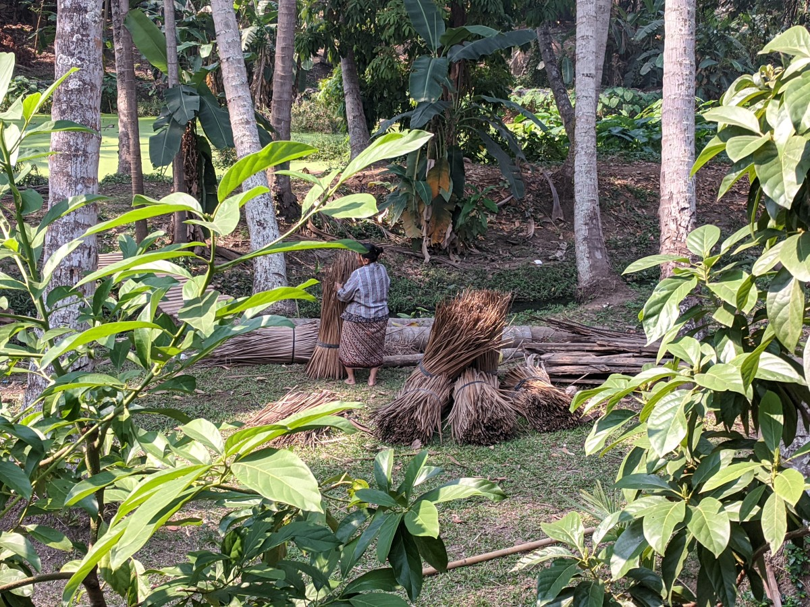

# *From Soil To Plate To Soil*

## The *Life - Death - Life* Cycle Of Soul Food.

### *To whence it comes from, to wherein it is going, and to whither it will become.*
*Proof of concept within a story. Harvesting form the environment too re-Cultivating an environmental deposit.*

#### Soil to Soul; Nature creates conditions for life. She can't force it and she can't fake it, things must undergo the formality of actually occurring. Its the soil and plants as part of a *symbiotic partnership* that make *soul food* possible.

***Meaningful work; an Act that transfers through to nature, the microbial soil, symbiotically healing Wo-Man too the Womb of Mother Earth.***

***A ritual; a participatory event done with purpose to achieve something real in ones life. To feel is to sense the mystery of life through nature, too allow change to occur while working in it.***

***Investigating the nature of the physical body, through the earth body, allowing the style of movement to evolve out of the personal creative expression. The style of life; the integration of movement and feeling connected through Mother Earth.***

***Intelligence is not to see that nature is alive, its to recognize when its seen. The felt experience of being in organism; standing as a mirror before nature as its object. Woman is natures destination; being endowed within by the spirit of selfless service, as such She can speak for Mother Earth. Being indigenous of this land means caring for its next generations use.***

**This will document the alchemical journey of *Soul Food,* from its soil source, cultivation, harvest, preservation/preparation to culinary delight, and its multi dimensional re-Cultivated return to source, soil.**

#### *The Return; a journey through the alchemy of soil.*

**A movable feast; plant knowledge distilled and assimilated through the physical body, cultivated into living soil, and returned to the womb of Mother Earth *in-kind.* Sustenance; life supporting and sustaining. Returned as something meaningful.**

#### *Empowering direct experience; contact with the divine made manifest.*

**A symbiotic microbial messenger; from humus, through human, to humus. Returned to a different local with a uniquely healing microbial make up, *pro-biotic soul food* for the ancestral soil, *earth body.* Healing Wo-Man, their relationships with one another and Mother Earth through the unified *Soil Womb*.**

#### What ever the physical mind feeds upon is what the *Earth Body* calls to *Wo-Man*, *Soil too Soul* they receive.

**As such this journey will begin in a field,** the soils cultivated by the [Nam Khan Eco Lodge and Farm,](https://www.namkhanecolodge.com/) chosen for the close proximity and open access. The Nam Khan River is a major tributary of the river Mekong, with which it joins at Luang Prabang. A journey 6.5km up river to harvest soil knowledge at the source, and document cultivation from seed to harvest. The journey will then continue into the home kitchen, with recipes of soul food for the physical body. Moving through the physical body, bio-matter enters into a cyclical fermentation process, whereupon the spirit is released. From tomb to womb, emerging whole as unified humus soil, pro-biotic soul food for the earth body.

#### *To Reveal a path toward healing the rift that grows between Wo-Man and nature.*

Re-connect; bringing the *physical body* back into conversation with all that is green and growing. A *universe* that never stopped speaking to *Earth Wo-Man,* even when they forgot how to listen.

Bend down and spread the *mud* with hands across the *Womb* of *Mother Earth.* Being moved into *action* by the extraordinary gifts of the plants and animals, singing *in thanks of giving* and dancing with feet caressing *Mother Earth.*

***The gift of life lives in the giving.***

The living land grows and grows as *Earth Wo-Man* dances in thanks, from the dab of mud on *Womb*, the *alchemy* of all the animals’ gifts coupled with *Earth Wo-Man* in symbiotic deep gratitude. Together, this *alchemical dance*, formed what people know today as planet *Earth*, home.

Like any good guest, *Earth Wo-Man* has not come empty-handed. With soil bundle clutched in hand, when toppled by domination from the hole in human heart, *Earth Wo-Man* reaches out clutching *Tree of Life* that grows. With-in grasp, branches—fruits and seeds of all kinds of plants. These *Earth Wo-Man* scatters onto new ground and carefully tends each one until *the world* turns from brown to green. Sunlight streams through the hole in the heart of the dominated, and these seeds too flourish. Wild grasses, flowers, trees, and medicines spread everywhere. And now that the animals too have plenty to eat, many come to live with *Earth Wo-Man* on *Earth Island*, the planet of life in *Ocean Sky*.

#### The plants tell the story; *Learn to live in the light of nature.*

Co-evolution; Each unique *Tree of Life* acts while keeping their autonomy, participates in collaborative symbiosis. Exactly how(?) is not the objective, *acknowledge the power of unity*. Living together, each changing as a result of changes in the other or others. Nature is a novelty conserving engine, its only objective is to conserve the 'gene,' not meaning.

***Forewarned is forearmed. The microbes warn each other and the invaders are repelled.***

The genes that translate to mast fruiting flow on enzymatic coevolutionary currents through the unified soil womb of *Mother Earth*. Symbiotically, through *Earth Wo-Man* soil knowledge is pulled into the next generations, as an attractor, like insects and the flowers that they pollinate. Those who harvest this knowledge; know how to read the land for *seeds of life*, carry them home to safety and cultivate *living soil*, will survive the *blizzards.* Passing on the knowledge harvested to their progeny, not by genetic transmission alone, but through symbiotic cultural practice, agreed upon *meaningful work.*

***Communities in mutual symbiosis solve problems.***

Synergized in people by plants, the living lands are a power of responsibility, *the world* is an enacted, *sacred ground*. To *Earth Wo-Man* it is everything, a living legacy; identity, connection to ancestors, the symbiotic whole home, the pharmacy, the library, the source of all that sustains *Earth Wo-Man*.

***The essence of the beautiful is unity in variety.***

All belong, it is through actions of reciprocity, the giving and receiving in harmony with the living land that people have become *Earth Wo-Man* (indigenous). Just as *Mother Earth* cannot be claimed, nor can *Earth Wo-Man*. Being self-initiated/declared, not from a land domination named through conquer or conquest.

#### Ethos; *Earth Wo-Man* and the balance between passion and caution.

Anyone who sees the monetary value as greater than the medicinal value of the stove or tincture must be too naive to ever decipher the formulas, or complete it.

Alchemy is an entirely natural science. The Alchemist does not force anything, but rather aids the substance to develop naturally where it wants to go by removing any impediment and assuring the optimal conditions.

The contradicting quotation is not truly contradicting as it does not contradict the premise; Emulate Nature- It only warns not to, too closely imitate every tiny detail of nature.

Alchemy can only truly be understood by gaining an understanding of how and why nature operates ***as it does.***

**Nature** - the ultimate non absolute ... where

**beliefs** - can be manipulated by imagination and

**danger resides** - from achieving wrong combinations from accurate information.

Shall She Continue ...

